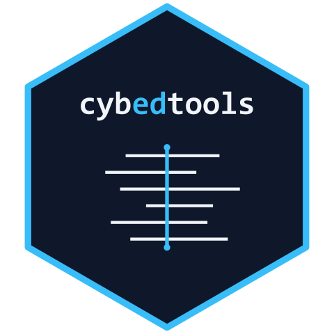

<!-- README.md is generated from README.qmd. Please edit README.qmd and run `quarto render README.qmd` to regenerate. -->

```{r setup}
#| include: false
knitr::opts_chunk$set(
  collapse = TRUE,
  comment = "#>",
  fig.path = "man/figures/README-",
  out.width = "100%",
  message = FALSE,
  warning = FALSE
)
options(tibble.print_min = 8, tibble.print_max = 8)

# Render-time policy: chunks that require an installed cybedtools and a
# clean rdflib/dplyr stack are flagged eval = TRUE and produce live output
# under normal conditions. Set DEMO_LIVE=false in the environment to fall
# back to static output if your local R install has package-load conflicts
# (e.g., another R process holding a DLL on Windows).
DEMO_LIVE <- !identical(tolower(Sys.getenv("DEMO_LIVE", "true")), "false")
```

```{r summary-setup}
#| include: false
suppressPackageStartupMessages({
  library(dplyr)
  library(cybedtools)
})

# Per-framework counts and metadata: ships with the package, no graph needed.
fs <- cybedtools::framework_summary

# Density spread (max vs. min elements per role).
density_max_value <- max(fs$elements_per_role)
density_min_value <- min(fs$elements_per_role)
density_max_name  <- fs$framework_name[which.max(fs$elements_per_role)]
density_min_name  <- fs$framework_name[which.min(fs$elements_per_role)]
density_ratio_x   <- round(density_max_value / density_min_value, -1)

# Element totals by jurisdiction (US vs. EU is what the prose calls out).
juris_totals <- fs |>
  count(jurisdiction, wt = element_count, name = "n_elements")
us_elements   <- juris_totals$n_elements[juris_totals$jurisdiction == "US"]
eu_elements   <- juris_totals$n_elements[juris_totals$jurisdiction == "EU"]
us_eu_ratio_x <- round(us_elements / eu_elements)
us_fmt        <- format(us_elements, big.mark = ",")
eu_fmt        <- format(eu_elements, big.mark = ",")
us_fws        <- paste(fs$framework_name[fs$jurisdiction == "US"], collapse = ", ")
eu_fws        <- paste(fs$framework_name[fs$jurisdiction == "EU"], collapse = " + ")

# Top-five NICE work roles by element count. Live-derived from the staged
# graph when DEMO_LIVE is true; falls back to a baked string otherwise.
nice_top5_text <- "Security Control Assessment (307 elements), Secure Systems Development (232), Cybersecurity Architecture (219), Defensive Cybersecurity (206), Systems Security Management (204)"

if (DEMO_LIVE) {
  rdf_full <- load_combined_ntriples_graph()
  nice_top5 <- role_framework_bindings(rdf_full) |>
    filter(framework_name == "NICE v2 (NIST SP 800-181 Rev 1 components)") |>
    inner_join(
      role_element_bindings(rdf_full) |> count(role, name = "element_count"),
      by = "role"
    ) |>
    arrange(desc(element_count)) |>
    slice_head(n = 5) |>
    select(role_name, element_count)
  nice_top5_text <- paste(
    paste0(nice_top5$role_name[1], " (", format(nice_top5$element_count[1], big.mark = ","), " elements)"),
    paste(
      paste0(nice_top5$role_name[-1], " (", format(nice_top5$element_count[-1], big.mark = ","), ")"),
      collapse = ", "
    ),
    sep = ", "
  )
}
```

# cybedtools <a href="https://ryanstraight.github.io/cybedtools/"></a>

<!-- badges: start -->
[](https://github.com/ryanstraight/cybedtools/actions/workflows/r-cmd-check.yaml)
[](https://github.com/ryanstraight/cybedtools/actions/workflows/test-coverage.yaml)
[](https://app.codecov.io/gh/ryanstraight/cybedtools)
[](https://lifecycle.r-lib.org/articles/stages.html#experimental)
[](https://opensource.org/license/MIT)
[](https://www.r-project.org/)
[](https://doi.org/10.5281/zenodo.20076116)
[](https://context7.com/ryanstraight/cybedtools)
<!-- badges: end -->

Eight cybersecurity workforce and learning frameworks. Eight different schemas, eight different vocabularies. Comparing them (what's specified where, where they overlap, how their structural commitments differ) has historically meant rebuilding the comparison from scratch every time, in a spreadsheet.

cybedtools makes the comparison one query.

The package ingests four workforce competency frameworks (NICE, DCWF, SFIA, ENISA ECSF) and four pedagogical or learning-standards frameworks (Cyber.org K-12, CSTA K-12 CS, ACM/IEEE CSEC2017, JRC DigComp 2.2), expresses them all in a shared `cybed:` semantic schema, and exposes a small set of R helpers that let you query across them as if they were one corpus.

It does not propose a replacement framework or attempt to re-author framework content. Existing frameworks retain their structure and vocabulary. The package adds a comparison layer.

Who it's for:

- cybersecurity education researchers comparing curricula across frameworks
- workforce-development analysts mapping job roles to training requirements
- framework authors and revisers checking structural coverage against peer frameworks
- doctoral students writing dissertations that need cross-framework empirical claims

```{r framework-table}
#| echo: false
#| results: asis
# Eight-framework summary, rendered as raw HTML so pkgdown extra.js can
# bind click-to-sort to the .sortable class. Source data is
# cybedtools::framework_summary (computed by
# data-raw/build-framework-summary.R against the staged combined graph).
# Pandoc's commonmark serializer expands the rendered HTML across many
# lines on its way to README.md; that's cosmetic noise in an
# auto-generated file. Both GitHub (static render) and pkgdown
# (script-bound render) display it correctly.
fs_tbl <- cybedtools::framework_summary
rows <- vapply(seq_len(nrow(fs_tbl)), function(i) {
  sprintf(
    "<tr><td>%s</td><td>%s</td><td>%s</td><td>%s</td><td>%s</td><td>%s</td></tr>",
    fs_tbl$framework_name[i],
    fs_tbl$framework_type[i],
    fs_tbl$jurisdiction[i],
    format(fs_tbl$role_count[i],    big.mark = ","),
    format(fs_tbl$element_count[i], big.mark = ","),
    fs_tbl$license[i]
  )
}, character(1))
cat('<table class="table sortable">\n')
cat("<thead>\n",
    "<tr><th>Framework</th><th>Type</th><th>Jurisdiction</th>",
    "<th>Roles</th><th>Elements</th><th>License</th></tr>\n",
    "</thead>\n",
    "<tbody>\n",
    sep = "")
cat(paste(rows, collapse = "\n"), "\n", sep = "")
cat("</tbody>\n</table>\n")
```

## What you can find with this

Three findings, one R query each.

**Element density per framework varies by `r density_ratio_x`x.** `r density_max_name` expresses `r format(density_max_value, nsmall = 1)` elements per role. `r density_min_name` expresses `r format(density_min_value, nsmall = 1)`. Some of this is framework purpose (workforce specification vs. K-12 learning outcomes). Some is uneven specification within the same framework type. Either way, "covers the NICE Framework" and "covers the CSEC2017 guidelines" are not comparable curricular claims.

**Jurisdictional element coverage is dominated by US frameworks `r us_eu_ratio_x` to 1.** US frameworks (`r us_fws`) contribute `r us_fmt` elements. EU frameworks (`r eu_fws`) contribute `r eu_fmt`. Comparative work in cybersecurity education has been operating against an asymmetric corpus.

**The five highest-element-load NICE work roles concentrate disproportionate competency specification.** `r nice_top5_text`. Curricula that "cover NICE" by surveying these five roles look thorough. Curricula that cover the long tail of `r fs$role_count[fs$framework_slug == "nice-v2"]` roles look thin by element count alone.

Each finding is one query and a few lines of dplyr. See below.

## Quick check after install

`make_demo_graph()` returns an in-memory two-framework synthetic graph that exercises every domain helper without staged data. If this runs cleanly, your install is sound:

```{r demo}
#| eval: !expr DEMO_LIVE
library(cybedtools)
library(dplyr)

rdf <- make_demo_graph()

# One row per framework with jurisdiction, sector, and specificity attached.
framework_metadata(rdf) |>
  arrange(jurisdiction, name)
```

The same helpers run against a staged eight-framework graph by swapping `make_demo_graph()` for `load_combined_ntriples_graph()`.

## A query against the eight-framework corpus

Once the combined graph is staged (see [Getting started](#getting-started)), one expression returns density per framework, sorted descending:

```{r real-density}
#| eval: !expr DEMO_LIVE
rdf <- load_combined_ntriples_graph()

role_framework_bindings(rdf) |>
  count(framework_name, name = "role_count") |>
  left_join(
    element_framework_bindings(rdf) |>
      count(framework_name, name = "element_count"),
    by = "framework_name"
  ) |>
  mutate(elements_per_role = round(element_count / role_count, 1)) |>
  arrange(desc(elements_per_role))
```

Jurisdiction pivots, top-load NICE roles, pairwise framework comparisons, and the librdf single-BGP discipline are covered in the [`cross-framework-analysis`](https://ryanstraight.github.io/cybedtools/articles/cross-framework-analysis.html) vignette. Extending the schema to a new framework is covered in [`adding-a-framework`](https://ryanstraight.github.io/cybedtools/articles/adding-a-framework.html).

## Getting started

```r
# install.packages("remotes")
remotes::install_github("ryanstraight/cybedtools")
```

The package does not redistribute upstream framework text. To run the pipeline end-to-end, clone the repository and stage each framework's source file at `data/raw/<framework>/` per [`docs/framework-data-sources.md`](docs/framework-data-sources.md):

```sh
git clone https://github.com/ryanstraight/cybedtools
cd cybedtools

# Stage source files, then:
Rscript scripts/000-build.R   # ingestion + verification + assembly + export
```

The [`getting-started`](https://ryanstraight.github.io/cybedtools/articles/getting-started.html) vignette walks through each stage, and the [function reference](https://ryanstraight.github.io/cybedtools/reference/) indexes the public API.

## Citing

If you use cybedtools in published work, see [`CITATION.cff`](CITATION.cff) or run `citation("cybedtools")` for the canonical citation.

## License

Package code is MIT (see [`LICENSE.md`](LICENSE.md)). Each framework retains its upstream license; source text is not bundled. Users stage source files locally per [`docs/framework-data-sources.md`](docs/framework-data-sources.md), and each ingestion script writes a per-framework `provenance.yml`. See [`LICENSING.md`](LICENSING.md) for layered guidance on academic vs. commercial use.

## Code of Conduct

Please note that the cybedtools project is released with a [Contributor Code of Conduct](https://ryanstraight.github.io/cybedtools/CODE_OF_CONDUCT.html). By contributing to this project, you agree to abide by its terms.
