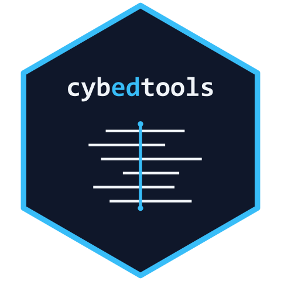

<!-- README.md is generated from README.qmd. Please edit README.qmd and run `quarto render README.qmd` to regenerate. -->

```{r setup}
#| include: false
knitr::opts_chunk$set(
  collapse = TRUE,
  comment = "#>",
  fig.path = "man/figures/README-",
  out.width = "100%",
  message = FALSE,
  warning = FALSE
)
options(tibble.print_min = 8, tibble.print_max = 8)

# Render-time policy: chunks that require an installed cybedtools and a
# clean rdflib/dplyr stack are flagged eval = TRUE and produce live output
# under normal conditions. Set DEMO_LIVE=false in the environment to fall
# back to static output if your local R install has package-load conflicts
# (e.g., another R process holding a DLL on Windows).
DEMO_LIVE <- !identical(tolower(Sys.getenv("DEMO_LIVE", "true")), "false")
```

```{r summary-setup}
#| include: false
suppressPackageStartupMessages({
  library(dplyr)
  library(cybedtools)
})

# Per-framework counts and metadata: ships with the package, no graph needed.
fs <- cybedtools::framework_summary

# Density spread (max vs min elements per top-level unit, Examples
# included). Counts what each framework puts in front of a teacher,
# trainee, or curriculum designer, which is the most steward-friendly
# cross-framework comparison: Cyber.org K-12 and CSTA's
# Clarification-statement examples are pedagogical content even though
# the source frameworks treat them as illustrative rather than
# enumerable. The strict count (parents + Subpoints, Examples excluded)
# is available in framework_summary for analyses that need it.
density_max_value <- max(fs$elements_per_organizing_unit_with_examples)
density_min_value <- min(fs$elements_per_organizing_unit_with_examples)
density_max_name <- fs$framework_name[
  which.max(fs$elements_per_organizing_unit_with_examples)
]
density_min_name <- fs$framework_name[
  which.min(fs$elements_per_organizing_unit_with_examples)
]
density_ratio_x <- round(density_max_value / density_min_value, 0)

# Element totals by jurisdiction. Uses the with-examples count so the
# comparison spans the same content the headline density figure does.
# Every figure the prose cites is computed here, so adding a framework
# or a jurisdiction cannot leave a stale number behind.
juris_totals <- fs |>
  count(jurisdiction, wt = element_count_with_examples, name = "n_elements")
all_elements  <- sum(juris_totals$n_elements)
us_elements   <- juris_totals$n_elements[juris_totals$jurisdiction == "US"]
eu_elements   <- juris_totals$n_elements[juris_totals$jurisdiction == "EU"]
us_share_pct  <- round(100 * us_elements / all_elements)
us_fmt        <- format(us_elements, big.mark = ",")
eu_fmt        <- format(eu_elements, big.mark = ",")
all_fmt       <- format(all_elements, big.mark = ",")
n_juris       <- nrow(juris_totals)
us_fws        <- paste(fs$framework_name[fs$jurisdiction == "US"], collapse = ", ")
eu_fws        <- paste(fs$framework_name[fs$jurisdiction == "EU"], collapse = " and ")

# Top-five NICE work roles by element count. Live-derived from the staged
# graph when DEMO_LIVE is true; falls back to a baked string otherwise.
nice_top5_text <- "Security Control Assessment (304 elements), Secure Systems Development (237), Cybersecurity Architecture (218), Defensive Cybersecurity (205), Systems Security Management (201)"

if (DEMO_LIVE) {
  rdf_full <- load_combined_ntriples_graph()
  nice_top5 <- role_framework_bindings(rdf_full) |>
    # Match the framework family, not an exact version string. The display
    # name carries the version, so an equality filter silently returns zero
    # rows the moment the framework is re-ingested (as v2 -> v2.2.0 did).
    filter(grepl("^NICE", framework_name)) |>
    inner_join(
      role_element_bindings(rdf_full) |> count(role, name = "element_count"),
      by = "role"
    ) |>
    arrange(desc(element_count)) |>
    slice_head(n = 5) |>
    select(role_name, element_count)
  nice_top5_text <- paste(
    paste0(
      nice_top5$role_name[1], " (",
      format(nice_top5$element_count[1], big.mark = ","), " elements)"
    ),
    paste(
      paste0(
        nice_top5$role_name[-1], " (",
        format(nice_top5$element_count[-1], big.mark = ","), ")"
      ),
      collapse = ", "
    ),
    sep = ", "
  )
}
```

# cybedtools <a href="https://ryanstraight.github.io/cybedtools/"></a>

<!-- badges: start -->
[](https://github.com/ryanstraight/cybedtools/actions/workflows/r-cmd-check.yaml)
[](https://github.com/ryanstraight/cybedtools/actions/workflows/test-coverage.yaml)
[](https://app.codecov.io/gh/ryanstraight/cybedtools)
[](https://lifecycle.r-lib.org/articles/stages.html#experimental)
[](https://opensource.org/license/MIT)
[](https://www.r-project.org/)
[](https://doi.org/10.5281/zenodo.20076116)
[](https://context7.com/ryanstraight/cybedtools)
<!-- badges: end -->

> [Concordance](https://ryanstraight.github.io/cybedtools/concordance/) renders the framework data, the cross-framework comparisons, and the working scenarios without requiring R. Cite Concordance for site content, and cybedtools for the methodology and any element-level analysis.

A corpus of cybersecurity workforce and learning frameworks. Each carries a different schema and a different vocabulary. Comparing them (what's specified where, where they overlap, how their structural commitments differ) has historically meant rebuilding the comparison from scratch every time, in a spreadsheet.

cybedtools makes the comparison one simple query.

The package ingests seven workforce competency frameworks (NICE, DCWF, SFIA, ENISA ECSF, the Czech CyQUAL, the Canadian Cyber Security Skills Framework, and Singapore's OTCCF) and four pedagogical or learning-standards frameworks (Cyber.org K-12, CSTA K-12 CS, ACM/IEEE CSEC2017, JRC DigComp 2.2). All eleven are expressed in a shared `cybed:` semantic schema. A small set of R helpers queries across them as if they were one corpus.

It does not propose a replacement framework or attempt to re-author framework content. Existing frameworks retain their structure and vocabulary. The package adds a comparison layer.

A native Python package is in development.

Who it's for:

- cybersecurity education researchers comparing curricula across frameworks
- workforce-development analysts mapping job roles to training requirements
- framework authors and revisers checking structural coverage against peer frameworks
- doctoral students writing dissertations that need cross-framework empirical claims

```{r framework-table}
#| echo: false
#| results: asis
# Eleven-framework summary, rendered as raw HTML so pkgdown extra.js can
# bind click-to-sort to the .sortable class. Source data is
# cybedtools::framework_summary (computed by
# data-raw/build-framework-summary.R against the staged combined graph).
# Pandoc's commonmark serializer expands the rendered HTML across many
# lines on its way to README.md; that's cosmetic noise in an
# auto-generated file. Both GitHub (static render) and pkgdown
# (script-bound render) display it correctly.
fs_tbl <- cybedtools::framework_summary
rows <- vapply(seq_len(nrow(fs_tbl)), function(i) {
  sprintf(
    "<tr><td>%s</td><td>%s</td><td>%s</td><td>%s</td><td>%s</td><td>%s</td></tr>",
    fs_tbl$framework_name[i],
    fs_tbl$framework_type[i],
    fs_tbl$jurisdiction[i],
    format(fs_tbl$organizing_unit_count[i],       big.mark = ","),
    format(fs_tbl$element_count_with_examples[i], big.mark = ","),
    fs_tbl$license[i]
  )
}, character(1))
cat('<table class="table sortable">\n')
cat("<thead>\n",
    "<tr><th>Framework</th><th>Type</th><th>Jurisdiction</th>",
    "<th>Top-level units</th><th>Elements</th><th>License</th></tr>\n",
    "</thead>\n",
    "<tbody>\n",
    sep = "")
cat(paste(rows, collapse = "\n"), "\n", sep = "")
cat("</tbody>\n</table>\n")
```

The "Top-level units" column reports each framework's own top-level enumerated unit, and those units are not the same kind of thing. NICE, DCWF, ECSF, CyQUAL, the Canadian framework, and OTCCF declare roles. SFIA declares skills, CSEC2017 declares Knowledge Areas, DigComp 2.2 declares competence areas, and Cyber.org K-12 and CSTA use unnamed groupings that cybedtools labels `StandardGroup`. All of them subclass `cybed:OrganizingUnit`, so cross-framework queries reach them uniformly. How the "Elements" column counts, and how `framework_summary` reports strict, augmented, and per-role totals, is in [`docs/framework-data-sources.md`](docs/framework-data-sources.md).

```{r value-setup}
#| include: false
# Every figure cited by the "What you could not do before" section. Baked
# fallbacks equal the values computed on 2026-09-19 against the staged
# eleven-framework graph, so the prose stays true when DEMO_LIVE is false.
cq_dc_fmt         <- "1,400"
shared_nice_n     <- 100
ccssf_pct_ceiling <- 1
ai_zero_n         <- "Five"
n_frameworks      <- "eleven"
dcwf_ai_n         <- 24
other_ai_n        <- 12
nice_ethics_n     <- "three"
nice_total_fmt    <- "2,225"
role_reuse_n      <- "Three"
role_once_n       <- "Three"
dcwf_all_roles_n  <- 8
dcwf_role_n       <- 74
cyq_max_roles_n   <- 50
cyq_role_n        <- 102

if (DEMO_LIVE) {
  suppressPackageStartupMessages({
    library(stringr)
    library(purrr)
  })

  norm_text <- function(x) {
    x |>
      str_to_lower() |>
      str_remove("^\\s*\\*\\s+") |>
      str_remove("[[:punct:]\\s]+$") |>
      str_squish()
  }

  value_all_text <- element_framework_bindings(rdf_full) |>
    inner_join(element_text(rdf_full), by = "element")

  value_parents <- value_all_text |>
    anti_join(subpoint_framework_bindings(rdf_full),
              by = c("element" = "subpoint")) |>
    anti_join(example_framework_bindings(rdf_full),
              by = c("element" = "example")) |>
    mutate(text = norm_text(text)) |>
    filter(nchar(text) > 15) |>
    distinct(framework_name, text)

  fw <- function(pattern) {
    hit <- grep(pattern, unique(value_parents$framework_name), value = TRUE)
    stopifnot(length(hit) == 1)
    hit
  }
  cyq_nm   <- fw("^CyQUAL")
  dcwf_nm  <- fw("^DCWF")
  nice_nm  <- fw("^NICE")
  ccssf_nm <- fw("^Canadian")

  texts_of <- function(nm) value_parents$text[value_parents$framework_name == nm]
  shared_cq_dc <- intersect(texts_of(cyq_nm), texts_of(dcwf_nm))
  cq_dc_fmt <- format(length(shared_cq_dc), big.mark = ",")

  nice_txt  <- texts_of(nice_nm)
  cq_nice_n <- length(intersect(texts_of(cyq_nm), nice_txt))
  dc_nice_n <- length(intersect(texts_of(dcwf_nm), nice_txt))
  # The prose says "each". If a re-ingest splits them, fail the render
  # rather than print a sentence that is quietly wrong.
  stopifnot(cq_nice_n == dc_nice_n)
  shared_nice_n <- cq_nice_n

  ccssf_txt <- texts_of(ccssf_nm)
  other_txt <- unique(value_parents$text[value_parents$framework_name != ccssf_nm])
  ccssf_pct_ceiling <- ceiling(
    100 * length(intersect(ccssf_txt, other_txt)) / length(ccssf_txt)
  )

  value_topics <- c(
    ai           = "machine learning|artificial intelligence|neural network",
    ethics       = "ethic|moral",
    cryptography = "cryptograph|encrypt"
  )
  topic_counts <- imap(value_topics, \(pattern, topic) {
    value_all_text |>
      summarise(
        "{topic}" := sum(str_detect(text, regex(pattern, ignore_case = TRUE))),
        .by = framework_name
      )
  }) |>
    reduce(left_join, by = "framework_name") |>
    left_join(
      count(value_all_text, framework_name, name = "statements"),
      by = "framework_name"
    )

  spelled <- function(n) {
    words <- c("one", "two", "three", "four", "five", "six",
               "seven", "eight", "nine", "ten", "eleven")
    if (n >= 1 && n <= 11) words[n] else format(n, big.mark = ",")
  }
  # Sentence-initial figures are spelled out and capitalised.
  Spelled <- function(n) sub("^(.)", "\\U\\1", spelled(n), perl = TRUE)
  ai_zero_names <- topic_counts$framework_name[topic_counts$ai == 0]
  ai_zero_n     <- Spelled(length(ai_zero_names))
  # The prose names the zero cases. Assert the named set, so a re-ingest
  # that moves a framework in or out fails the render instead of leaving
  # a false sentence standing.
  stopifnot(
    setequal(
      sort(sub("^(CCSSF|Canadian|CSEC2017|Cyber\\.org|DigComp|ECSF).*$", "\\1",
               ai_zero_names)),
      c("CSEC2017", "Canadian", "Cyber.org", "DigComp", "ECSF")
    )
  )
  n_frameworks <- spelled(nrow(topic_counts))

  pick <- function(tbl, nm, col) tbl[[col]][tbl$framework_name == nm]
  dcwf_ai_n     <- pick(topic_counts, dcwf_nm, "ai")
  other_ai_n    <- sum(topic_counts$ai) - dcwf_ai_n
  nice_ethics_n <- spelled(pick(topic_counts, nice_nm, "ethics"))
  nice_total_fmt <- format(pick(topic_counts, nice_nm, "statements"),
                           big.mark = ",")

  crypto_zero_names <- topic_counts$framework_name[topic_counts$cryptography == 0]
  stopifnot(
    setequal(
      sort(sub("^(SFIA|ECSF|DigComp).*$", "\\1", crypto_zero_names)),
      c("DigComp", "ECSF", "SFIA")
    )
  )

  # role_element_bindings() covers every organizing unit. Keep true roles
  # only, and count parent statements (sub-points are fragments of them).
  value_roles <- role_element_bindings(rdf_full) |>
    semi_join(role_framework_bindings(rdf_full), by = "role") |>
    count(element, name = "n_roles") |>
    anti_join(
      subpoint_framework_bindings(rdf_full),
      by = c("element" = "subpoint")
    ) |>
    inner_join(element_framework_bindings(rdf_full), by = "element")
  role_totals <- role_framework_bindings(rdf_full) |>
    count(framework_name, name = "n_roles_total")
  reuse_summary <- value_roles |>
    summarise(max_roles = max(n_roles),
              used_once = all(n_roles == 1),
              .by = framework_name)
  role_reuse_n <- Spelled(sum(!reuse_summary$used_once))
  role_once_n  <- Spelled(sum(reuse_summary$used_once))

  dcwf_role_n      <- pick(role_totals, dcwf_nm, "n_roles_total")
  cyq_role_n       <- pick(role_totals, cyq_nm, "n_roles_total")
  dcwf_all_roles_n <- sum(
    value_roles$n_roles[value_roles$framework_name == dcwf_nm] == dcwf_role_n
  )
  cyq_max_roles_n <- pick(reuse_summary, cyq_nm, "max_roles")
}
```

## What you could not do before

Counting what is in a framework is easy. Download it and count. The harder questions run across frameworks, and those used to mean parsing a NIST JSON file, a DoD spreadsheet, a SQLite database, an open-data export and two PDFs into one shape before the first comparison. cybedtools does that part. Three examples follow. Each runs in about a second.

### Which frameworks are made of the same sentences?

```{r value-shared-text}
#| eval: !expr DEMO_LIVE
library(cybedtools)
library(dplyr)
library(stringr)

rdf <- load_combined_ntriples_graph()

statements <- element_framework_bindings(rdf) |>
  anti_join(subpoint_framework_bindings(rdf), by = c("element" = "subpoint")) |>
  anti_join(example_framework_bindings(rdf), by = c("element" = "example")) |>
  inner_join(element_text(rdf), by = "element") |>
  mutate(
    text = text |>
      str_to_lower() |>
      str_remove("^\\s*\\*\\s+") |>
      str_remove("[[:punct:]\\s]+$") |>
      str_squish()
  ) |>
  filter(nchar(text) > 15) |>
  distinct(framework_name, text)

statements |>
  inner_join(statements, by = "text", suffix = c("", "_2"),
             relationship = "many-to-many") |>
  filter(framework_name < framework_name_2) |>
  count(framework_name, framework_name_2, sort = TRUE) |>
  slice_head(n = 6)
```

<!-- The two percentages in the paragraph below are fixed, not computed at render time: the August 2017 NICE Framework is not in the corpus graph. They were measured on 2026-09-19 against the NIST SP 800-181 supplemental task and KSA workbook, normalised the same way as the chunk above and on the same parents-only basis. -->

The largest block of shared text in the corpus is between CyQUAL, the Czech national framework, and DCWF, the US Department of Defense framework: `r cq_dc_fmt` statements, word for word. Neither names the other as a source. Each shares only `r shared_nice_n` statements with the current NICE Framework. What they have in common is the 2017 NICE Framework. Checked against NIST's 2017 release, nearly all of what the two share is 2017 NICE text, and under 5 percent of that 2017 text survives in NICE v2.2.0. The 2017 edition is better preserved in Prague and at the Pentagon than at NIST. Canada's framework describes itself as an adaptation of NICE and shares under `r ccssf_pct_ceiling` percent of its statements with anything.

### Which frameworks have nothing to say about a topic?

```{r value-topics}
#| eval: !expr DEMO_LIVE
library(purrr)

topics <- c(
  ai           = "machine learning|artificial intelligence|neural network",
  ethics       = "ethic|moral",
  cryptography = "cryptograph|encrypt",
  supply_chain = "supply chain|third.party"
)

all_text <- element_framework_bindings(rdf) |>
  inner_join(element_text(rdf), by = "element")

imap(topics, \(pattern, topic) {
  all_text |>
    summarise(
      "{topic}" := sum(str_detect(text, regex(pattern, ignore_case = TRUE))),
      .by = framework_name
    )
}) |>
  reduce(left_join, by = "framework_name") |>
  left_join(
    count(all_text, framework_name, name = "statements"),
    by = "framework_name"
  ) |>
  relocate(statements, .after = framework_name) |>
  arrange(desc(statements)) |>
  print(n = Inf)
```

`r ai_zero_n` of the `r n_frameworks` frameworks contain no statement that mentions artificial intelligence or machine learning. DCWF has `r dcwf_ai_n` such statements, more than the other ten frameworks combined. NICE has `r nice_ethics_n` statements that mention ethics, out of `r nice_total_fmt`. SFIA, ECSF and DigComp have none that mention cryptography.

This measures the words a framework uses. It does not measure what a framework covers. OTCCF is a framework about operational technology and scores zero on the phrase "operational technology", because CSA writes "OT". A zero in this table is a reason to go and read the framework.

### Which frameworks reuse statements across roles?

```{r value-role-reuse}
#| eval: !expr DEMO_LIVE
role_element_bindings(rdf) |>
  semi_join(role_framework_bindings(rdf), by = "role") |>
  count(element, name = "n_roles") |>
  inner_join(element_framework_bindings(rdf), by = "element") |>
  summarise(
    statements    = n(),
    mean_roles    = round(mean(n_roles), 1),
    max_roles     = max(n_roles),
    used_once_pct = round(100 * mean(n_roles == 1)),
    .by = framework_name
  ) |>
  arrange(desc(mean_roles))
```

`r role_reuse_n` of the role-based frameworks attach one statement to many roles. `r role_once_n` never do. In DCWF, `r dcwf_all_roles_n` statements are attached to all `r dcwf_role_n` work roles, which makes them a common core the framework does not name. In CyQUAL the most widely shared statement reaches `r cyq_max_roles_n` of `r cyq_role_n` roles. In ECSF, CCSSF and OTCCF every statement belongs to exactly one role, so "how many roles need this skill" cannot be answered from those frameworks' own data, and an element count does not show the difference. OTCCF's row counts the key tasks attached to its job roles. Its skill statements attach to skills.

## Finding things with `cybedtools`

The frameworks in the corpus were authored independently, for different audiences, at different times and with different units of analysis (work role, skill level, competence, learning standard, Knowledge Area, competence area). They specify in different formats and under different licenses. They do not agree on what to count. cybedtools makes them queryable in one graph anyway. Three findings follow.

### Per-unit density varies by `r density_ratio_x`x across the corpus

`r density_max_name` expresses `r format(density_max_value, nsmall = 1)` elements per top-level unit. `r density_min_name` expresses `r format(density_min_value, nsmall = 1)`. The spread reflects design philosophy more than completeness. NICE and DCWF are granular by intent, as the basis for hiring and training pipelines. ENISA's ECSF and JRC's DigComp are high-level by intent, as an interoperability frame and a citizen self-assessment instrument. Per-unit density is a comparison aid across unlike denominators. It is not a quality claim. `framework_summary` also carries a `_strict` variant for analyses that prefer each framework's own count.

### US frameworks are about `r us_share_pct` percent of the corpus, and NICE's reach is wider than that

The corpus spans `r n_juris` jurisdictions and `r all_fmt` elements, counted with parsed examples included. US frameworks (`r us_fws`) contribute `r us_fmt` of them. The two EU-level frameworks (`r eu_fws`) contribute `r eu_fmt`, which reflects design intent: ECSF profiles point to e-CF 4.0 competences instead of restating them, and DigComp 2.2's annex examples are not yet extracted. Counting by jurisdiction understates how far one framework travels. Canada's framework describes itself as an adaptation of NICE for the Canadian labour market and cites NICE work roles throughout. CyQUAL says its structure and elements were adopted from NICE, and its task list carries the 2017 NICE task codes. Both describe the borrowing openly. The graph makes it countable. Element counts used as a coverage metric are evidence of lineage and design, and they do not measure how much work a framework represents.

### Five NICE work roles carry a disproportionate share of the specification

`r nice_top5_text`. Curricula that "cover NICE" by surveying these five look thorough. Curricula that cover the long tail of `r fs$role_count[grepl("^nice", fs$framework_slug)]` work roles look thin by element count alone. This describes NICE's internal weighting and says nothing about the rest of the corpus.

Each finding is one query and a few lines of dplyr. See below.

## Quick check after install

`make_demo_graph()` returns an in-memory two-framework synthetic graph that exercises every domain helper without staged data. If this runs cleanly, your install is sound:

```{r demo}
#| eval: !expr DEMO_LIVE
library(cybedtools)
library(dplyr)

rdf <- make_demo_graph()

# One row per framework with jurisdiction, sector, and specificity attached.
framework_metadata(rdf) |>
  arrange(jurisdiction, name)
```

The same helpers run against the staged framework graph by swapping `make_demo_graph()` for `load_combined_ntriples_graph()`.

## A query against the framework corpus

Once the combined graph is staged (see [Getting started](#getting-started)), one expression returns per-unit density per framework, sorted descending:

```{r real-density}
#| eval: !expr DEMO_LIVE
rdf <- load_combined_ntriples_graph()

organizing_unit_framework_bindings(rdf) |>
  count(framework_name, name = "top_level_unit_count") |>
  left_join(
    element_framework_bindings(rdf) |>
      count(framework_name, name = "element_count"),
    by = "framework_name"
  ) |>
  mutate(elements_per_unit = round(element_count / top_level_unit_count, 1)) |>
  arrange(desc(elements_per_unit))
```

Jurisdiction pivots, top-load NICE roles, pairwise framework comparisons, and the librdf single-BGP discipline are covered in the [`cross-framework-analysis`](https://ryanstraight.github.io/cybedtools/articles/cross-framework-analysis.html) vignette. Extending the schema to a new framework is covered in [`adding-a-framework`](https://ryanstraight.github.io/cybedtools/articles/adding-a-framework.html).

## Getting started

```r
# install.packages("remotes")
remotes::install_github("ryanstraight/cybedtools")
```

The package **does not** redistribute source framework text. To run the pipeline end-to-end, clone the repository and stage each framework's source file at `data/raw/<framework>/` per [`docs/framework-data-sources.md`](docs/framework-data-sources.md):

```sh
git clone https://github.com/ryanstraight/cybedtools
cd cybedtools

# Stage source files, then:
Rscript scripts/000-build.R   # ingestion + verification + assembly + export
```

The [`getting-started`](https://ryanstraight.github.io/cybedtools/articles/getting-started.html) vignette walks through each stage, and the [function reference](https://ryanstraight.github.io/cybedtools/reference/) indexes the public API.

## Citing

If you use cybedtools in published work, see [`CITATION.cff`](CITATION.cff) or run `citation("cybedtools")` for the canonical citation. Dropping me a line would also be appreciated!

## License

Package code is MIT (see [`LICENSE.md`](LICENSE.md)). Each framework retains its upstream license, and source text is not bundled. Users stage source files locally per [`docs/framework-data-sources.md`](docs/framework-data-sources.md), and each ingestion script writes a per-framework `provenance.yml`. See [`LICENSING.md`](LICENSING.md) for layered guidance on academic vs. commercial use.

Three frameworks are represented here by written permission of their stewards, on terms narrower than MIT. Their permission was given to cybedtools and does not pass to you.

- Derived from the Operational Technology Cybersecurity Competency Framework (OTCCF), published by the Cyber Security Agency of Singapore (CSA). Available at: <https://www.csa.gov.sg/resources/publications/operational-technology-cybersecurity-competency-framework--otccf-/> CSA's permission covers the framework's structure, for non-commercial, academic and research use.
- Canadian Centre for Cyber Security, The Canadian Cyber Security Skills Framework (ITSM.00.039), 2022 edition. Copyright Government of Canada. Used with permission.
- CyQUAL, the Czech national cybersecurity qualifications framework, developed at Masaryk University. Open data, version 1.2.0, <https://platform.cyqual.cz/>.

## Code of Conduct

Please note that the cybedtools project is released with a [Contributor Code of Conduct](https://ryanstraight.github.io/cybedtools/CODE_OF_CONDUCT.html). By contributing to this project, you agree to abide by its terms.
