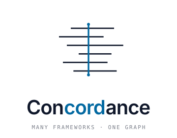
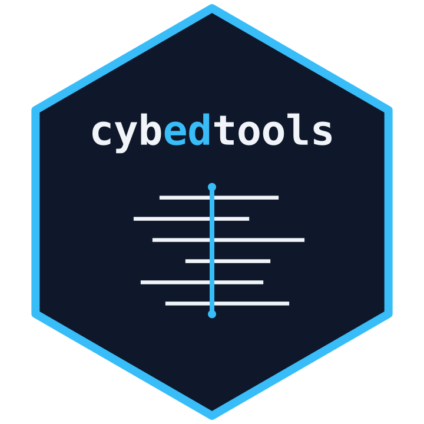
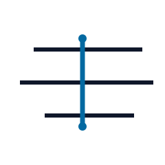

![](data:image/svg+xml;base64,PHN2ZyB4bWxucz0iaHR0cDovL3d3dy53My5vcmcvMjAwMC9zdmciIHN0eWxlPSJkaXNwbGF5Om5vbmUiIGFyaWEtaGlkZGVuPSJ0cnVlIj4KCiAgPHN5bWJvbCBpZD0iaWNvbi13b3JrZm9yY2UiIHZpZXdib3g9IjAgMCAyNCAyNCIgZmlsbD0ibm9uZSIgc3Ryb2tlPSJjdXJyZW50Q29sb3IiIHN0cm9rZS13aWR0aD0iMS42IiBzdHJva2UtbGluZWNhcD0icm91bmQiIHN0cm9rZS1saW5lam9pbj0icm91bmQiPgoKICAgIDx0aXRsZT5Xb3JrZm9yY2U8L3RpdGxlPgoKICAgIDxyZWN0IHg9IjMiIHk9IjgiIHdpZHRoPSIxOCIgaGVpZ2h0PSIxMiIgcng9IjEuNSIgLz4KCiAgICA8cGF0aCBkPSJNOSA4IFY2IFE5IDUgMTAgNSBIMTQgUTE1IDUgMTUgNiBWOCIgLz4KCiAgICA8bGluZSB4MT0iMyIgeTE9IjEzLjUiIHgyPSIyMSIgeTI9IjEzLjUiPjwvbGluZT4KCiAgICA8cmVjdCB4PSIxMSIgeT0iMTIuNiIgd2lkdGg9IjIiIGhlaWdodD0iMS44IiByeD0iMC4zIiBmaWxsPSJjdXJyZW50Q29sb3IiIHN0cm9rZT0ibm9uZSIgLz4KCiAgPC9zeW1ib2w+CgoKCiAgPHN5bWJvbCBpZD0iaWNvbi1wZWRhZ29neSIgdmlld2JveD0iMCAwIDI0IDI0IiBmaWxsPSJub25lIiBzdHJva2U9ImN1cnJlbnRDb2xvciIgc3Ryb2tlLXdpZHRoPSIxLjYiIHN0cm9rZS1saW5lY2FwPSJyb3VuZCIgc3Ryb2tlLWxpbmVqb2luPSJyb3VuZCI+CgogICAgPHRpdGxlPlBlZGFnb2d5PC90aXRsZT4KCiAgICA8cGF0aCBkPSJNMiA5IEwxMiA0LjUgTDIyIDkgTDEyIDEzLjUgWiIgLz4KCiAgICA8cGF0aCBkPSJNOCAxMi41IFE4IDE2LjUgMTIgMTYuNSBRMTYgMTYuNSAxNiAxMi41IiAvPgoKICAgIDxwYXRoIGQ9Ik0yMiA5IFYxNCIgLz4KCiAgICA8Y2lyY2xlIGN4PSIyMiIgY3k9IjE0LjgiIHI9IjEiIGZpbGw9ImN1cnJlbnRDb2xvciIgc3Ryb2tlPSJub25lIj48L2NpcmNsZT4KCiAgPC9zeW1ib2w+CgoKCiAgPHN5bWJvbCBpZD0iaWNvbi11cyIgdmlld2JveD0iMCAwIDI0IDI0IiBmaWxsPSJub25lIiBzdHJva2U9ImN1cnJlbnRDb2xvciIgc3Ryb2tlLXdpZHRoPSIxLjYiIHN0cm9rZS1saW5lY2FwPSJyb3VuZCIgc3Ryb2tlLWxpbmVqb2luPSJyb3VuZCI+CgogICAgPHRpdGxlPlVTPC90aXRsZT4KCiAgICA8cmVjdCB4PSIzIiB5PSI2IiB3aWR0aD0iMTgiIGhlaWdodD0iMTIiIHJ4PSIxIiAvPgoKICAgIDxsaW5lIHgxPSIzIiB5MT0iMTAiIHgyPSIyMSIgeTI9IjEwIj48L2xpbmU+CgogICAgPGxpbmUgeDE9IjMiIHkxPSIxNCIgeDI9IjIxIiB5Mj0iMTQiPjwvbGluZT4KCiAgICA8cmVjdCB4PSIzIiB5PSI2IiB3aWR0aD0iNy41IiBoZWlnaHQ9IjUiIGZpbGw9ImN1cnJlbnRDb2xvciIgb3BhY2l0eT0iMC4yIiBzdHJva2U9Im5vbmUiIC8+CgogIDwvc3ltYm9sPgoKCgogIDxzeW1ib2wgaWQ9Imljb24tZXUiIHZpZXdib3g9IjAgMCAyNCAyNCIgZmlsbD0ibm9uZSIgc3Ryb2tlPSJjdXJyZW50Q29sb3IiIHN0cm9rZS13aWR0aD0iMS42Ij4KCiAgICA8dGl0bGU+RVU8L3RpdGxlPgoKICAgIDxjaXJjbGUgY3g9IjEyIiBjeT0iMTIiIHI9IjkiPjwvY2lyY2xlPgoKICAgIDxjaXJjbGUgY3g9IjEyIiBjeT0iNSIgcj0iMSIgZmlsbD0iY3VycmVudENvbG9yIj48L2NpcmNsZT4KCiAgICA8Y2lyY2xlIGN4PSIxNy42IiBjeT0iOC41IiByPSIxIiBmaWxsPSJjdXJyZW50Q29sb3IiPjwvY2lyY2xlPgoKICAgIDxjaXJjbGUgY3g9IjE3LjYiIGN5PSIxNS41IiByPSIxIiBmaWxsPSJjdXJyZW50Q29sb3IiPjwvY2lyY2xlPgoKICAgIDxjaXJjbGUgY3g9IjEyIiBjeT0iMTkiIHI9IjEiIGZpbGw9ImN1cnJlbnRDb2xvciI+PC9jaXJjbGU+CgogICAgPGNpcmNsZSBjeD0iNi40IiBjeT0iMTUuNSIgcj0iMSIgZmlsbD0iY3VycmVudENvbG9yIj48L2NpcmNsZT4KCiAgICA8Y2lyY2xlIGN4PSI2LjQiIGN5PSI4LjUiIHI9IjEiIGZpbGw9ImN1cnJlbnRDb2xvciI+PC9jaXJjbGU+CgogIDwvc3ltYm9sPgoKCgogIDxzeW1ib2wgaWQ9Imljb24tY3oiIHZpZXdib3g9IjAgMCAyNCAyNCIgZmlsbD0ibm9uZSIgc3Ryb2tlPSJjdXJyZW50Q29sb3IiIHN0cm9rZS13aWR0aD0iMS42IiBzdHJva2UtbGluZWNhcD0icm91bmQiIHN0cm9rZS1saW5lam9pbj0icm91bmQiPgoKICAgIDx0aXRsZT5DWjwvdGl0bGU+CgogICAgPHJlY3QgeD0iMyIgeT0iNiIgd2lkdGg9IjE4IiBoZWlnaHQ9IjEyIiByeD0iMSIgLz4KCiAgICA8bGluZSB4MT0iMTEiIHkxPSIxMiIgeDI9IjIxIiB5Mj0iMTIiPjwvbGluZT4KCiAgICA8cGF0aCBkPSJNMyA2IEwxMSAxMiBMMyAxOCBaIiBmaWxsPSJjdXJyZW50Q29sb3IiIG9wYWNpdHk9IjAuMiIgc3Ryb2tlPSJub25lIiAvPgoKICAgIDxwYXRoIGQ9Ik0zIDYgTDExIDEyIEwzIDE4IiAvPgoKICA8L3N5bWJvbD4KCgoKICA8c3ltYm9sIGlkPSJpY29uLWNhIiB2aWV3Ym94PSIwIDAgMjQgMjQiIGZpbGw9Im5vbmUiIHN0cm9rZT0iY3VycmVudENvbG9yIiBzdHJva2Utd2lkdGg9IjEuNiIgc3Ryb2tlLWxpbmVjYXA9InJvdW5kIiBzdHJva2UtbGluZWpvaW49InJvdW5kIj4KCiAgICA8dGl0bGU+Q0E8L3RpdGxlPgoKICAgIDxyZWN0IHg9IjMiIHk9IjYiIHdpZHRoPSIxOCIgaGVpZ2h0PSIxMiIgcng9IjEiIC8+CgogICAgPGxpbmUgeDE9IjgiIHkxPSI2IiB4Mj0iOCIgeTI9IjE4Ij48L2xpbmU+CgogICAgPGxpbmUgeDE9IjE2IiB5MT0iNiIgeDI9IjE2IiB5Mj0iMTgiPjwvbGluZT4KCiAgICA8cmVjdCB4PSIzIiB5PSI2IiB3aWR0aD0iNSIgaGVpZ2h0PSIxMiIgZmlsbD0iY3VycmVudENvbG9yIiBvcGFjaXR5PSIwLjIiIHN0cm9rZT0ibm9uZSIgLz4KCiAgICA8cmVjdCB4PSIxNiIgeT0iNiIgd2lkdGg9IjUiIGhlaWdodD0iMTIiIGZpbGw9ImN1cnJlbnRDb2xvciIgb3BhY2l0eT0iMC4yIiBzdHJva2U9Im5vbmUiIC8+CgogICAgPHBhdGggZD0iTTEyIDkgTDEzIDExLjIgTDE0LjYgMTAuNiBMMTQgMTIuNCBMMTUuNiAxMi42IEwxMi44IDE0LjIgTDEzLjEgMTUgTDExIDE0LjcgTDEwLjkgMTUgTDEwLjcgMTQuNyBMOC42IDE1IEw4LjkgMTQuMiBMNi4xIDEyLjYgTDcuNyAxMi40IEw3LjEgMTAuNiBMOC43IDExLjIgWiIgZmlsbD0iY3VycmVudENvbG9yIiBzdHJva2U9Im5vbmUiIC8+CgogIDwvc3ltYm9sPgoKCgogIDxzeW1ib2wgaWQ9Imljb24tc2ciIHZpZXdib3g9IjAgMCAyNCAyNCIgZmlsbD0ibm9uZSIgc3Ryb2tlPSJjdXJyZW50Q29sb3IiIHN0cm9rZS13aWR0aD0iMS42IiBzdHJva2UtbGluZWNhcD0icm91bmQiIHN0cm9rZS1saW5lam9pbj0icm91bmQiPgoKICAgIDx0aXRsZT5TRzwvdGl0bGU+CgogICAgPHJlY3QgeD0iMyIgeT0iNiIgd2lkdGg9IjE4IiBoZWlnaHQ9IjEyIiByeD0iMSIgLz4KCiAgICA8bGluZSB4MT0iMyIgeTE9IjEyIiB4Mj0iMjEiIHkyPSIxMiI+PC9saW5lPgoKICAgIDxyZWN0IHg9IjMiIHk9IjYiIHdpZHRoPSIxOCIgaGVpZ2h0PSI2IiBmaWxsPSJjdXJyZW50Q29sb3IiIG9wYWNpdHk9IjAuMiIgc3Ryb2tlPSJub25lIiAvPgoKICAgIDxwYXRoIGQ9Ik05LjYgOC4xIEEyLjYgMi42IDAgMSAwIDkuNiAxMS45IEEyIDIgMCAxIDEgOS42IDguMSBaIiBmaWxsPSJjdXJyZW50Q29sb3IiIHN0cm9rZT0ibm9uZSIgLz4KCiAgICA8Y2lyY2xlIGN4PSIxMy4yIiBjeT0iOC4zIiByPSIwLjYiIGZpbGw9ImN1cnJlbnRDb2xvciIgc3Ryb2tlPSJub25lIj48L2NpcmNsZT4KCiAgICA8Y2lyY2xlIGN4PSIxNS40IiBjeT0iOC4zIiByPSIwLjYiIGZpbGw9ImN1cnJlbnRDb2xvciIgc3Ryb2tlPSJub25lIj48L2NpcmNsZT4KCiAgICA8Y2lyY2xlIGN4PSIxMi41IiBjeT0iMTAuMiIgcj0iMC42IiBmaWxsPSJjdXJyZW50Q29sb3IiIHN0cm9rZT0ibm9uZSI+PC9jaXJjbGU+CgogICAgPGNpcmNsZSBjeD0iMTYuMSIgY3k9IjEwLjIiIHI9IjAuNiIgZmlsbD0iY3VycmVudENvbG9yIiBzdHJva2U9Im5vbmUiPjwvY2lyY2xlPgoKICAgIDxjaXJjbGUgY3g9IjE0LjMiIGN5PSIxMS4zIiByPSIwLjYiIGZpbGw9ImN1cnJlbnRDb2xvciIgc3Ryb2tlPSJub25lIj48L2NpcmNsZT4KCiAgPC9zeW1ib2w+CgoKCiAgPHN5bWJvbCBpZD0iaWNvbi1nbG9iYWwiIHZpZXdib3g9IjAgMCAyNCAyNCIgZmlsbD0ibm9uZSIgc3Ryb2tlPSJjdXJyZW50Q29sb3IiIHN0cm9rZS13aWR0aD0iMS42IiBzdHJva2UtbGluZWNhcD0icm91bmQiIHN0cm9rZS1saW5lam9pbj0icm91bmQiPgoKICAgIDx0aXRsZT5HbG9iYWw8L3RpdGxlPgoKICAgIDxjaXJjbGUgY3g9IjEyIiBjeT0iMTIiIHI9IjkiPjwvY2lyY2xlPgoKICAgIDxlbGxpcHNlIGN4PSIxMiIgY3k9IjEyIiByeD0iOSIgcnk9IjMuNCI+PC9lbGxpcHNlPgoKICAgIDxsaW5lIHgxPSIxMiIgeTE9IjMiIHgyPSIxMiIgeTI9IjIxIj48L2xpbmU+CgogIDwvc3ltYm9sPgoKCgogIDxzeW1ib2wgaWQ9Imljb24tYXJjaGl2ZSIgdmlld2JveD0iMCAwIDI0IDI0IiBmaWxsPSJub25lIiBzdHJva2U9ImN1cnJlbnRDb2xvciIgc3Ryb2tlLXdpZHRoPSIxLjYiIHN0cm9rZS1saW5lY2FwPSJyb3VuZCIgc3Ryb2tlLWxpbmVqb2luPSJyb3VuZCI+CgogICAgPHRpdGxlPlNvdXJjZTwvdGl0bGU+CgogICAgPHJlY3QgeD0iMyIgeT0iNCIgd2lkdGg9IjE4IiBoZWlnaHQ9IjQiIHJ4PSIxIiAvPgoKICAgIDxwYXRoIGQ9Ik01IDggVjIwIFE1IDIxIDYgMjEgSDE4IFExOSAyMSAxOSAyMCBWOCIgLz4KCiAgICA8bGluZSB4MT0iMTAiIHkxPSIxMyIgeDI9IjE0IiB5Mj0iMTMiPjwvbGluZT4KCiAgPC9zeW1ib2w+CgoKCiAgPHN5bWJvbCBpZD0iaWNvbi1nZWFyIiB2aWV3Ym94PSIwIDAgMjQgMjQiIGZpbGw9Im5vbmUiIHN0cm9rZT0iY3VycmVudENvbG9yIiBzdHJva2Utd2lkdGg9IjEuNiIgc3Ryb2tlLWxpbmVjYXA9InJvdW5kIiBzdHJva2UtbGluZWpvaW49InJvdW5kIj4KCiAgICA8dGl0bGU+SW5nZXN0aW9uPC90aXRsZT4KCiAgICA8Y2lyY2xlIGN4PSIxMiIgY3k9IjEyIiByPSIzLjUiPjwvY2lyY2xlPgoKICAgIDxsaW5lIHgxPSIxMiIgeTE9IjIiIHgyPSIxMiIgeTI9IjUiPjwvbGluZT4KCiAgICA8bGluZSB4MT0iMTIiIHkxPSIxOSIgeDI9IjEyIiB5Mj0iMjIiPjwvbGluZT4KCiAgICA8bGluZSB4MT0iMjIiIHkxPSIxMiIgeDI9IjE5IiB5Mj0iMTIiPjwvbGluZT4KCiAgICA8bGluZSB4MT0iNSIgeTE9IjEyIiB4Mj0iMiIgeTI9IjEyIj48L2xpbmU+CgogICAgPGxpbmUgeDE9IjE5LjA3IiB5MT0iNC45MyIgeDI9IjE3IiB5Mj0iNyI+PC9saW5lPgoKICAgIDxsaW5lIHgxPSI3IiB5MT0iMTciIHgyPSI0LjkzIiB5Mj0iMTkuMDciPjwvbGluZT4KCiAgICA8bGluZSB4MT0iMTkuMDciIHkxPSIxOS4wNyIgeDI9IjE3IiB5Mj0iMTciPjwvbGluZT4KCiAgICA8bGluZSB4MT0iNyIgeTE9IjciIHgyPSI0LjkzIiB5Mj0iNC45MyI+PC9saW5lPgoKICA8L3N5bWJvbD4KCgoKICA8c3ltYm9sIGlkPSJpY29uLWxpY2Vuc2UiIHZpZXdib3g9IjAgMCAyNCAyNCIgZmlsbD0ibm9uZSIgc3Ryb2tlPSJjdXJyZW50Q29sb3IiIHN0cm9rZS13aWR0aD0iMS42IiBzdHJva2UtbGluZWNhcD0icm91bmQiIHN0cm9rZS1saW5lam9pbj0icm91bmQiPgoKICAgIDx0aXRsZT5MaWNlbnNlPC90aXRsZT4KCiAgICA8cGF0aCBkPSJNMTIgMyBMMjAgNiBWMTIgUTIwIDE3IDEyIDIxIFE0IDE3IDQgMTIgVjYgWiIgLz4KCiAgICA8cmVjdCB4PSI5IiB5PSIxMSIgd2lkdGg9IjYiIGhlaWdodD0iNSIgcng9IjAuNiIgLz4KCiAgICA8cGF0aCBkPSJNMTAuNSAxMSBWOSBRMTAuNSA3LjUgMTIgNy41IFExMy41IDcuNSAxMy41IDkgVjExIiAvPgoKICA8L3N5bWJvbD4KCgoKICA8c3ltYm9sIGlkPSJpY29uLXNhIiB2aWV3Ym94PSIwIDAgMjQgMjQiIGZpbGw9Im5vbmUiIHN0cm9rZT0iY3VycmVudENvbG9yIiBzdHJva2Utd2lkdGg9IjEuNiIgc3Ryb2tlLWxpbmVjYXA9InJvdW5kIiBzdHJva2UtbGluZWpvaW49InJvdW5kIj4KCiAgICA8dGl0bGU+U0E8L3RpdGxlPgoKICAgIDxyZWN0IHg9IjMiIHk9IjYiIHdpZHRoPSIxOCIgaGVpZ2h0PSIxMiIgcng9IjEiIC8+CgogICAgPHJlY3QgeD0iMyIgeT0iNiIgd2lkdGg9IjE4IiBoZWlnaHQ9IjEyIiBmaWxsPSJjdXJyZW50Q29sb3IiIG9wYWNpdHk9IjAuMiIgc3Ryb2tlPSJub25lIiAvPgoKICAgIDxsaW5lIHgxPSI3IiB5MT0iMTIiIHgyPSIxNyIgeTI9IjEyIj48L2xpbmU+CgogICAgPGxpbmUgeDE9IjE0IiB5MT0iOSIgeDI9IjE3IiB5Mj0iMTIiPjwvbGluZT4KCiAgICA8bGluZSB4MT0iMTQiIHkxPSIxNSIgeDI9IjE3IiB5Mj0iMTIiPjwvbGluZT4KCiAgPC9zeW1ib2w+CgoKCiAgPHN5bWJvbCBpZD0iaWNvbi11ayIgdmlld2JveD0iMCAwIDI0IDI0IiBmaWxsPSJub25lIiBzdHJva2U9ImN1cnJlbnRDb2xvciIgc3Ryb2tlLXdpZHRoPSIxLjYiIHN0cm9rZS1saW5lY2FwPSJyb3VuZCIgc3Ryb2tlLWxpbmVqb2luPSJyb3VuZCI+CgogICAgPHRpdGxlPlVLPC90aXRsZT4KCiAgICA8cmVjdCB4PSIzIiB5PSI2IiB3aWR0aD0iMTgiIGhlaWdodD0iMTIiIHJ4PSIxIiAvPgoKICAgIDxsaW5lIHgxPSIzIiB5MT0iNiIgeDI9IjIxIiB5Mj0iMTgiPjwvbGluZT4KCiAgICA8bGluZSB4MT0iMjEiIHkxPSI2IiB4Mj0iMyIgeTI9IjE4Ij48L2xpbmU+CgogICAgPGxpbmUgeDE9IjEyIiB5MT0iNiIgeDI9IjEyIiB5Mj0iMTgiPjwvbGluZT4KCiAgICA8bGluZSB4MT0iMyIgeTE9IjEyIiB4Mj0iMjEiIHkyPSIxMiI+PC9saW5lPgoKICA8L3N5bWJvbD4KCgoKPC9zdmc+)

# About Concordance

What this site is, how it relates to the cybedtools R package, and how to cite it

[](assets/branding/concordance-lockup-stacked-paper.svg)

What this site is, how it relates to the cybedtools R package, and how to cite it.

## What this is

The Cybersecurity Framework Concordance is the audience-facing surface for the [cybedtools R package](https://github.com/ryanstraight/cybedtools). cybedtools ingests, parses, and queries a corpus of cybersecurity workforce and learning frameworks under a shared semantic schema. This site renders the framework data, the cross-framework comparisons, and the working scenarios in a form that does not require running R.

The two carry related but distinct identities. cybedtools is the methodology engine. Concordance is what readers see and cite.

## How it relates to cybedtools

|  | cybedtools | Concordance |
|----|----|----|
| Form | R package | Quarto subsite |
| Audience | Researchers, methodology collaborators | K-12 teachers, curriculum coordinators, workforce-policy analysts |
| Distribution | GitHub plus Zenodo, install via `remotes::install_github` | Static HTML, deployed to gh-pages |
| License | MIT | Content CC BY 4.0, code MIT |
| Canonical citation | `citation("cybedtools")` from R, or [`CITATION.cff`](https://github.com/ryanstraight/cybedtools/blob/main/CITATION.cff) | this site (see below) |

Every number, table, and lookup widget on this site is derived from the same package the methodology documents.

## Install cybedtools

``` r
# Option A: remotes
install.packages("remotes")
remotes::install_github("ryanstraight/cybedtools")

# Option B: pak (faster on first install)
install.packages("pak")
pak::pkg_install("ryanstraight/cybedtools")
```

The package depends on `rdflib`, `jsonlite`, `dplyr`, `purrr`, and `tibble`. See [Start](start/install.llms.md) for the full staging pipeline (framework source data, ingestion, graph assembly, query loading).

## How to cite

[](assets/branding/cybedtools-hex-slate.svg)

If your work references the methodology, the R package, or any element-level analysis behind the figures on this site, cite the package. The 0.3.0 version, for example:

    Straight, R. (2026). cybedtools: Comparison and querying of cybersecurity
    workforce and learning frameworks. R package version 0.3.0.
    https://doi.org/10.5281/zenodo.20076116

[](assets/branding/concordance-mark-mini-paper.svg)

If your work references Concordance itself (a specific worked scenario, a lookup widget, audience-facing prose, or the persona pages), cite the site:

    Straight, R. (2026). Cybersecurity Framework Concordance.
    https://ryanstraight.github.io/cybedtools/concordance/

The Zenodo DOI [10.5281/zenodo.20076116](https://doi.org/10.5281/zenodo.20076116) is a *concept DOI*: it resolves to the latest released version of the package and persists across all subsequent versions. Per-version DOIs are minted automatically when each release is tagged on GitHub.

## Author

Ryan Straight, Assistant Professor, College of Information Science, University of Arizona. ORCID: [0000-0002-6251-5662](https://orcid.org/0000-0002-6251-5662).

## Acknowledgments

The frameworks displayed on this site are the work of their respective authoring communities. cybedtools represents them under the layered licensing terms named on each framework’s page. The package’s design owes substantive intellectual debt to:

- The NICE program at NIST for the Workforce Framework for Cybersecurity (SP 800-181 Rev 1).
- The DoD Chief Information Officer for the DoD Cyber Workforce Framework v5.1.
- The European Union Agency for Cybersecurity (ENISA) for the European Cybersecurity Skills Framework v1.
- The SFIA Foundation for SFIA 9.
- The Cyber Innovation Center and the Cyber.org K-12 standards team for the K-12 Cybersecurity Learning Standards.
- The Computer Science Teachers Association for the K-12 CS Standards (Rev 2017).
- The ACM, IEEE-CS, AIS SIGSEC, and IFIP WG 11.8 Joint Task Force for CSEC2017.
- Cosgrove and Cachia (Joint Research Centre, European Commission) for DigComp 3.0, building on the original framework authored by Vuorikari, Kluzer, and Punie.

Three frameworks are here on their stewards’ terms. Two of them gave written permission, and the Canadian framework is referenced as its steward asked. Each asked to be credited in a particular way.

- CyQUAL, the Czech national cybersecurity qualifications framework, developed at Masaryk University. Open data, version 1.2.0, <https://platform.cyqual.cz/>. Thanks to the CyQUAL team for confirming the open-data terms and for repairing the export so it could be used.
- Canadian Centre for Cyber Security, The Canadian Cyber Security Skills Framework (ITSM.00.039), 2022 edition. Copyright Government of Canada. Used with permission of the Canadian Centre for Cyber Security. Thanks to the Centre’s Cyber Skills Development Team for supplying the full framework with its annexes.
- Derived from the Operational Technology Cybersecurity Competency Framework (OTCCF), published by the Cyber Security Agency of Singapore (CSA). Available at: https://www.csa.gov.sg/resources/publications/operational-technology-cybersecurity-competency-framework–otccf-/

CSA’s permission covers the OTCCF’s structure, for non-commercial, academic and research use. This site shows OTCCF roles, skills, levels, and mappings, and does not reproduce its statement text. Terms for all three are in the package’s [LICENSING](https://github.com/ryanstraight/cybedtools/blob/main/LICENSING.md) file.

## AI disclosure

The development and delivery of both cybedtools and Concordance was substantially accelerated by Anthropic’s Claude Code, under the author’s direction.

## License

This site carries layered licensing. Site content (prose, scenarios, query interpretations) is under [Creative Commons Attribution 4.0 International (CC BY 4.0)](https://creativecommons.org/licenses/by/4.0/). Site source code (R, Quarto, SCSS, JavaScript, SVG) is under the [MIT License](https://opensource.org/license/MIT). Framework source data retains its upstream license per framework. Full terms in [LICENSE](LICENSE.llms.md).

## Source and contributions

- Repository: [github.com/ryanstraight/cybedtools](https://github.com/ryanstraight/cybedtools)
- Issues and feature requests: [GitHub issues](https://github.com/ryanstraight/cybedtools/issues)
- Concept DOI: [10.5281/zenodo.20076116](https://doi.org/10.5281/zenodo.20076116)
- Code of conduct: [CODE_OF_CONDUCT.md](https://github.com/ryanstraight/cybedtools/blob/main/CODE_OF_CONDUCT.md)

Back to top
