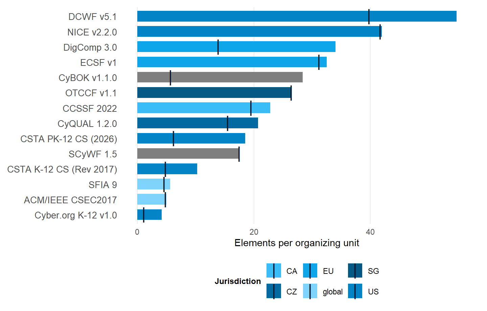

![](data:image/svg+xml;base64,PHN2ZyB4bWxucz0iaHR0cDovL3d3dy53My5vcmcvMjAwMC9zdmciIHN0eWxlPSJkaXNwbGF5Om5vbmUiIGFyaWEtaGlkZGVuPSJ0cnVlIj48c3ltYm9sIGlkPSJpY29uLXdvcmtmb3JjZSIgdmlld2JveD0iMCAwIDI0IDI0IiBmaWxsPSJub25lIiBzdHJva2U9ImN1cnJlbnRDb2xvciIgc3Ryb2tlLXdpZHRoPSIxLjYiIHN0cm9rZS1saW5lY2FwPSJyb3VuZCIgc3Ryb2tlLWxpbmVqb2luPSJyb3VuZCI+PHRpdGxlPldvcmtmb3JjZTwvdGl0bGU+CjxyZWN0IHg9IjMiIHk9IjgiIHdpZHRoPSIxOCIgaGVpZ2h0PSIxMiIgcng9IjEuNSIgLz48cGF0aCBkPSJNOSA4IFY2IFE5IDUgMTAgNSBIMTQgUTE1IDUgMTUgNiBWOCIgLz48bGluZSB4MT0iMyIgeTE9IjEzLjUiIHgyPSIyMSIgeTI9IjEzLjUiPjwvbGluZT48cmVjdCB4PSIxMSIgeT0iMTIuNiIgd2lkdGg9IjIiIGhlaWdodD0iMS44IiByeD0iMC4zIiBmaWxsPSJjdXJyZW50Q29sb3IiIHN0cm9rZT0ibm9uZSIgLz48L3N5bWJvbD48c3ltYm9sIGlkPSJpY29uLXBlZGFnb2d5IiB2aWV3Ym94PSIwIDAgMjQgMjQiIGZpbGw9Im5vbmUiIHN0cm9rZT0iY3VycmVudENvbG9yIiBzdHJva2Utd2lkdGg9IjEuNiIgc3Ryb2tlLWxpbmVjYXA9InJvdW5kIiBzdHJva2UtbGluZWpvaW49InJvdW5kIj48dGl0bGU+UGVkYWdvZ3k8L3RpdGxlPgo8cGF0aCBkPSJNMiA5IEwxMiA0LjUgTDIyIDkgTDEyIDEzLjUgWiIgLz48cGF0aCBkPSJNOCAxMi41IFE4IDE2LjUgMTIgMTYuNSBRMTYgMTYuNSAxNiAxMi41IiAvPjxwYXRoIGQ9Ik0yMiA5IFYxNCIgLz48Y2lyY2xlIGN4PSIyMiIgY3k9IjE0LjgiIHI9IjEiIGZpbGw9ImN1cnJlbnRDb2xvciIgc3Ryb2tlPSJub25lIj48L2NpcmNsZT48L3N5bWJvbD48c3ltYm9sIGlkPSJpY29uLXVzIiB2aWV3Ym94PSIwIDAgMjQgMjQiIGZpbGw9Im5vbmUiIHN0cm9rZT0iY3VycmVudENvbG9yIiBzdHJva2Utd2lkdGg9IjEuNiIgc3Ryb2tlLWxpbmVjYXA9InJvdW5kIiBzdHJva2UtbGluZWpvaW49InJvdW5kIj48dGl0bGU+VVM8L3RpdGxlPgo8cmVjdCB4PSIzIiB5PSI2IiB3aWR0aD0iMTgiIGhlaWdodD0iMTIiIHJ4PSIxIiAvPjxsaW5lIHgxPSIzIiB5MT0iMTAiIHgyPSIyMSIgeTI9IjEwIj48L2xpbmU+PGxpbmUgeDE9IjMiIHkxPSIxNCIgeDI9IjIxIiB5Mj0iMTQiPjwvbGluZT48cmVjdCB4PSIzIiB5PSI2IiB3aWR0aD0iNy41IiBoZWlnaHQ9IjUiIGZpbGw9ImN1cnJlbnRDb2xvciIgb3BhY2l0eT0iMC4yIiBzdHJva2U9Im5vbmUiIC8+PC9zeW1ib2w+PHN5bWJvbCBpZD0iaWNvbi1ldSIgdmlld2JveD0iMCAwIDI0IDI0IiBmaWxsPSJub25lIiBzdHJva2U9ImN1cnJlbnRDb2xvciIgc3Ryb2tlLXdpZHRoPSIxLjYiPjx0aXRsZT5FVTwvdGl0bGU+CjxjaXJjbGUgY3g9IjEyIiBjeT0iMTIiIHI9IjkiPjwvY2lyY2xlPjxjaXJjbGUgY3g9IjEyIiBjeT0iNSIgcj0iMSIgZmlsbD0iY3VycmVudENvbG9yIj48L2NpcmNsZT48Y2lyY2xlIGN4PSIxNy42IiBjeT0iOC41IiByPSIxIiBmaWxsPSJjdXJyZW50Q29sb3IiPjwvY2lyY2xlPjxjaXJjbGUgY3g9IjE3LjYiIGN5PSIxNS41IiByPSIxIiBmaWxsPSJjdXJyZW50Q29sb3IiPjwvY2lyY2xlPjxjaXJjbGUgY3g9IjEyIiBjeT0iMTkiIHI9IjEiIGZpbGw9ImN1cnJlbnRDb2xvciI+PC9jaXJjbGU+PGNpcmNsZSBjeD0iNi40IiBjeT0iMTUuNSIgcj0iMSIgZmlsbD0iY3VycmVudENvbG9yIj48L2NpcmNsZT48Y2lyY2xlIGN4PSI2LjQiIGN5PSI4LjUiIHI9IjEiIGZpbGw9ImN1cnJlbnRDb2xvciI+PC9jaXJjbGU+PC9zeW1ib2w+PHN5bWJvbCBpZD0iaWNvbi1jeiIgdmlld2JveD0iMCAwIDI0IDI0IiBmaWxsPSJub25lIiBzdHJva2U9ImN1cnJlbnRDb2xvciIgc3Ryb2tlLXdpZHRoPSIxLjYiIHN0cm9rZS1saW5lY2FwPSJyb3VuZCIgc3Ryb2tlLWxpbmVqb2luPSJyb3VuZCI+PHRpdGxlPkNaPC90aXRsZT4KPHJlY3QgeD0iMyIgeT0iNiIgd2lkdGg9IjE4IiBoZWlnaHQ9IjEyIiByeD0iMSIgLz48bGluZSB4MT0iMTEiIHkxPSIxMiIgeDI9IjIxIiB5Mj0iMTIiPjwvbGluZT48cGF0aCBkPSJNMyA2IEwxMSAxMiBMMyAxOCBaIiBmaWxsPSJjdXJyZW50Q29sb3IiIG9wYWNpdHk9IjAuMiIgc3Ryb2tlPSJub25lIiAvPjxwYXRoIGQ9Ik0zIDYgTDExIDEyIEwzIDE4IiAvPjwvc3ltYm9sPjxzeW1ib2wgaWQ9Imljb24tY2EiIHZpZXdib3g9IjAgMCAyNCAyNCIgZmlsbD0ibm9uZSIgc3Ryb2tlPSJjdXJyZW50Q29sb3IiIHN0cm9rZS13aWR0aD0iMS42IiBzdHJva2UtbGluZWNhcD0icm91bmQiIHN0cm9rZS1saW5lam9pbj0icm91bmQiPjx0aXRsZT5DQTwvdGl0bGU+CjxyZWN0IHg9IjMiIHk9IjYiIHdpZHRoPSIxOCIgaGVpZ2h0PSIxMiIgcng9IjEiIC8+PGxpbmUgeDE9IjgiIHkxPSI2IiB4Mj0iOCIgeTI9IjE4Ij48L2xpbmU+PGxpbmUgeDE9IjE2IiB5MT0iNiIgeDI9IjE2IiB5Mj0iMTgiPjwvbGluZT48cmVjdCB4PSIzIiB5PSI2IiB3aWR0aD0iNSIgaGVpZ2h0PSIxMiIgZmlsbD0iY3VycmVudENvbG9yIiBvcGFjaXR5PSIwLjIiIHN0cm9rZT0ibm9uZSIgLz48cmVjdCB4PSIxNiIgeT0iNiIgd2lkdGg9IjUiIGhlaWdodD0iMTIiIGZpbGw9ImN1cnJlbnRDb2xvciIgb3BhY2l0eT0iMC4yIiBzdHJva2U9Im5vbmUiIC8+PHBhdGggZD0iTTEyIDkgTDEzIDExLjIgTDE0LjYgMTAuNiBMMTQgMTIuNCBMMTUuNiAxMi42IEwxMi44IDE0LjIgTDEzLjEgMTUgTDExIDE0LjcgTDEwLjkgMTUgTDEwLjcgMTQuNyBMOC42IDE1IEw4LjkgMTQuMiBMNi4xIDEyLjYgTDcuNyAxMi40IEw3LjEgMTAuNiBMOC43IDExLjIgWiIgZmlsbD0iY3VycmVudENvbG9yIiBzdHJva2U9Im5vbmUiIC8+PC9zeW1ib2w+PHN5bWJvbCBpZD0iaWNvbi1zZyIgdmlld2JveD0iMCAwIDI0IDI0IiBmaWxsPSJub25lIiBzdHJva2U9ImN1cnJlbnRDb2xvciIgc3Ryb2tlLXdpZHRoPSIxLjYiIHN0cm9rZS1saW5lY2FwPSJyb3VuZCIgc3Ryb2tlLWxpbmVqb2luPSJyb3VuZCI+PHRpdGxlPlNHPC90aXRsZT4KPHJlY3QgeD0iMyIgeT0iNiIgd2lkdGg9IjE4IiBoZWlnaHQ9IjEyIiByeD0iMSIgLz48bGluZSB4MT0iMyIgeTE9IjEyIiB4Mj0iMjEiIHkyPSIxMiI+PC9saW5lPjxyZWN0IHg9IjMiIHk9IjYiIHdpZHRoPSIxOCIgaGVpZ2h0PSI2IiBmaWxsPSJjdXJyZW50Q29sb3IiIG9wYWNpdHk9IjAuMiIgc3Ryb2tlPSJub25lIiAvPjxwYXRoIGQ9Ik05LjYgOC4xIEEyLjYgMi42IDAgMSAwIDkuNiAxMS45IEEyIDIgMCAxIDEgOS42IDguMSBaIiBmaWxsPSJjdXJyZW50Q29sb3IiIHN0cm9rZT0ibm9uZSIgLz48Y2lyY2xlIGN4PSIxMy4yIiBjeT0iOC4zIiByPSIwLjYiIGZpbGw9ImN1cnJlbnRDb2xvciIgc3Ryb2tlPSJub25lIj48L2NpcmNsZT48Y2lyY2xlIGN4PSIxNS40IiBjeT0iOC4zIiByPSIwLjYiIGZpbGw9ImN1cnJlbnRDb2xvciIgc3Ryb2tlPSJub25lIj48L2NpcmNsZT48Y2lyY2xlIGN4PSIxMi41IiBjeT0iMTAuMiIgcj0iMC42IiBmaWxsPSJjdXJyZW50Q29sb3IiIHN0cm9rZT0ibm9uZSI+PC9jaXJjbGU+PGNpcmNsZSBjeD0iMTYuMSIgY3k9IjEwLjIiIHI9IjAuNiIgZmlsbD0iY3VycmVudENvbG9yIiBzdHJva2U9Im5vbmUiPjwvY2lyY2xlPjxjaXJjbGUgY3g9IjE0LjMiIGN5PSIxMS4zIiByPSIwLjYiIGZpbGw9ImN1cnJlbnRDb2xvciIgc3Ryb2tlPSJub25lIj48L2NpcmNsZT48L3N5bWJvbD48c3ltYm9sIGlkPSJpY29uLWdsb2JhbCIgdmlld2JveD0iMCAwIDI0IDI0IiBmaWxsPSJub25lIiBzdHJva2U9ImN1cnJlbnRDb2xvciIgc3Ryb2tlLXdpZHRoPSIxLjYiIHN0cm9rZS1saW5lY2FwPSJyb3VuZCIgc3Ryb2tlLWxpbmVqb2luPSJyb3VuZCI+PHRpdGxlPkdsb2JhbDwvdGl0bGU+CjxjaXJjbGUgY3g9IjEyIiBjeT0iMTIiIHI9IjkiPjwvY2lyY2xlPjxlbGxpcHNlIGN4PSIxMiIgY3k9IjEyIiByeD0iOSIgcnk9IjMuNCI+PC9lbGxpcHNlPjxsaW5lIHgxPSIxMiIgeTE9IjMiIHgyPSIxMiIgeTI9IjIxIj48L2xpbmU+PC9zeW1ib2w+PHN5bWJvbCBpZD0iaWNvbi1hcmNoaXZlIiB2aWV3Ym94PSIwIDAgMjQgMjQiIGZpbGw9Im5vbmUiIHN0cm9rZT0iY3VycmVudENvbG9yIiBzdHJva2Utd2lkdGg9IjEuNiIgc3Ryb2tlLWxpbmVjYXA9InJvdW5kIiBzdHJva2UtbGluZWpvaW49InJvdW5kIj48dGl0bGU+U291cmNlPC90aXRsZT4KPHJlY3QgeD0iMyIgeT0iNCIgd2lkdGg9IjE4IiBoZWlnaHQ9IjQiIHJ4PSIxIiAvPjxwYXRoIGQ9Ik01IDggVjIwIFE1IDIxIDYgMjEgSDE4IFExOSAyMSAxOSAyMCBWOCIgLz48bGluZSB4MT0iMTAiIHkxPSIxMyIgeDI9IjE0IiB5Mj0iMTMiPjwvbGluZT48L3N5bWJvbD48c3ltYm9sIGlkPSJpY29uLWdlYXIiIHZpZXdib3g9IjAgMCAyNCAyNCIgZmlsbD0ibm9uZSIgc3Ryb2tlPSJjdXJyZW50Q29sb3IiIHN0cm9rZS13aWR0aD0iMS42IiBzdHJva2UtbGluZWNhcD0icm91bmQiIHN0cm9rZS1saW5lam9pbj0icm91bmQiPjx0aXRsZT5Jbmdlc3Rpb248L3RpdGxlPgo8Y2lyY2xlIGN4PSIxMiIgY3k9IjEyIiByPSIzLjUiPjwvY2lyY2xlPjxsaW5lIHgxPSIxMiIgeTE9IjIiIHgyPSIxMiIgeTI9IjUiPjwvbGluZT48bGluZSB4MT0iMTIiIHkxPSIxOSIgeDI9IjEyIiB5Mj0iMjIiPjwvbGluZT48bGluZSB4MT0iMjIiIHkxPSIxMiIgeDI9IjE5IiB5Mj0iMTIiPjwvbGluZT48bGluZSB4MT0iNSIgeTE9IjEyIiB4Mj0iMiIgeTI9IjEyIj48L2xpbmU+PGxpbmUgeDE9IjE5LjA3IiB5MT0iNC45MyIgeDI9IjE3IiB5Mj0iNyI+PC9saW5lPjxsaW5lIHgxPSI3IiB5MT0iMTciIHgyPSI0LjkzIiB5Mj0iMTkuMDciPjwvbGluZT48bGluZSB4MT0iMTkuMDciIHkxPSIxOS4wNyIgeDI9IjE3IiB5Mj0iMTciPjwvbGluZT48bGluZSB4MT0iNyIgeTE9IjciIHgyPSI0LjkzIiB5Mj0iNC45MyI+PC9saW5lPjwvc3ltYm9sPjxzeW1ib2wgaWQ9Imljb24tbGljZW5zZSIgdmlld2JveD0iMCAwIDI0IDI0IiBmaWxsPSJub25lIiBzdHJva2U9ImN1cnJlbnRDb2xvciIgc3Ryb2tlLXdpZHRoPSIxLjYiIHN0cm9rZS1saW5lY2FwPSJyb3VuZCIgc3Ryb2tlLWxpbmVqb2luPSJyb3VuZCI+PHRpdGxlPkxpY2Vuc2U8L3RpdGxlPgo8cGF0aCBkPSJNMTIgMyBMMjAgNiBWMTIgUTIwIDE3IDEyIDIxIFE0IDE3IDQgMTIgVjYgWiIgLz48cmVjdCB4PSI5IiB5PSIxMSIgd2lkdGg9IjYiIGhlaWdodD0iNSIgcng9IjAuNiIgLz48cGF0aCBkPSJNMTAuNSAxMSBWOSBRMTAuNSA3LjUgMTIgNy41IFExMy41IDcuNSAxMy41IDkgVjExIiAvPjwvc3ltYm9sPjxzeW1ib2wgaWQ9Imljb24tc2EiIHZpZXdib3g9IjAgMCAyNCAyNCIgZmlsbD0ibm9uZSIgc3Ryb2tlPSJjdXJyZW50Q29sb3IiIHN0cm9rZS13aWR0aD0iMS42IiBzdHJva2UtbGluZWNhcD0icm91bmQiIHN0cm9rZS1saW5lam9pbj0icm91bmQiPjx0aXRsZT5TQTwvdGl0bGU+CjxyZWN0IHg9IjMiIHk9IjYiIHdpZHRoPSIxOCIgaGVpZ2h0PSIxMiIgcng9IjEiIC8+PHJlY3QgeD0iMyIgeT0iNiIgd2lkdGg9IjE4IiBoZWlnaHQ9IjEyIiBmaWxsPSJjdXJyZW50Q29sb3IiIG9wYWNpdHk9IjAuMiIgc3Ryb2tlPSJub25lIiAvPjxsaW5lIHgxPSI3IiB5MT0iMTIiIHgyPSIxNyIgeTI9IjEyIj48L2xpbmU+PGxpbmUgeDE9IjE0IiB5MT0iOSIgeDI9IjE3IiB5Mj0iMTIiPjwvbGluZT48bGluZSB4MT0iMTQiIHkxPSIxNSIgeDI9IjE3IiB5Mj0iMTIiPjwvbGluZT48L3N5bWJvbD48c3ltYm9sIGlkPSJpY29uLXVrIiB2aWV3Ym94PSIwIDAgMjQgMjQiIGZpbGw9Im5vbmUiIHN0cm9rZT0iY3VycmVudENvbG9yIiBzdHJva2Utd2lkdGg9IjEuNiIgc3Ryb2tlLWxpbmVjYXA9InJvdW5kIiBzdHJva2UtbGluZWpvaW49InJvdW5kIj48dGl0bGU+VUs8L3RpdGxlPgo8cmVjdCB4PSIzIiB5PSI2IiB3aWR0aD0iMTgiIGhlaWdodD0iMTIiIHJ4PSIxIiAvPjxsaW5lIHgxPSIzIiB5MT0iNiIgeDI9IjIxIiB5Mj0iMTgiPjwvbGluZT48bGluZSB4MT0iMjEiIHkxPSI2IiB4Mj0iMyIgeTI9IjE4Ij48L2xpbmU+PGxpbmUgeDE9IjEyIiB5MT0iNiIgeDI9IjEyIiB5Mj0iMTgiPjwvbGluZT48bGluZSB4MT0iMyIgeTE9IjEyIiB4Mj0iMjEiIHkyPSIxMiI+PC9saW5lPjwvc3ltYm9sPjwvc3ZnPg==)

# How does element density vary across frameworks?

Per-unit density, strict and with examples

Cross-framework

Per-unit element density across the framework corpus, strict and with examples. The density-spread finding, read as a comparison of design philosophy rather than a quality ranking.

## The question

How many elements does each framework specify per top-level organizing unit, and how does that count change when prose-encoded examples are included alongside numbered standards?

## Why it matters

Per-unit density is easy to mis-read as a quality ranking. It isn’t one. What the figure measures is how granular each framework’s stewards chose to be when they decided what work, what knowledge, or what competence belongs to a single organizing unit. NICE specifies tasks, knowledge statements, and skill statements per work role at one level of granularity. DigComp specifies competence areas at a different level, designed for citizen self-assessment. Both are valid specifications answering different questions.

## The result

| Framework | Type | Jurisdiction | Units | Strict elements | With examples | Per unit (strict) | Per unit (with ex.) |
|:---|:---|:---|---:|---:|---:|---:|---:|
| DCWF v5.1 | Workforce | US | 74 | 2945 | 4052 | 39.8 | 54.8 |
| NICE v2.2.0 | Workforce | US | 53 | 2211 | 2225 | 41.7 | 42.0 |
| DigComp 3.0 | Pedagogy | EU | 26 | 362 | 884 | 13.9 | 34.0 |
| ECSF v1 | Workforce | EU | 12 | 374 | 390 | 31.2 | 32.5 |
| CyBOK v1.1.0 | Pedagogy | UK | 21 | 119 | 596 | 5.7 | 28.4 |
| OTCCF v1.1 | Workforce | SG | 61 | 1612 | 1612 | 26.4 | 26.4 |
| CCSSF 2022 | Workforce | CA | 59 | 1148 | 1345 | 19.5 | 22.8 |
| CyQUAL 1.2.0 | Workforce | CZ | 161 | 2488 | 3340 | 15.5 | 20.7 |
| CSTA PK-12 CS (2026) | Pedagogy | US | 53 | 331 | 983 | 6.2 | 18.5 |
| SCyWF 1.5 | Workforce | SA | 81 | 1419 | 1419 | 17.5 | 17.5 |
| CSTA K-12 CS (Rev 2017) | Pedagogy | US | 25 | 120 | 258 | 4.8 | 10.3 |
| SFIA 9 | Workforce | global | 147 | 672 | 821 | 4.6 | 5.6 |
| ACM/IEEE CSEC2017 | Pedagogy | global | 8 | 38 | 40 | 4.8 | 5.0 |
| Cyber.org K-12 v1.0 | Pedagogy | US | 116 | 123 | 492 | 1.1 | 4.2 |

Table 1: 14 frameworks, ranked by elements per organizing unit (with examples)

[](density-spread_files/figure-html/fig-density-1.png "Figure 1: Per-unit element density across the framework corpus. Bars show the with-examples figure. The vertical tick on each bar marks the strict count for the same framework.")

Figure 1: Per-unit element density across the framework corpus. Bars show the with-examples figure. The vertical tick on each bar marks the strict count for the same framework.

## What this tells us

Three observations carry weight.

### The spread is real and large

With examples included, the spread runs at roughly 13 to one (DCWF v5.1 at 54.8 against Cyber.org K-12 v1.0 at 4.2). With examples excluded, the strict-count spread runs at roughly 38 to one (NICE v2.2.0 at 41.7 against Cyber.org K-12 v1.0 at 1.1). Either way, the gap merits an explanation.

The strict figure moved for a structural reason worth naming. NICE’s element counts did not change. Its per-unit denominator did, because the 11 competency areas added in v2.2.0 count as organizing units alongside the 42 work roles.

### The spread reflects design philosophy

NICE was built to be operationally specific. It supports workforce planning at the position-description level for the United States federal government, and the granularity is the point. DigComp was built for citizen self-assessment, so the unit of specification is necessarily coarser. SFIA at 5.6 sits near the low end of this ranking, which follows from counting per skill rather than per role. The middle of the distribution is held by the three national workforce frameworks added in v0.3.0: OTCCF v1.1 at 26.4, CCSSF 2022 at 22.8, CyQUAL 1.2.0 at 20.7.

### The strict-vs-with-examples gap is informative on its own

Frameworks that encode pedagogical detail in prose clarification statements (Cyber.org K-12, CSTA) widen when those Examples are folded in. The 8 workforce frameworks move too, through a different mechanism. None of them carry Cyber.org/CSTA-style Clarification-statement Examples. All of them except OTCCF v1.1 and SCyWF 1.5 carry Subpoints, enumeration lists (“including X and Y”) parsed out of a single numbered statement’s own text, and the gap that produces varies enormously by framework, from NICE’s negligible 14 through CCSSF’s 197 and CyQUAL’s 852 to DCWF’s 1,107. DCWF alone now carries the corpus’s largest strict-to-with-examples gap of any kind, a fact only visible after a same-day parser fix (2026-08-14) corrected a dead introducer pattern that had been silently invisible to most of DCWF’s “(e.g., …)”-style enumerations. Read the gap as a proxy for how much of a framework’s real content sits inside prose rather than at the level of its numbered structure – pedagogical scaffolding for Cyber.org/CSTA, embedded enumeration for the workforce frameworks.

## What this doesn’t tell us

### Density is not quality

A framework with high per-unit density isn’t better-specified than one with low per-unit density. The denominator (organizing units) is a design choice, not a corpus property, and different denominators rerank the list.

### Strict counts undercount frameworks that encode detail in prose

The roughly 38 to one strict spread overstates the specificity gap because it ignores the prose-encoded detail in the pedagogy frameworks. Use the with-examples figure when the comparison crosses the workforce-pedagogy boundary.

### Cross-framework comparisons require shared denominators

“Top-level organizing unit per framework” is the denominator used here. A NICE work role and a DigComp competence area aren’t the same kind of object, and treating them as commensurable for the purpose of a single ratio is itself an analytic move worth examining before leaning on the number.

## Reproduce this

``` downlit
library(cybedtools)
library(dplyr)

framework_summary |>
  arrange(desc(elements_per_organizing_unit_with_examples)) |>
  select(
    framework_name,
    organizing_unit_count,
    element_count_strict,
    element_count_with_examples,
    elements_per_organizing_unit_strict,
    elements_per_organizing_unit_with_examples
  )
```

The `framework_summary` tibble ships with the package as a lazy-loaded data object. It is built from the canonical pipeline run documented in `data-raw/build-framework-summary.R` and tagged at each release.

## Related queries

- [How is element coverage distributed across US and EU frameworks?](../queries/us-eu-asymmetry.llms.md), the jurisdictional distribution and what it reframes.
- [Which NICE work roles concentrate the most element coverage?](../queries/top-work-roles.llms.md), power-law shape inside NICE.
- [How does the Cyber.org/CSTA K-12 alignment compare?](../queries/k12-alignment.llms.md), pedagogy lens.
- [The vocabulary](../concepts/vocabulary.llms.md), why `cybed:OrganizingUnit` is the right denominator.

Back to top
