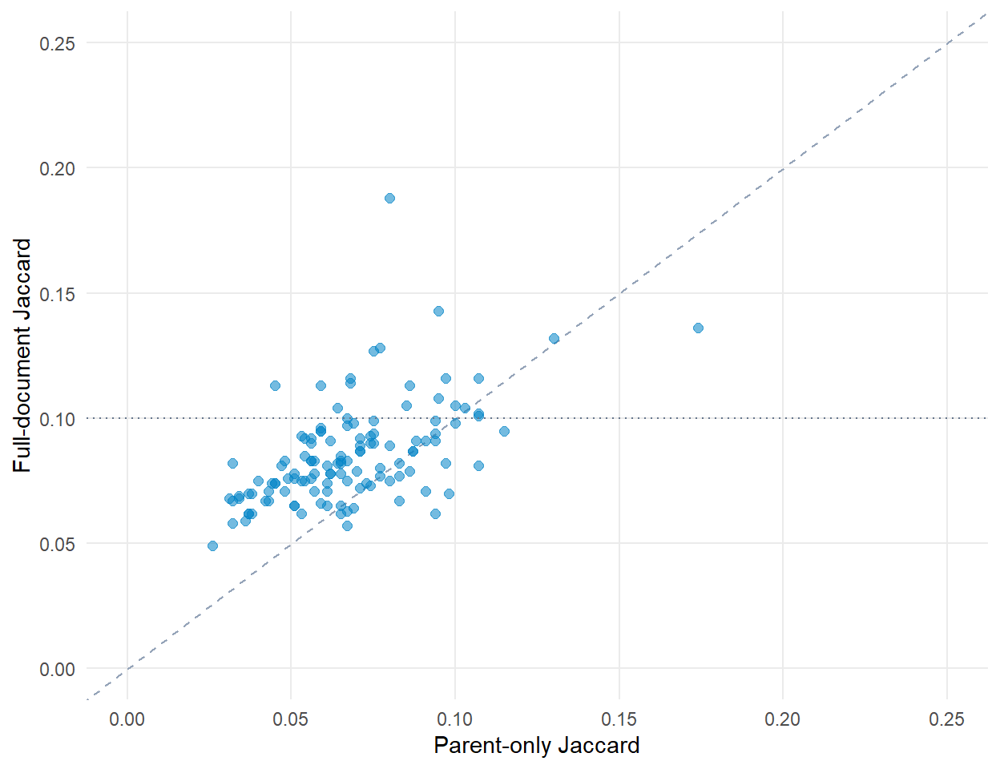

![](data:image/svg+xml;base64,PHN2ZyB4bWxucz0iaHR0cDovL3d3dy53My5vcmcvMjAwMC9zdmciIHN0eWxlPSJkaXNwbGF5Om5vbmUiIGFyaWEtaGlkZGVuPSJ0cnVlIj48c3ltYm9sIGlkPSJpY29uLXdvcmtmb3JjZSIgdmlld2JveD0iMCAwIDI0IDI0IiBmaWxsPSJub25lIiBzdHJva2U9ImN1cnJlbnRDb2xvciIgc3Ryb2tlLXdpZHRoPSIxLjYiIHN0cm9rZS1saW5lY2FwPSJyb3VuZCIgc3Ryb2tlLWxpbmVqb2luPSJyb3VuZCI+PHRpdGxlPldvcmtmb3JjZTwvdGl0bGU+CjxyZWN0IHg9IjMiIHk9IjgiIHdpZHRoPSIxOCIgaGVpZ2h0PSIxMiIgcng9IjEuNSIgLz48cGF0aCBkPSJNOSA4IFY2IFE5IDUgMTAgNSBIMTQgUTE1IDUgMTUgNiBWOCIgLz48bGluZSB4MT0iMyIgeTE9IjEzLjUiIHgyPSIyMSIgeTI9IjEzLjUiPjwvbGluZT48cmVjdCB4PSIxMSIgeT0iMTIuNiIgd2lkdGg9IjIiIGhlaWdodD0iMS44IiByeD0iMC4zIiBmaWxsPSJjdXJyZW50Q29sb3IiIHN0cm9rZT0ibm9uZSIgLz48L3N5bWJvbD48c3ltYm9sIGlkPSJpY29uLXBlZGFnb2d5IiB2aWV3Ym94PSIwIDAgMjQgMjQiIGZpbGw9Im5vbmUiIHN0cm9rZT0iY3VycmVudENvbG9yIiBzdHJva2Utd2lkdGg9IjEuNiIgc3Ryb2tlLWxpbmVjYXA9InJvdW5kIiBzdHJva2UtbGluZWpvaW49InJvdW5kIj48dGl0bGU+UGVkYWdvZ3k8L3RpdGxlPgo8cGF0aCBkPSJNMiA5IEwxMiA0LjUgTDIyIDkgTDEyIDEzLjUgWiIgLz48cGF0aCBkPSJNOCAxMi41IFE4IDE2LjUgMTIgMTYuNSBRMTYgMTYuNSAxNiAxMi41IiAvPjxwYXRoIGQ9Ik0yMiA5IFYxNCIgLz48Y2lyY2xlIGN4PSIyMiIgY3k9IjE0LjgiIHI9IjEiIGZpbGw9ImN1cnJlbnRDb2xvciIgc3Ryb2tlPSJub25lIj48L2NpcmNsZT48L3N5bWJvbD48c3ltYm9sIGlkPSJpY29uLXVzIiB2aWV3Ym94PSIwIDAgMjQgMjQiIGZpbGw9Im5vbmUiIHN0cm9rZT0iY3VycmVudENvbG9yIiBzdHJva2Utd2lkdGg9IjEuNiIgc3Ryb2tlLWxpbmVjYXA9InJvdW5kIiBzdHJva2UtbGluZWpvaW49InJvdW5kIj48dGl0bGU+VVM8L3RpdGxlPgo8cmVjdCB4PSIzIiB5PSI2IiB3aWR0aD0iMTgiIGhlaWdodD0iMTIiIHJ4PSIxIiAvPjxsaW5lIHgxPSIzIiB5MT0iMTAiIHgyPSIyMSIgeTI9IjEwIj48L2xpbmU+PGxpbmUgeDE9IjMiIHkxPSIxNCIgeDI9IjIxIiB5Mj0iMTQiPjwvbGluZT48cmVjdCB4PSIzIiB5PSI2IiB3aWR0aD0iNy41IiBoZWlnaHQ9IjUiIGZpbGw9ImN1cnJlbnRDb2xvciIgb3BhY2l0eT0iMC4yIiBzdHJva2U9Im5vbmUiIC8+PC9zeW1ib2w+PHN5bWJvbCBpZD0iaWNvbi1ldSIgdmlld2JveD0iMCAwIDI0IDI0IiBmaWxsPSJub25lIiBzdHJva2U9ImN1cnJlbnRDb2xvciIgc3Ryb2tlLXdpZHRoPSIxLjYiPjx0aXRsZT5FVTwvdGl0bGU+CjxjaXJjbGUgY3g9IjEyIiBjeT0iMTIiIHI9IjkiPjwvY2lyY2xlPjxjaXJjbGUgY3g9IjEyIiBjeT0iNSIgcj0iMSIgZmlsbD0iY3VycmVudENvbG9yIj48L2NpcmNsZT48Y2lyY2xlIGN4PSIxNy42IiBjeT0iOC41IiByPSIxIiBmaWxsPSJjdXJyZW50Q29sb3IiPjwvY2lyY2xlPjxjaXJjbGUgY3g9IjE3LjYiIGN5PSIxNS41IiByPSIxIiBmaWxsPSJjdXJyZW50Q29sb3IiPjwvY2lyY2xlPjxjaXJjbGUgY3g9IjEyIiBjeT0iMTkiIHI9IjEiIGZpbGw9ImN1cnJlbnRDb2xvciI+PC9jaXJjbGU+PGNpcmNsZSBjeD0iNi40IiBjeT0iMTUuNSIgcj0iMSIgZmlsbD0iY3VycmVudENvbG9yIj48L2NpcmNsZT48Y2lyY2xlIGN4PSI2LjQiIGN5PSI4LjUiIHI9IjEiIGZpbGw9ImN1cnJlbnRDb2xvciI+PC9jaXJjbGU+PC9zeW1ib2w+PHN5bWJvbCBpZD0iaWNvbi1jeiIgdmlld2JveD0iMCAwIDI0IDI0IiBmaWxsPSJub25lIiBzdHJva2U9ImN1cnJlbnRDb2xvciIgc3Ryb2tlLXdpZHRoPSIxLjYiIHN0cm9rZS1saW5lY2FwPSJyb3VuZCIgc3Ryb2tlLWxpbmVqb2luPSJyb3VuZCI+PHRpdGxlPkNaPC90aXRsZT4KPHJlY3QgeD0iMyIgeT0iNiIgd2lkdGg9IjE4IiBoZWlnaHQ9IjEyIiByeD0iMSIgLz48bGluZSB4MT0iMTEiIHkxPSIxMiIgeDI9IjIxIiB5Mj0iMTIiPjwvbGluZT48cGF0aCBkPSJNMyA2IEwxMSAxMiBMMyAxOCBaIiBmaWxsPSJjdXJyZW50Q29sb3IiIG9wYWNpdHk9IjAuMiIgc3Ryb2tlPSJub25lIiAvPjxwYXRoIGQ9Ik0zIDYgTDExIDEyIEwzIDE4IiAvPjwvc3ltYm9sPjxzeW1ib2wgaWQ9Imljb24tY2EiIHZpZXdib3g9IjAgMCAyNCAyNCIgZmlsbD0ibm9uZSIgc3Ryb2tlPSJjdXJyZW50Q29sb3IiIHN0cm9rZS13aWR0aD0iMS42IiBzdHJva2UtbGluZWNhcD0icm91bmQiIHN0cm9rZS1saW5lam9pbj0icm91bmQiPjx0aXRsZT5DQTwvdGl0bGU+CjxyZWN0IHg9IjMiIHk9IjYiIHdpZHRoPSIxOCIgaGVpZ2h0PSIxMiIgcng9IjEiIC8+PGxpbmUgeDE9IjgiIHkxPSI2IiB4Mj0iOCIgeTI9IjE4Ij48L2xpbmU+PGxpbmUgeDE9IjE2IiB5MT0iNiIgeDI9IjE2IiB5Mj0iMTgiPjwvbGluZT48cmVjdCB4PSIzIiB5PSI2IiB3aWR0aD0iNSIgaGVpZ2h0PSIxMiIgZmlsbD0iY3VycmVudENvbG9yIiBvcGFjaXR5PSIwLjIiIHN0cm9rZT0ibm9uZSIgLz48cmVjdCB4PSIxNiIgeT0iNiIgd2lkdGg9IjUiIGhlaWdodD0iMTIiIGZpbGw9ImN1cnJlbnRDb2xvciIgb3BhY2l0eT0iMC4yIiBzdHJva2U9Im5vbmUiIC8+PHBhdGggZD0iTTEyIDkgTDEzIDExLjIgTDE0LjYgMTAuNiBMMTQgMTIuNCBMMTUuNiAxMi42IEwxMi44IDE0LjIgTDEzLjEgMTUgTDExIDE0LjcgTDEwLjkgMTUgTDEwLjcgMTQuNyBMOC42IDE1IEw4LjkgMTQuMiBMNi4xIDEyLjYgTDcuNyAxMi40IEw3LjEgMTAuNiBMOC43IDExLjIgWiIgZmlsbD0iY3VycmVudENvbG9yIiBzdHJva2U9Im5vbmUiIC8+PC9zeW1ib2w+PHN5bWJvbCBpZD0iaWNvbi1zZyIgdmlld2JveD0iMCAwIDI0IDI0IiBmaWxsPSJub25lIiBzdHJva2U9ImN1cnJlbnRDb2xvciIgc3Ryb2tlLXdpZHRoPSIxLjYiIHN0cm9rZS1saW5lY2FwPSJyb3VuZCIgc3Ryb2tlLWxpbmVqb2luPSJyb3VuZCI+PHRpdGxlPlNHPC90aXRsZT4KPHJlY3QgeD0iMyIgeT0iNiIgd2lkdGg9IjE4IiBoZWlnaHQ9IjEyIiByeD0iMSIgLz48bGluZSB4MT0iMyIgeTE9IjEyIiB4Mj0iMjEiIHkyPSIxMiI+PC9saW5lPjxyZWN0IHg9IjMiIHk9IjYiIHdpZHRoPSIxOCIgaGVpZ2h0PSI2IiBmaWxsPSJjdXJyZW50Q29sb3IiIG9wYWNpdHk9IjAuMiIgc3Ryb2tlPSJub25lIiAvPjxwYXRoIGQ9Ik05LjYgOC4xIEEyLjYgMi42IDAgMSAwIDkuNiAxMS45IEEyIDIgMCAxIDEgOS42IDguMSBaIiBmaWxsPSJjdXJyZW50Q29sb3IiIHN0cm9rZT0ibm9uZSIgLz48Y2lyY2xlIGN4PSIxMy4yIiBjeT0iOC4zIiByPSIwLjYiIGZpbGw9ImN1cnJlbnRDb2xvciIgc3Ryb2tlPSJub25lIj48L2NpcmNsZT48Y2lyY2xlIGN4PSIxNS40IiBjeT0iOC4zIiByPSIwLjYiIGZpbGw9ImN1cnJlbnRDb2xvciIgc3Ryb2tlPSJub25lIj48L2NpcmNsZT48Y2lyY2xlIGN4PSIxMi41IiBjeT0iMTAuMiIgcj0iMC42IiBmaWxsPSJjdXJyZW50Q29sb3IiIHN0cm9rZT0ibm9uZSI+PC9jaXJjbGU+PGNpcmNsZSBjeD0iMTYuMSIgY3k9IjEwLjIiIHI9IjAuNiIgZmlsbD0iY3VycmVudENvbG9yIiBzdHJva2U9Im5vbmUiPjwvY2lyY2xlPjxjaXJjbGUgY3g9IjE0LjMiIGN5PSIxMS4zIiByPSIwLjYiIGZpbGw9ImN1cnJlbnRDb2xvciIgc3Ryb2tlPSJub25lIj48L2NpcmNsZT48L3N5bWJvbD48c3ltYm9sIGlkPSJpY29uLWdsb2JhbCIgdmlld2JveD0iMCAwIDI0IDI0IiBmaWxsPSJub25lIiBzdHJva2U9ImN1cnJlbnRDb2xvciIgc3Ryb2tlLXdpZHRoPSIxLjYiIHN0cm9rZS1saW5lY2FwPSJyb3VuZCIgc3Ryb2tlLWxpbmVqb2luPSJyb3VuZCI+PHRpdGxlPkdsb2JhbDwvdGl0bGU+CjxjaXJjbGUgY3g9IjEyIiBjeT0iMTIiIHI9IjkiPjwvY2lyY2xlPjxlbGxpcHNlIGN4PSIxMiIgY3k9IjEyIiByeD0iOSIgcnk9IjMuNCI+PC9lbGxpcHNlPjxsaW5lIHgxPSIxMiIgeTE9IjMiIHgyPSIxMiIgeTI9IjIxIj48L2xpbmU+PC9zeW1ib2w+PHN5bWJvbCBpZD0iaWNvbi1hcmNoaXZlIiB2aWV3Ym94PSIwIDAgMjQgMjQiIGZpbGw9Im5vbmUiIHN0cm9rZT0iY3VycmVudENvbG9yIiBzdHJva2Utd2lkdGg9IjEuNiIgc3Ryb2tlLWxpbmVjYXA9InJvdW5kIiBzdHJva2UtbGluZWpvaW49InJvdW5kIj48dGl0bGU+U291cmNlPC90aXRsZT4KPHJlY3QgeD0iMyIgeT0iNCIgd2lkdGg9IjE4IiBoZWlnaHQ9IjQiIHJ4PSIxIiAvPjxwYXRoIGQ9Ik01IDggVjIwIFE1IDIxIDYgMjEgSDE4IFExOSAyMSAxOSAyMCBWOCIgLz48bGluZSB4MT0iMTAiIHkxPSIxMyIgeDI9IjE0IiB5Mj0iMTMiPjwvbGluZT48L3N5bWJvbD48c3ltYm9sIGlkPSJpY29uLWdlYXIiIHZpZXdib3g9IjAgMCAyNCAyNCIgZmlsbD0ibm9uZSIgc3Ryb2tlPSJjdXJyZW50Q29sb3IiIHN0cm9rZS13aWR0aD0iMS42IiBzdHJva2UtbGluZWNhcD0icm91bmQiIHN0cm9rZS1saW5lam9pbj0icm91bmQiPjx0aXRsZT5Jbmdlc3Rpb248L3RpdGxlPgo8Y2lyY2xlIGN4PSIxMiIgY3k9IjEyIiByPSIzLjUiPjwvY2lyY2xlPjxsaW5lIHgxPSIxMiIgeTE9IjIiIHgyPSIxMiIgeTI9IjUiPjwvbGluZT48bGluZSB4MT0iMTIiIHkxPSIxOSIgeDI9IjEyIiB5Mj0iMjIiPjwvbGluZT48bGluZSB4MT0iMjIiIHkxPSIxMiIgeDI9IjE5IiB5Mj0iMTIiPjwvbGluZT48bGluZSB4MT0iNSIgeTE9IjEyIiB4Mj0iMiIgeTI9IjEyIj48L2xpbmU+PGxpbmUgeDE9IjE5LjA3IiB5MT0iNC45MyIgeDI9IjE3IiB5Mj0iNyI+PC9saW5lPjxsaW5lIHgxPSI3IiB5MT0iMTciIHgyPSI0LjkzIiB5Mj0iMTkuMDciPjwvbGluZT48bGluZSB4MT0iMTkuMDciIHkxPSIxOS4wNyIgeDI9IjE3IiB5Mj0iMTciPjwvbGluZT48bGluZSB4MT0iNyIgeTE9IjciIHgyPSI0LjkzIiB5Mj0iNC45MyI+PC9saW5lPjwvc3ltYm9sPjxzeW1ib2wgaWQ9Imljb24tbGljZW5zZSIgdmlld2JveD0iMCAwIDI0IDI0IiBmaWxsPSJub25lIiBzdHJva2U9ImN1cnJlbnRDb2xvciIgc3Ryb2tlLXdpZHRoPSIxLjYiIHN0cm9rZS1saW5lY2FwPSJyb3VuZCIgc3Ryb2tlLWxpbmVqb2luPSJyb3VuZCI+PHRpdGxlPkxpY2Vuc2U8L3RpdGxlPgo8cGF0aCBkPSJNMTIgMyBMMjAgNiBWMTIgUTIwIDE3IDEyIDIxIFE0IDE3IDQgMTIgVjYgWiIgLz48cmVjdCB4PSI5IiB5PSIxMSIgd2lkdGg9IjYiIGhlaWdodD0iNSIgcng9IjAuNiIgLz48cGF0aCBkPSJNMTAuNSAxMSBWOSBRMTAuNSA3LjUgMTIgNy41IFExMy41IDcuNSAxMy41IDkgVjExIiAvPjwvc3ltYm9sPjxzeW1ib2wgaWQ9Imljb24tc2EiIHZpZXdib3g9IjAgMCAyNCAyNCIgZmlsbD0ibm9uZSIgc3Ryb2tlPSJjdXJyZW50Q29sb3IiIHN0cm9rZS13aWR0aD0iMS42IiBzdHJva2UtbGluZWNhcD0icm91bmQiIHN0cm9rZS1saW5lam9pbj0icm91bmQiPjx0aXRsZT5TQTwvdGl0bGU+CjxyZWN0IHg9IjMiIHk9IjYiIHdpZHRoPSIxOCIgaGVpZ2h0PSIxMiIgcng9IjEiIC8+PHJlY3QgeD0iMyIgeT0iNiIgd2lkdGg9IjE4IiBoZWlnaHQ9IjEyIiBmaWxsPSJjdXJyZW50Q29sb3IiIG9wYWNpdHk9IjAuMiIgc3Ryb2tlPSJub25lIiAvPjxsaW5lIHgxPSI3IiB5MT0iMTIiIHgyPSIxNyIgeTI9IjEyIj48L2xpbmU+PGxpbmUgeDE9IjE0IiB5MT0iOSIgeDI9IjE3IiB5Mj0iMTIiPjwvbGluZT48bGluZSB4MT0iMTQiIHkxPSIxNSIgeDI9IjE3IiB5Mj0iMTIiPjwvbGluZT48L3N5bWJvbD48c3ltYm9sIGlkPSJpY29uLXVrIiB2aWV3Ym94PSIwIDAgMjQgMjQiIGZpbGw9Im5vbmUiIHN0cm9rZT0iY3VycmVudENvbG9yIiBzdHJva2Utd2lkdGg9IjEuNiIgc3Ryb2tlLWxpbmVjYXA9InJvdW5kIiBzdHJva2UtbGluZWpvaW49InJvdW5kIj48dGl0bGU+VUs8L3RpdGxlPgo8cmVjdCB4PSIzIiB5PSI2IiB3aWR0aD0iMTgiIGhlaWdodD0iMTIiIHJ4PSIxIiAvPjxsaW5lIHgxPSIzIiB5MT0iNiIgeDI9IjIxIiB5Mj0iMTgiPjwvbGluZT48bGluZSB4MT0iMjEiIHkxPSI2IiB4Mj0iMyIgeTI9IjE4Ij48L2xpbmU+PGxpbmUgeDE9IjEyIiB5MT0iNiIgeDI9IjEyIiB5Mj0iMTgiPjwvbGluZT48bGluZSB4MT0iMyIgeTE9IjEyIiB4Mj0iMjEiIHkyPSIxMiI+PC9saW5lPjwvc3ltYm9sPjwvc3ZnPg==)

# Where do Cyber.org K-12 and CSTA standards lexically align?

Pairwise text similarity with and without prose-encoded examples

Cross-framework

K-12

Pedagogy

Pairwise Jaccard similarity between the Cyber.org K-12 parent standards and the CSTA K-12 CS parent standards, with and without each side’s clarification-derived examples. The contrast between parent-only and full-document similarity is the methodological finding.

Published

May 9, 2026

## The question

For each Cyber.org K-12 standard, what is the closest CSTA K-12 CS standard by text similarity, and how does that closeness change when each side’s prose-encoded examples (Cyber.org clarification statements, CSTA clarification-column content) are included alongside the parent statement text?

## Why it matters

Cyber.org and CSTA are the two most widely-referenced K-12 standards sets covering cybersecurity content in US classrooms. Practitioners frequently ask whether a curriculum aligned to one is implicitly aligned to the other. The naive comparison (parent text against parent text) understates the alignment because the two frameworks encode pedagogical detail differently. Cyber.org embeds clarifications directly inside the numbered standard’s prose. CSTA stores them in a separate clarification column.

cybedtools v0.2.0 introduced the reclassification of both forms of clarification content as `cybed:Example` nodes, and v0.3.0 keeps it unchanged. Those nodes are distinct from parent statements and from parser-extracted `cybed:Subpoint` bullets. That vocabulary distinction is what makes a fair cross-framework comparison possible. The full-document text for a parent is the parent statement plus all of its `cybed:hasExample` and `cybed:hasElement` children, concatenated and tokenized as a single document.

The parent-only-vs-full-document contrast is the finding.

This query stays on the 2017 CSTA edition rather than the 2026 edition added to the corpus since this page was written, because the two CSTA editions share no identifier scheme and re-anchoring the comparison is a separate piece of work.

## The result

| Match strength | Parent-only Jaccard | Full-document Jaccard |
|:---------------|--------------------:|----------------------:|
| weak           |                  10 |                    21 |
| none           |                 113 |                   102 |

Table 1: Cyber.org standards by their best CSTA match strength, parent-only vs full-document

The full-document pass roughly doubles the count of detectable matches (10 to 21) over the parent-only pass. None reach the moderate tier (Jaccard ≥ 0.20) under either pass.

[](k12-alignment_files/figure-html/fig-similarity-shift-1.png "Figure 1: How parent-only similarity shifts under full-document scoring. Each point is one Cyber.org standard’s best CSTA match. The 1:1 line is dashed. Points above the line gained similarity when CSTA Examples were included.")

Figure 1: How parent-only similarity shifts under full-document scoring. Each point is one Cyber.org standard’s best CSTA match. The 1:1 line is dashed. Points above the line gained similarity when CSTA Examples were included.

The points cluster above the 1:1 line. Full-document scoring systematically raises best-match similarity over parent-only scoring. The dotted horizontal line marks the 0.10 threshold below which no match is reported.

## What this tells us

### The vocabulary distinction matters

Compare Cyber.org and CSTA at the parent-statement level only and you find 10 of 123 Cyber.org standards with a CSTA match. Compare full documents (parent plus Subpoints plus Examples) and you find 21. 11 Cyber.org standards have a plausible CSTA counterpart that is invisible to the parent-only comparison.

### The frameworks are still largely complementary

Even on the full-document pass, 102 of 123 Cyber.org standards (83%) have no detectable CSTA match. Cyber.org covers cybersecurity-specific territory (threat actors, social engineering, physical security, risk-management foundations) that the CSTA K-12 CS Standards do not address.

### The matches concentrate where the frameworks share computing foundations

Networking, hardware, software vulnerabilities, encryption, and personally identifiable information are where CSTA’s general computer-science scope overlaps with Cyber.org’s cybersecurity-specific scope. Outside that overlap, the frameworks sit on different territory.

## What this doesn’t tell us

### Lexical similarity is not coverage

A Jaccard score of 0.10 to 0.20 means 10-20% of the unique vocabulary is shared. Suggestive, not dispositive. A teacher claiming CSTA coverage from a Cyber.org-aligned lesson should read both standards and decide whether the same cognitive demand is met. The tool surfaces candidates. The practitioner makes the equivalence judgment.

### Grade-band drift is not corrected for

The strongest match in this data pairs a Cyber.org 6-8 standard with a CSTA 3A (grades 9-10) standard. Topic alignment is real. Cognitive-level alignment is not. This is a known limitation of any vocabulary-similarity approach to cross-framework comparison and applies equally to other K-12 cyber crosswalks (NICE, NCyTE materials).

### The metric is one of several reasonable choices

Jaccard on unigrams is interpretable and fast, but ignores word order, multi-word phrases, and synonymy. Other choices (cosine on TF-IDF vectors, embedding-based similarity, manually-curated crosswalk) trade interpretability for sensitivity. The cybedtools SPARQL helpers return the structured graph, and downstream analysts can run whichever similarity metric suits their question.

## Look up your standard

The widget below shows every Cyber.org K-12 standard alongside its closest CSTA match (full-document Jaccard). Search by topic word (“network,” “encryption,” “PII”) to find your standards quickly, or sort by overlap to see the strongest candidates first.

Table 2

The full row count is 123, one per Cyber.org standard. Standards with no detectable CSTA match (overlap below 10% under the methodology above) appear with their closest candidate even though that candidate is not a defensible coverage claim. The “no detectable match” bracket on the persona page is the same data filtered to overlap below 10%.

## Reproduce this

``` downlit
library(cybedtools)
library(dplyr)
library(stringr)
library(purrr)
library(tidyr)
library(rdflib)

g <- load_combined_ntriples_graph()

prefix_block <- paste0(
  "PREFIX cybed: <https://w3id.org/cybed/ontology#>\n",
  "PREFIX schema: <http://schema.org/>\n",
  "PREFIX cyberorg: <https://cyber.org/standards/terms#>\n",
  "PREFIX csta: <https://csteachers.org/k12standards/terms#>\n"
)
query_subjects <- function(rdf, type_iri) {
  q <- paste0(prefix_block, sprintf("SELECT ?s WHERE { ?s a %s }", type_iri))
  res <- rdflib::rdf_query(rdf, q)
  if (nrow(res) == 0) tibble::tibble(s = character(0)) else tibble::as_tibble(res)
}
```

The parent pull is read straight out of the prep script, so this block cannot drift away from what actually ran:

``` downlit
subpoint_ids <- query_subjects(g, "cybed:Subpoint")

cyberorg_parents <- query_subjects(g, "cyberorg:Standard") |>
  anti_join(subpoint_ids, by = "s") |>
  transmute(element = s, framework_slug = "cyberorg-k12")
csta_parents <- query_subjects(g, "csta:Standard") |>
  anti_join(subpoint_ids, by = "s") |>
  transmute(element = s, framework_slug = "csta-2017")
parents_iri <- bind_rows(cyberorg_parents, csta_parents)
```

The `anti_join` is required, not optional. `cybed:Subpoint` children retain their parent’s framework-native subtype (`csta:Standard`, `cyberorg:Standard`), so a plain type query catches parsed sub-points alongside genuine parents. CSTA carries 24 Subpoints this way. Cyber.org carries none, so its pool was clean by coincidence rather than by construction.

Element text is then pulled and scoped to the frameworks whose statement text may be published, via the site’s publication guard:

``` downlit
elem_text <- sparql_pairs(g, "cybed:elementText") |>
  transmute(element = s, text = o) |>
  inner_join(element_framework_bindings(g) |> select(element, framework_name),
             by = "element") |>
  filter(is_text_publishable(framework_name)) |>
  select(element, text)
```

From there the script attaches Subpoint and Example children via `cybed:hasElement` and `cybed:hasExample`, builds full-document text per parent, tokenizes, drops stopwords and short tokens, computes Jaccard pairwise, and keeps the best CSTA match per Cyber.org standard. Every write passes through `assert_no_unpublishable_text()` first. The full script is `concordance/_data-prep-k12-alignment.R` in the repository.

The data file shipped with this page (`_data/k12_alignment.rds`) is the output of that prep script. Re-run the prep when the package or the staged framework data changes.

## Related queries

- [How does element density vary across frameworks?](../queries/density-spread.llms.md), the per-unit density comparison that motivates the Jaccard granularity choice.
- [The two-tier vocabulary](../concepts/vocabulary.llms.md), why `cybed:Example` and `cybed:Subpoint` are distinct types, and why that distinction makes this comparison possible.

## Use case using this data

- [Tasha cross-walks her Cyber.org-aligned cyber unit to CSTA](../use-cases/k12-teacher.llms.md), the practitioner-facing version of this analytic question.

Back to top
