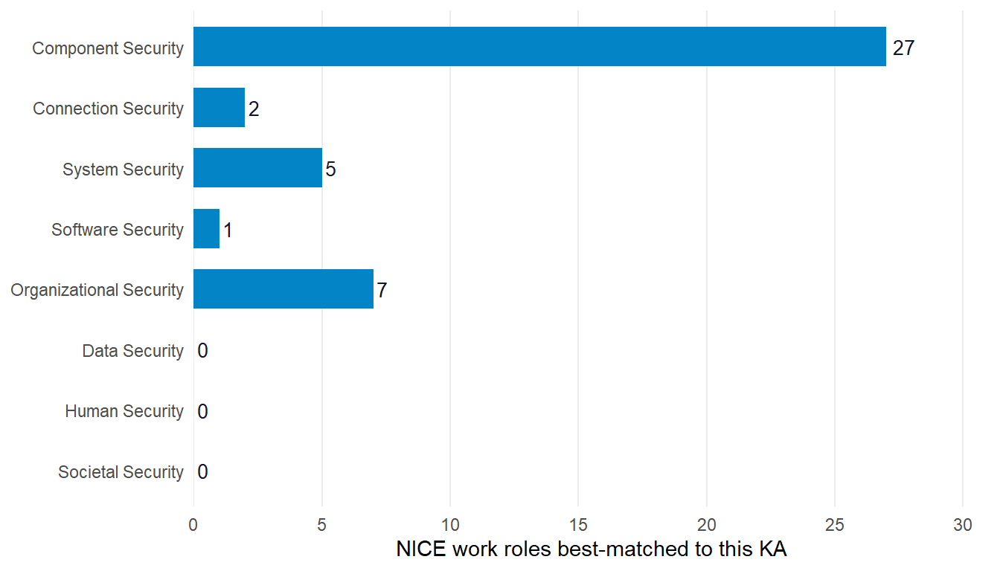

![](data:image/svg+xml;base64,PHN2ZyB4bWxucz0iaHR0cDovL3d3dy53My5vcmcvMjAwMC9zdmciIHN0eWxlPSJkaXNwbGF5Om5vbmUiIGFyaWEtaGlkZGVuPSJ0cnVlIj48c3ltYm9sIGlkPSJpY29uLXdvcmtmb3JjZSIgdmlld2JveD0iMCAwIDI0IDI0IiBmaWxsPSJub25lIiBzdHJva2U9ImN1cnJlbnRDb2xvciIgc3Ryb2tlLXdpZHRoPSIxLjYiIHN0cm9rZS1saW5lY2FwPSJyb3VuZCIgc3Ryb2tlLWxpbmVqb2luPSJyb3VuZCI+PHRpdGxlPldvcmtmb3JjZTwvdGl0bGU+CjxyZWN0IHg9IjMiIHk9IjgiIHdpZHRoPSIxOCIgaGVpZ2h0PSIxMiIgcng9IjEuNSIgLz48cGF0aCBkPSJNOSA4IFY2IFE5IDUgMTAgNSBIMTQgUTE1IDUgMTUgNiBWOCIgLz48bGluZSB4MT0iMyIgeTE9IjEzLjUiIHgyPSIyMSIgeTI9IjEzLjUiPjwvbGluZT48cmVjdCB4PSIxMSIgeT0iMTIuNiIgd2lkdGg9IjIiIGhlaWdodD0iMS44IiByeD0iMC4zIiBmaWxsPSJjdXJyZW50Q29sb3IiIHN0cm9rZT0ibm9uZSIgLz48L3N5bWJvbD48c3ltYm9sIGlkPSJpY29uLXBlZGFnb2d5IiB2aWV3Ym94PSIwIDAgMjQgMjQiIGZpbGw9Im5vbmUiIHN0cm9rZT0iY3VycmVudENvbG9yIiBzdHJva2Utd2lkdGg9IjEuNiIgc3Ryb2tlLWxpbmVjYXA9InJvdW5kIiBzdHJva2UtbGluZWpvaW49InJvdW5kIj48dGl0bGU+UGVkYWdvZ3k8L3RpdGxlPgo8cGF0aCBkPSJNMiA5IEwxMiA0LjUgTDIyIDkgTDEyIDEzLjUgWiIgLz48cGF0aCBkPSJNOCAxMi41IFE4IDE2LjUgMTIgMTYuNSBRMTYgMTYuNSAxNiAxMi41IiAvPjxwYXRoIGQ9Ik0yMiA5IFYxNCIgLz48Y2lyY2xlIGN4PSIyMiIgY3k9IjE0LjgiIHI9IjEiIGZpbGw9ImN1cnJlbnRDb2xvciIgc3Ryb2tlPSJub25lIj48L2NpcmNsZT48L3N5bWJvbD48c3ltYm9sIGlkPSJpY29uLXVzIiB2aWV3Ym94PSIwIDAgMjQgMjQiIGZpbGw9Im5vbmUiIHN0cm9rZT0iY3VycmVudENvbG9yIiBzdHJva2Utd2lkdGg9IjEuNiIgc3Ryb2tlLWxpbmVjYXA9InJvdW5kIiBzdHJva2UtbGluZWpvaW49InJvdW5kIj48dGl0bGU+VVM8L3RpdGxlPgo8cmVjdCB4PSIzIiB5PSI2IiB3aWR0aD0iMTgiIGhlaWdodD0iMTIiIHJ4PSIxIiAvPjxsaW5lIHgxPSIzIiB5MT0iMTAiIHgyPSIyMSIgeTI9IjEwIj48L2xpbmU+PGxpbmUgeDE9IjMiIHkxPSIxNCIgeDI9IjIxIiB5Mj0iMTQiPjwvbGluZT48cmVjdCB4PSIzIiB5PSI2IiB3aWR0aD0iNy41IiBoZWlnaHQ9IjUiIGZpbGw9ImN1cnJlbnRDb2xvciIgb3BhY2l0eT0iMC4yIiBzdHJva2U9Im5vbmUiIC8+PC9zeW1ib2w+PHN5bWJvbCBpZD0iaWNvbi1ldSIgdmlld2JveD0iMCAwIDI0IDI0IiBmaWxsPSJub25lIiBzdHJva2U9ImN1cnJlbnRDb2xvciIgc3Ryb2tlLXdpZHRoPSIxLjYiPjx0aXRsZT5FVTwvdGl0bGU+CjxjaXJjbGUgY3g9IjEyIiBjeT0iMTIiIHI9IjkiPjwvY2lyY2xlPjxjaXJjbGUgY3g9IjEyIiBjeT0iNSIgcj0iMSIgZmlsbD0iY3VycmVudENvbG9yIj48L2NpcmNsZT48Y2lyY2xlIGN4PSIxNy42IiBjeT0iOC41IiByPSIxIiBmaWxsPSJjdXJyZW50Q29sb3IiPjwvY2lyY2xlPjxjaXJjbGUgY3g9IjE3LjYiIGN5PSIxNS41IiByPSIxIiBmaWxsPSJjdXJyZW50Q29sb3IiPjwvY2lyY2xlPjxjaXJjbGUgY3g9IjEyIiBjeT0iMTkiIHI9IjEiIGZpbGw9ImN1cnJlbnRDb2xvciI+PC9jaXJjbGU+PGNpcmNsZSBjeD0iNi40IiBjeT0iMTUuNSIgcj0iMSIgZmlsbD0iY3VycmVudENvbG9yIj48L2NpcmNsZT48Y2lyY2xlIGN4PSI2LjQiIGN5PSI4LjUiIHI9IjEiIGZpbGw9ImN1cnJlbnRDb2xvciI+PC9jaXJjbGU+PC9zeW1ib2w+PHN5bWJvbCBpZD0iaWNvbi1jeiIgdmlld2JveD0iMCAwIDI0IDI0IiBmaWxsPSJub25lIiBzdHJva2U9ImN1cnJlbnRDb2xvciIgc3Ryb2tlLXdpZHRoPSIxLjYiIHN0cm9rZS1saW5lY2FwPSJyb3VuZCIgc3Ryb2tlLWxpbmVqb2luPSJyb3VuZCI+PHRpdGxlPkNaPC90aXRsZT4KPHJlY3QgeD0iMyIgeT0iNiIgd2lkdGg9IjE4IiBoZWlnaHQ9IjEyIiByeD0iMSIgLz48bGluZSB4MT0iMTEiIHkxPSIxMiIgeDI9IjIxIiB5Mj0iMTIiPjwvbGluZT48cGF0aCBkPSJNMyA2IEwxMSAxMiBMMyAxOCBaIiBmaWxsPSJjdXJyZW50Q29sb3IiIG9wYWNpdHk9IjAuMiIgc3Ryb2tlPSJub25lIiAvPjxwYXRoIGQ9Ik0zIDYgTDExIDEyIEwzIDE4IiAvPjwvc3ltYm9sPjxzeW1ib2wgaWQ9Imljb24tY2EiIHZpZXdib3g9IjAgMCAyNCAyNCIgZmlsbD0ibm9uZSIgc3Ryb2tlPSJjdXJyZW50Q29sb3IiIHN0cm9rZS13aWR0aD0iMS42IiBzdHJva2UtbGluZWNhcD0icm91bmQiIHN0cm9rZS1saW5lam9pbj0icm91bmQiPjx0aXRsZT5DQTwvdGl0bGU+CjxyZWN0IHg9IjMiIHk9IjYiIHdpZHRoPSIxOCIgaGVpZ2h0PSIxMiIgcng9IjEiIC8+PGxpbmUgeDE9IjgiIHkxPSI2IiB4Mj0iOCIgeTI9IjE4Ij48L2xpbmU+PGxpbmUgeDE9IjE2IiB5MT0iNiIgeDI9IjE2IiB5Mj0iMTgiPjwvbGluZT48cmVjdCB4PSIzIiB5PSI2IiB3aWR0aD0iNSIgaGVpZ2h0PSIxMiIgZmlsbD0iY3VycmVudENvbG9yIiBvcGFjaXR5PSIwLjIiIHN0cm9rZT0ibm9uZSIgLz48cmVjdCB4PSIxNiIgeT0iNiIgd2lkdGg9IjUiIGhlaWdodD0iMTIiIGZpbGw9ImN1cnJlbnRDb2xvciIgb3BhY2l0eT0iMC4yIiBzdHJva2U9Im5vbmUiIC8+PHBhdGggZD0iTTEyIDkgTDEzIDExLjIgTDE0LjYgMTAuNiBMMTQgMTIuNCBMMTUuNiAxMi42IEwxMi44IDE0LjIgTDEzLjEgMTUgTDExIDE0LjcgTDEwLjkgMTUgTDEwLjcgMTQuNyBMOC42IDE1IEw4LjkgMTQuMiBMNi4xIDEyLjYgTDcuNyAxMi40IEw3LjEgMTAuNiBMOC43IDExLjIgWiIgZmlsbD0iY3VycmVudENvbG9yIiBzdHJva2U9Im5vbmUiIC8+PC9zeW1ib2w+PHN5bWJvbCBpZD0iaWNvbi1zZyIgdmlld2JveD0iMCAwIDI0IDI0IiBmaWxsPSJub25lIiBzdHJva2U9ImN1cnJlbnRDb2xvciIgc3Ryb2tlLXdpZHRoPSIxLjYiIHN0cm9rZS1saW5lY2FwPSJyb3VuZCIgc3Ryb2tlLWxpbmVqb2luPSJyb3VuZCI+PHRpdGxlPlNHPC90aXRsZT4KPHJlY3QgeD0iMyIgeT0iNiIgd2lkdGg9IjE4IiBoZWlnaHQ9IjEyIiByeD0iMSIgLz48bGluZSB4MT0iMyIgeTE9IjEyIiB4Mj0iMjEiIHkyPSIxMiI+PC9saW5lPjxyZWN0IHg9IjMiIHk9IjYiIHdpZHRoPSIxOCIgaGVpZ2h0PSI2IiBmaWxsPSJjdXJyZW50Q29sb3IiIG9wYWNpdHk9IjAuMiIgc3Ryb2tlPSJub25lIiAvPjxwYXRoIGQ9Ik05LjYgOC4xIEEyLjYgMi42IDAgMSAwIDkuNiAxMS45IEEyIDIgMCAxIDEgOS42IDguMSBaIiBmaWxsPSJjdXJyZW50Q29sb3IiIHN0cm9rZT0ibm9uZSIgLz48Y2lyY2xlIGN4PSIxMy4yIiBjeT0iOC4zIiByPSIwLjYiIGZpbGw9ImN1cnJlbnRDb2xvciIgc3Ryb2tlPSJub25lIj48L2NpcmNsZT48Y2lyY2xlIGN4PSIxNS40IiBjeT0iOC4zIiByPSIwLjYiIGZpbGw9ImN1cnJlbnRDb2xvciIgc3Ryb2tlPSJub25lIj48L2NpcmNsZT48Y2lyY2xlIGN4PSIxMi41IiBjeT0iMTAuMiIgcj0iMC42IiBmaWxsPSJjdXJyZW50Q29sb3IiIHN0cm9rZT0ibm9uZSI+PC9jaXJjbGU+PGNpcmNsZSBjeD0iMTYuMSIgY3k9IjEwLjIiIHI9IjAuNiIgZmlsbD0iY3VycmVudENvbG9yIiBzdHJva2U9Im5vbmUiPjwvY2lyY2xlPjxjaXJjbGUgY3g9IjE0LjMiIGN5PSIxMS4zIiByPSIwLjYiIGZpbGw9ImN1cnJlbnRDb2xvciIgc3Ryb2tlPSJub25lIj48L2NpcmNsZT48L3N5bWJvbD48c3ltYm9sIGlkPSJpY29uLWdsb2JhbCIgdmlld2JveD0iMCAwIDI0IDI0IiBmaWxsPSJub25lIiBzdHJva2U9ImN1cnJlbnRDb2xvciIgc3Ryb2tlLXdpZHRoPSIxLjYiIHN0cm9rZS1saW5lY2FwPSJyb3VuZCIgc3Ryb2tlLWxpbmVqb2luPSJyb3VuZCI+PHRpdGxlPkdsb2JhbDwvdGl0bGU+CjxjaXJjbGUgY3g9IjEyIiBjeT0iMTIiIHI9IjkiPjwvY2lyY2xlPjxlbGxpcHNlIGN4PSIxMiIgY3k9IjEyIiByeD0iOSIgcnk9IjMuNCI+PC9lbGxpcHNlPjxsaW5lIHgxPSIxMiIgeTE9IjMiIHgyPSIxMiIgeTI9IjIxIj48L2xpbmU+PC9zeW1ib2w+PHN5bWJvbCBpZD0iaWNvbi1hcmNoaXZlIiB2aWV3Ym94PSIwIDAgMjQgMjQiIGZpbGw9Im5vbmUiIHN0cm9rZT0iY3VycmVudENvbG9yIiBzdHJva2Utd2lkdGg9IjEuNiIgc3Ryb2tlLWxpbmVjYXA9InJvdW5kIiBzdHJva2UtbGluZWpvaW49InJvdW5kIj48dGl0bGU+U291cmNlPC90aXRsZT4KPHJlY3QgeD0iMyIgeT0iNCIgd2lkdGg9IjE4IiBoZWlnaHQ9IjQiIHJ4PSIxIiAvPjxwYXRoIGQ9Ik01IDggVjIwIFE1IDIxIDYgMjEgSDE4IFExOSAyMSAxOSAyMCBWOCIgLz48bGluZSB4MT0iMTAiIHkxPSIxMyIgeDI9IjE0IiB5Mj0iMTMiPjwvbGluZT48L3N5bWJvbD48c3ltYm9sIGlkPSJpY29uLWdlYXIiIHZpZXdib3g9IjAgMCAyNCAyNCIgZmlsbD0ibm9uZSIgc3Ryb2tlPSJjdXJyZW50Q29sb3IiIHN0cm9rZS13aWR0aD0iMS42IiBzdHJva2UtbGluZWNhcD0icm91bmQiIHN0cm9rZS1saW5lam9pbj0icm91bmQiPjx0aXRsZT5Jbmdlc3Rpb248L3RpdGxlPgo8Y2lyY2xlIGN4PSIxMiIgY3k9IjEyIiByPSIzLjUiPjwvY2lyY2xlPjxsaW5lIHgxPSIxMiIgeTE9IjIiIHgyPSIxMiIgeTI9IjUiPjwvbGluZT48bGluZSB4MT0iMTIiIHkxPSIxOSIgeDI9IjEyIiB5Mj0iMjIiPjwvbGluZT48bGluZSB4MT0iMjIiIHkxPSIxMiIgeDI9IjE5IiB5Mj0iMTIiPjwvbGluZT48bGluZSB4MT0iNSIgeTE9IjEyIiB4Mj0iMiIgeTI9IjEyIj48L2xpbmU+PGxpbmUgeDE9IjE5LjA3IiB5MT0iNC45MyIgeDI9IjE3IiB5Mj0iNyI+PC9saW5lPjxsaW5lIHgxPSI3IiB5MT0iMTciIHgyPSI0LjkzIiB5Mj0iMTkuMDciPjwvbGluZT48bGluZSB4MT0iMTkuMDciIHkxPSIxOS4wNyIgeDI9IjE3IiB5Mj0iMTciPjwvbGluZT48bGluZSB4MT0iNyIgeTE9IjciIHgyPSI0LjkzIiB5Mj0iNC45MyI+PC9saW5lPjwvc3ltYm9sPjxzeW1ib2wgaWQ9Imljb24tbGljZW5zZSIgdmlld2JveD0iMCAwIDI0IDI0IiBmaWxsPSJub25lIiBzdHJva2U9ImN1cnJlbnRDb2xvciIgc3Ryb2tlLXdpZHRoPSIxLjYiIHN0cm9rZS1saW5lY2FwPSJyb3VuZCIgc3Ryb2tlLWxpbmVqb2luPSJyb3VuZCI+PHRpdGxlPkxpY2Vuc2U8L3RpdGxlPgo8cGF0aCBkPSJNMTIgMyBMMjAgNiBWMTIgUTIwIDE3IDEyIDIxIFE0IDE3IDQgMTIgVjYgWiIgLz48cmVjdCB4PSI5IiB5PSIxMSIgd2lkdGg9IjYiIGhlaWdodD0iNSIgcng9IjAuNiIgLz48cGF0aCBkPSJNMTAuNSAxMSBWOSBRMTAuNSA3LjUgMTIgNy41IFExMy41IDcuNSAxMy41IDkgVjExIiAvPjwvc3ltYm9sPjxzeW1ib2wgaWQ9Imljb24tc2EiIHZpZXdib3g9IjAgMCAyNCAyNCIgZmlsbD0ibm9uZSIgc3Ryb2tlPSJjdXJyZW50Q29sb3IiIHN0cm9rZS13aWR0aD0iMS42IiBzdHJva2UtbGluZWNhcD0icm91bmQiIHN0cm9rZS1saW5lam9pbj0icm91bmQiPjx0aXRsZT5TQTwvdGl0bGU+CjxyZWN0IHg9IjMiIHk9IjYiIHdpZHRoPSIxOCIgaGVpZ2h0PSIxMiIgcng9IjEiIC8+PHJlY3QgeD0iMyIgeT0iNiIgd2lkdGg9IjE4IiBoZWlnaHQ9IjEyIiBmaWxsPSJjdXJyZW50Q29sb3IiIG9wYWNpdHk9IjAuMiIgc3Ryb2tlPSJub25lIiAvPjxsaW5lIHgxPSI3IiB5MT0iMTIiIHgyPSIxNyIgeTI9IjEyIj48L2xpbmU+PGxpbmUgeDE9IjE0IiB5MT0iOSIgeDI9IjE3IiB5Mj0iMTIiPjwvbGluZT48bGluZSB4MT0iMTQiIHkxPSIxNSIgeDI9IjE3IiB5Mj0iMTIiPjwvbGluZT48L3N5bWJvbD48c3ltYm9sIGlkPSJpY29uLXVrIiB2aWV3Ym94PSIwIDAgMjQgMjQiIGZpbGw9Im5vbmUiIHN0cm9rZT0iY3VycmVudENvbG9yIiBzdHJva2Utd2lkdGg9IjEuNiIgc3Ryb2tlLWxpbmVjYXA9InJvdW5kIiBzdHJva2UtbGluZWpvaW49InJvdW5kIj48dGl0bGU+VUs8L3RpdGxlPgo8cmVjdCB4PSIzIiB5PSI2IiB3aWR0aD0iMTgiIGhlaWdodD0iMTIiIHJ4PSIxIiAvPjxsaW5lIHgxPSIzIiB5MT0iNiIgeDI9IjIxIiB5Mj0iMTgiPjwvbGluZT48bGluZSB4MT0iMjEiIHkxPSI2IiB4Mj0iMyIgeTI9IjE4Ij48L2xpbmU+PGxpbmUgeDE9IjEyIiB5MT0iNiIgeDI9IjEyIiB5Mj0iMTgiPjwvbGluZT48bGluZSB4MT0iMyIgeTE9IjEyIiB4Mj0iMjEiIHkyPSIxMiI+PC9saW5lPjwvc3ltYm9sPjwvc3ZnPg==)

# Where do NICE work roles align with CSEC2017 Knowledge Areas?

Cross-framework similarity at the role-to-curriculum-area level

Cross-framework

Workforce

Higher Ed

Pairwise Jaccard similarity between the NICE work roles and the 8 CSEC2017 Knowledge Areas, with each unit’s full document (parent description plus all child elements concatenated) as the comparison surface. The uniformly-low similarity is the methodological finding.

Published

May 9, 2026

## The question

For each of the 42 NICE work roles, what is the closest CSEC2017 Knowledge Area by full-document text similarity, and how does that similarity distribute across the 8 KAs?

## Why it matters

Both NICE and CSEC2017 are widely-referenced US cybersecurity frameworks with overlapping audiences. CAE designation files cite both. ABET cybersecurity program criteria align loosely to both. Federal and academic policy discussions invoke both. Practitioners frequently ask whether a NICE-aligned curriculum implicitly addresses CSEC2017 KAs, or whether mapping between the two is straightforward.

The frameworks were designed for different purposes. NICE specifies work roles defined by the tasks, knowledge, and skills a person in the position performs. CSEC2017 specifies curricular Knowledge Areas defined by what a cyber program teaches. They sit at different abstraction layers and use different vocabularies on purpose.

This query asks whether that purpose-difference shows up in vocabulary overlap.

## The result

| Statistic    | Value |
|:-------------|:------|
| Minimum      | 0.025 |
| 1st Quartile | 0.037 |
| Median       | 0.040 |
| Mean         | 0.043 |
| 3rd Quartile | 0.048 |
| Maximum      | 0.070 |

Table 1: NICE work-role-to-CSEC2017-KA best-match similarity, summary statistics

Every best-match similarity sits below 0.10. The strongest pairing in the entire 42-role set is roughly 7% vocabulary overlap. The median is 4%.

[](nice-csec2017-alignment_files/figure-html/fig-ka-distribution-1.png "Figure 1: How NICE work roles distribute across CSEC2017 KAs as best matches. Three KAs (Data Security, Human Security, Societal Security) draw zero NICE roles as top match.")

Figure 1: How NICE work roles distribute across CSEC2017 KAs as best matches. Three KAs (Data Security, Human Security, Societal Security) draw zero NICE roles as top match.

Of 42 NICE work roles, 27 (64%) best-match to Component Security. The remaining 15 distribute across four KAs (Organizational, System, Connection, Software). 3 KAs attract zero NICE roles as top match.

## What this tells us

### The two frameworks are not text-aligned

A best-match similarity ceiling of 0.07 across all 42 NICE roles is the structural finding. Even the highest-overlap pairs share fewer than one in fourteen unique tokens. The vocabulary similarity is too low to support any defensible NICE-to-CSEC2017 crosswalking at the role-to-KA level.

### Component Security dominance is a vocabulary-scale artifact

Component Security’s scope covers hardware, firmware, integrated systems, embedded design, and component testing. That vocabulary is broad enough to overlap weakly with any NICE role that mentions technology components. Other KAs use narrower, more specialized vocabulary. Human Security covers identity, social engineering, awareness. Societal Security covers policy, ethics, law. Neither overlaps with NICE workforce-position language regardless of the role’s semantic relationship to those topics.

### Evidence of absence is useful

A practitioner considering a manual NICE-to-CSEC2017 crosswalk can use this result to decide not to do the work. The frameworks do not align at this layer because they were not designed to align at this layer. The right crosswalk for a NICE-aligned program is to the CAE Knowledge Unit set (NSA/CISA), not to CSEC2017 Knowledge Areas.

## What this doesn’t tell us

### Vocabulary similarity is not the only similarity that matters

NICE and CSEC2017 share many concepts at the semantic level (both cover incident response, cryptography, access control) but use different terminology and different framing. A NICE-aligned curriculum may genuinely address CSEC2017 Knowledge Areas through specific course content that doesn’t share much vocabulary with the NICE TKS statements. The text-similarity metric here can’t detect that alignment.

### This is not a quality claim against either framework

Low vocabulary overlap reflects different design purposes, not different quality. NICE is excellent for workforce planning. CSEC2017 is excellent for curriculum architecture. Their inability to align at the vocabulary level is a structural feature of two well-designed frameworks pursuing different goals.

### Different metrics produce different results

TF-IDF cosine similarity, embedding-based similarity, and topic-modeling approaches would each give different alignment estimates. Jaccard on unigrams is the simplest, most-interpretable choice. Downstream analysts can re-run on the same RDF graph with whatever metric suits their question.

## Look up by NICE work role

The widget below shows each of the 42 NICE work roles with its top-3 CSEC2017 Knowledge Areas by full-document Jaccard. Search by role name (“incident,” “forensics,” “policy”) or sort by overlap percentage.

Table 2

Rows group by NICE work role. Expand a role to see its top-3 CSEC2017 matches in similarity-descending order. The headline finding (every best match below 10% overlap) is visible in the data. Even the top-ranked match for any role rarely clears 7%.

## Reproduce this

``` downlit
library(cybedtools)
library(dplyr)
library(stringr)
library(purrr)
library(tidyr)
library(rdflib)

g <- load_combined_ntriples_graph()
```

The unit pull is read straight out of the prep script, so this block cannot drift away from what actually ran:

``` downlit
unit_bindings <- organizing_unit_framework_bindings(g)
# NICE side must be WORK ROLES ONLY. Since the v2.2.0 re-ingest NICE also
# contributes 11 competency areas as cybed:OrganizingUnit -- a second
# grouping axis over the same K/S catalog, not roles. Filtering organizing
# units by framework alone silently pulled those in (53 units instead of
# 42). Use the cybed:Role-typed bindings for NICE; CSEC2017 knowledge
# areas are OrganizingUnit-only by design and stay on that path.
nice_roles <- role_framework_bindings(g) |>
  filter(grepl("^NICE", framework_name)) |>
  select(unit = role, unit_name = role_name)

csec_kas <- unit_bindings |>
  filter(grepl("CSEC2017", framework_name)) |>
  select(unit, unit_name)
```

Note which binding each side uses. The NICE side comes off [`role_framework_bindings()`](https://ryanstraight.github.io/cybedtools/reference/role_framework_bindings.html), not [`organizing_unit_framework_bindings()`](https://ryanstraight.github.io/cybedtools/reference/organizing_unit_framework_bindings.html), because since the v2.2.0 re-ingest NICE contributes 11 competency areas as organizing units alongside its work roles. CSEC2017 Knowledge Areas are organizing-unit-only by design and stay on that path.

From there the script builds full-document text per unit (parent description plus all child element text), tokenizes, drops stopwords and short tokens, computes Jaccard pairwise, and keeps the top 3 CSEC2017 KAs per NICE work role. The full script is `concordance/_data-prep-nice-csec2017-alignment.R` in the repository.

## Related queries

- [Where do Cyber.org K-12 and CSTA standards lexically align?](../queries/k12-alignment.llms.md), the analogous query at the K-12 pedagogy layer.
- [How does element density vary across frameworks?](../queries/density-spread.llms.md), the structural design-philosophy comparison.

## Use case using this data

- [Marcus uses this analysis to decide against a manual NICE-to-CSEC2017 crosswalk](../use-cases/curriculum-coordinator.llms.md), the practitioner-facing version.

Back to top
