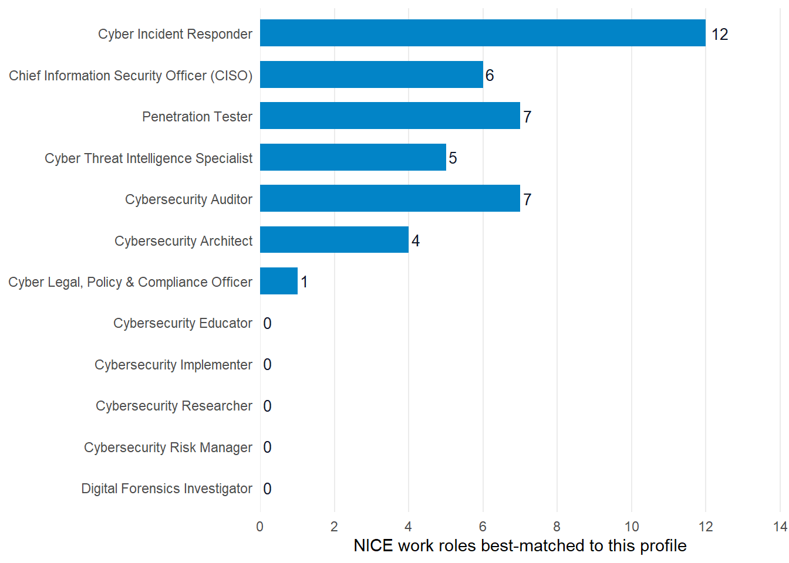

![](data:image/svg+xml;base64,PHN2ZyB4bWxucz0iaHR0cDovL3d3dy53My5vcmcvMjAwMC9zdmciIHN0eWxlPSJkaXNwbGF5Om5vbmUiIGFyaWEtaGlkZGVuPSJ0cnVlIj48c3ltYm9sIGlkPSJpY29uLXdvcmtmb3JjZSIgdmlld2JveD0iMCAwIDI0IDI0IiBmaWxsPSJub25lIiBzdHJva2U9ImN1cnJlbnRDb2xvciIgc3Ryb2tlLXdpZHRoPSIxLjYiIHN0cm9rZS1saW5lY2FwPSJyb3VuZCIgc3Ryb2tlLWxpbmVqb2luPSJyb3VuZCI+PHRpdGxlPldvcmtmb3JjZTwvdGl0bGU+CjxyZWN0IHg9IjMiIHk9IjgiIHdpZHRoPSIxOCIgaGVpZ2h0PSIxMiIgcng9IjEuNSIgLz48cGF0aCBkPSJNOSA4IFY2IFE5IDUgMTAgNSBIMTQgUTE1IDUgMTUgNiBWOCIgLz48bGluZSB4MT0iMyIgeTE9IjEzLjUiIHgyPSIyMSIgeTI9IjEzLjUiPjwvbGluZT48cmVjdCB4PSIxMSIgeT0iMTIuNiIgd2lkdGg9IjIiIGhlaWdodD0iMS44IiByeD0iMC4zIiBmaWxsPSJjdXJyZW50Q29sb3IiIHN0cm9rZT0ibm9uZSIgLz48L3N5bWJvbD48c3ltYm9sIGlkPSJpY29uLXBlZGFnb2d5IiB2aWV3Ym94PSIwIDAgMjQgMjQiIGZpbGw9Im5vbmUiIHN0cm9rZT0iY3VycmVudENvbG9yIiBzdHJva2Utd2lkdGg9IjEuNiIgc3Ryb2tlLWxpbmVjYXA9InJvdW5kIiBzdHJva2UtbGluZWpvaW49InJvdW5kIj48dGl0bGU+UGVkYWdvZ3k8L3RpdGxlPgo8cGF0aCBkPSJNMiA5IEwxMiA0LjUgTDIyIDkgTDEyIDEzLjUgWiIgLz48cGF0aCBkPSJNOCAxMi41IFE4IDE2LjUgMTIgMTYuNSBRMTYgMTYuNSAxNiAxMi41IiAvPjxwYXRoIGQ9Ik0yMiA5IFYxNCIgLz48Y2lyY2xlIGN4PSIyMiIgY3k9IjE0LjgiIHI9IjEiIGZpbGw9ImN1cnJlbnRDb2xvciIgc3Ryb2tlPSJub25lIj48L2NpcmNsZT48L3N5bWJvbD48c3ltYm9sIGlkPSJpY29uLXVzIiB2aWV3Ym94PSIwIDAgMjQgMjQiIGZpbGw9Im5vbmUiIHN0cm9rZT0iY3VycmVudENvbG9yIiBzdHJva2Utd2lkdGg9IjEuNiIgc3Ryb2tlLWxpbmVjYXA9InJvdW5kIiBzdHJva2UtbGluZWpvaW49InJvdW5kIj48dGl0bGU+VVM8L3RpdGxlPgo8cmVjdCB4PSIzIiB5PSI2IiB3aWR0aD0iMTgiIGhlaWdodD0iMTIiIHJ4PSIxIiAvPjxsaW5lIHgxPSIzIiB5MT0iMTAiIHgyPSIyMSIgeTI9IjEwIj48L2xpbmU+PGxpbmUgeDE9IjMiIHkxPSIxNCIgeDI9IjIxIiB5Mj0iMTQiPjwvbGluZT48cmVjdCB4PSIzIiB5PSI2IiB3aWR0aD0iNy41IiBoZWlnaHQ9IjUiIGZpbGw9ImN1cnJlbnRDb2xvciIgb3BhY2l0eT0iMC4yIiBzdHJva2U9Im5vbmUiIC8+PC9zeW1ib2w+PHN5bWJvbCBpZD0iaWNvbi1ldSIgdmlld2JveD0iMCAwIDI0IDI0IiBmaWxsPSJub25lIiBzdHJva2U9ImN1cnJlbnRDb2xvciIgc3Ryb2tlLXdpZHRoPSIxLjYiPjx0aXRsZT5FVTwvdGl0bGU+CjxjaXJjbGUgY3g9IjEyIiBjeT0iMTIiIHI9IjkiPjwvY2lyY2xlPjxjaXJjbGUgY3g9IjEyIiBjeT0iNSIgcj0iMSIgZmlsbD0iY3VycmVudENvbG9yIj48L2NpcmNsZT48Y2lyY2xlIGN4PSIxNy42IiBjeT0iOC41IiByPSIxIiBmaWxsPSJjdXJyZW50Q29sb3IiPjwvY2lyY2xlPjxjaXJjbGUgY3g9IjE3LjYiIGN5PSIxNS41IiByPSIxIiBmaWxsPSJjdXJyZW50Q29sb3IiPjwvY2lyY2xlPjxjaXJjbGUgY3g9IjEyIiBjeT0iMTkiIHI9IjEiIGZpbGw9ImN1cnJlbnRDb2xvciI+PC9jaXJjbGU+PGNpcmNsZSBjeD0iNi40IiBjeT0iMTUuNSIgcj0iMSIgZmlsbD0iY3VycmVudENvbG9yIj48L2NpcmNsZT48Y2lyY2xlIGN4PSI2LjQiIGN5PSI4LjUiIHI9IjEiIGZpbGw9ImN1cnJlbnRDb2xvciI+PC9jaXJjbGU+PC9zeW1ib2w+PHN5bWJvbCBpZD0iaWNvbi1jeiIgdmlld2JveD0iMCAwIDI0IDI0IiBmaWxsPSJub25lIiBzdHJva2U9ImN1cnJlbnRDb2xvciIgc3Ryb2tlLXdpZHRoPSIxLjYiIHN0cm9rZS1saW5lY2FwPSJyb3VuZCIgc3Ryb2tlLWxpbmVqb2luPSJyb3VuZCI+PHRpdGxlPkNaPC90aXRsZT4KPHJlY3QgeD0iMyIgeT0iNiIgd2lkdGg9IjE4IiBoZWlnaHQ9IjEyIiByeD0iMSIgLz48bGluZSB4MT0iMTEiIHkxPSIxMiIgeDI9IjIxIiB5Mj0iMTIiPjwvbGluZT48cGF0aCBkPSJNMyA2IEwxMSAxMiBMMyAxOCBaIiBmaWxsPSJjdXJyZW50Q29sb3IiIG9wYWNpdHk9IjAuMiIgc3Ryb2tlPSJub25lIiAvPjxwYXRoIGQ9Ik0zIDYgTDExIDEyIEwzIDE4IiAvPjwvc3ltYm9sPjxzeW1ib2wgaWQ9Imljb24tY2EiIHZpZXdib3g9IjAgMCAyNCAyNCIgZmlsbD0ibm9uZSIgc3Ryb2tlPSJjdXJyZW50Q29sb3IiIHN0cm9rZS13aWR0aD0iMS42IiBzdHJva2UtbGluZWNhcD0icm91bmQiIHN0cm9rZS1saW5lam9pbj0icm91bmQiPjx0aXRsZT5DQTwvdGl0bGU+CjxyZWN0IHg9IjMiIHk9IjYiIHdpZHRoPSIxOCIgaGVpZ2h0PSIxMiIgcng9IjEiIC8+PGxpbmUgeDE9IjgiIHkxPSI2IiB4Mj0iOCIgeTI9IjE4Ij48L2xpbmU+PGxpbmUgeDE9IjE2IiB5MT0iNiIgeDI9IjE2IiB5Mj0iMTgiPjwvbGluZT48cmVjdCB4PSIzIiB5PSI2IiB3aWR0aD0iNSIgaGVpZ2h0PSIxMiIgZmlsbD0iY3VycmVudENvbG9yIiBvcGFjaXR5PSIwLjIiIHN0cm9rZT0ibm9uZSIgLz48cmVjdCB4PSIxNiIgeT0iNiIgd2lkdGg9IjUiIGhlaWdodD0iMTIiIGZpbGw9ImN1cnJlbnRDb2xvciIgb3BhY2l0eT0iMC4yIiBzdHJva2U9Im5vbmUiIC8+PHBhdGggZD0iTTEyIDkgTDEzIDExLjIgTDE0LjYgMTAuNiBMMTQgMTIuNCBMMTUuNiAxMi42IEwxMi44IDE0LjIgTDEzLjEgMTUgTDExIDE0LjcgTDEwLjkgMTUgTDEwLjcgMTQuNyBMOC42IDE1IEw4LjkgMTQuMiBMNi4xIDEyLjYgTDcuNyAxMi40IEw3LjEgMTAuNiBMOC43IDExLjIgWiIgZmlsbD0iY3VycmVudENvbG9yIiBzdHJva2U9Im5vbmUiIC8+PC9zeW1ib2w+PHN5bWJvbCBpZD0iaWNvbi1zZyIgdmlld2JveD0iMCAwIDI0IDI0IiBmaWxsPSJub25lIiBzdHJva2U9ImN1cnJlbnRDb2xvciIgc3Ryb2tlLXdpZHRoPSIxLjYiIHN0cm9rZS1saW5lY2FwPSJyb3VuZCIgc3Ryb2tlLWxpbmVqb2luPSJyb3VuZCI+PHRpdGxlPlNHPC90aXRsZT4KPHJlY3QgeD0iMyIgeT0iNiIgd2lkdGg9IjE4IiBoZWlnaHQ9IjEyIiByeD0iMSIgLz48bGluZSB4MT0iMyIgeTE9IjEyIiB4Mj0iMjEiIHkyPSIxMiI+PC9saW5lPjxyZWN0IHg9IjMiIHk9IjYiIHdpZHRoPSIxOCIgaGVpZ2h0PSI2IiBmaWxsPSJjdXJyZW50Q29sb3IiIG9wYWNpdHk9IjAuMiIgc3Ryb2tlPSJub25lIiAvPjxwYXRoIGQ9Ik05LjYgOC4xIEEyLjYgMi42IDAgMSAwIDkuNiAxMS45IEEyIDIgMCAxIDEgOS42IDguMSBaIiBmaWxsPSJjdXJyZW50Q29sb3IiIHN0cm9rZT0ibm9uZSIgLz48Y2lyY2xlIGN4PSIxMy4yIiBjeT0iOC4zIiByPSIwLjYiIGZpbGw9ImN1cnJlbnRDb2xvciIgc3Ryb2tlPSJub25lIj48L2NpcmNsZT48Y2lyY2xlIGN4PSIxNS40IiBjeT0iOC4zIiByPSIwLjYiIGZpbGw9ImN1cnJlbnRDb2xvciIgc3Ryb2tlPSJub25lIj48L2NpcmNsZT48Y2lyY2xlIGN4PSIxMi41IiBjeT0iMTAuMiIgcj0iMC42IiBmaWxsPSJjdXJyZW50Q29sb3IiIHN0cm9rZT0ibm9uZSI+PC9jaXJjbGU+PGNpcmNsZSBjeD0iMTYuMSIgY3k9IjEwLjIiIHI9IjAuNiIgZmlsbD0iY3VycmVudENvbG9yIiBzdHJva2U9Im5vbmUiPjwvY2lyY2xlPjxjaXJjbGUgY3g9IjE0LjMiIGN5PSIxMS4zIiByPSIwLjYiIGZpbGw9ImN1cnJlbnRDb2xvciIgc3Ryb2tlPSJub25lIj48L2NpcmNsZT48L3N5bWJvbD48c3ltYm9sIGlkPSJpY29uLWdsb2JhbCIgdmlld2JveD0iMCAwIDI0IDI0IiBmaWxsPSJub25lIiBzdHJva2U9ImN1cnJlbnRDb2xvciIgc3Ryb2tlLXdpZHRoPSIxLjYiIHN0cm9rZS1saW5lY2FwPSJyb3VuZCIgc3Ryb2tlLWxpbmVqb2luPSJyb3VuZCI+PHRpdGxlPkdsb2JhbDwvdGl0bGU+CjxjaXJjbGUgY3g9IjEyIiBjeT0iMTIiIHI9IjkiPjwvY2lyY2xlPjxlbGxpcHNlIGN4PSIxMiIgY3k9IjEyIiByeD0iOSIgcnk9IjMuNCI+PC9lbGxpcHNlPjxsaW5lIHgxPSIxMiIgeTE9IjMiIHgyPSIxMiIgeTI9IjIxIj48L2xpbmU+PC9zeW1ib2w+PHN5bWJvbCBpZD0iaWNvbi1hcmNoaXZlIiB2aWV3Ym94PSIwIDAgMjQgMjQiIGZpbGw9Im5vbmUiIHN0cm9rZT0iY3VycmVudENvbG9yIiBzdHJva2Utd2lkdGg9IjEuNiIgc3Ryb2tlLWxpbmVjYXA9InJvdW5kIiBzdHJva2UtbGluZWpvaW49InJvdW5kIj48dGl0bGU+U291cmNlPC90aXRsZT4KPHJlY3QgeD0iMyIgeT0iNCIgd2lkdGg9IjE4IiBoZWlnaHQ9IjQiIHJ4PSIxIiAvPjxwYXRoIGQ9Ik01IDggVjIwIFE1IDIxIDYgMjEgSDE4IFExOSAyMSAxOSAyMCBWOCIgLz48bGluZSB4MT0iMTAiIHkxPSIxMyIgeDI9IjE0IiB5Mj0iMTMiPjwvbGluZT48L3N5bWJvbD48c3ltYm9sIGlkPSJpY29uLWdlYXIiIHZpZXdib3g9IjAgMCAyNCAyNCIgZmlsbD0ibm9uZSIgc3Ryb2tlPSJjdXJyZW50Q29sb3IiIHN0cm9rZS13aWR0aD0iMS42IiBzdHJva2UtbGluZWNhcD0icm91bmQiIHN0cm9rZS1saW5lam9pbj0icm91bmQiPjx0aXRsZT5Jbmdlc3Rpb248L3RpdGxlPgo8Y2lyY2xlIGN4PSIxMiIgY3k9IjEyIiByPSIzLjUiPjwvY2lyY2xlPjxsaW5lIHgxPSIxMiIgeTE9IjIiIHgyPSIxMiIgeTI9IjUiPjwvbGluZT48bGluZSB4MT0iMTIiIHkxPSIxOSIgeDI9IjEyIiB5Mj0iMjIiPjwvbGluZT48bGluZSB4MT0iMjIiIHkxPSIxMiIgeDI9IjE5IiB5Mj0iMTIiPjwvbGluZT48bGluZSB4MT0iNSIgeTE9IjEyIiB4Mj0iMiIgeTI9IjEyIj48L2xpbmU+PGxpbmUgeDE9IjE5LjA3IiB5MT0iNC45MyIgeDI9IjE3IiB5Mj0iNyI+PC9saW5lPjxsaW5lIHgxPSI3IiB5MT0iMTciIHgyPSI0LjkzIiB5Mj0iMTkuMDciPjwvbGluZT48bGluZSB4MT0iMTkuMDciIHkxPSIxOS4wNyIgeDI9IjE3IiB5Mj0iMTciPjwvbGluZT48bGluZSB4MT0iNyIgeTE9IjciIHgyPSI0LjkzIiB5Mj0iNC45MyI+PC9saW5lPjwvc3ltYm9sPjxzeW1ib2wgaWQ9Imljb24tbGljZW5zZSIgdmlld2JveD0iMCAwIDI0IDI0IiBmaWxsPSJub25lIiBzdHJva2U9ImN1cnJlbnRDb2xvciIgc3Ryb2tlLXdpZHRoPSIxLjYiIHN0cm9rZS1saW5lY2FwPSJyb3VuZCIgc3Ryb2tlLWxpbmVqb2luPSJyb3VuZCI+PHRpdGxlPkxpY2Vuc2U8L3RpdGxlPgo8cGF0aCBkPSJNMTIgMyBMMjAgNiBWMTIgUTIwIDE3IDEyIDIxIFE0IDE3IDQgMTIgVjYgWiIgLz48cmVjdCB4PSI5IiB5PSIxMSIgd2lkdGg9IjYiIGhlaWdodD0iNSIgcng9IjAuNiIgLz48cGF0aCBkPSJNMTAuNSAxMSBWOSBRMTAuNSA3LjUgMTIgNy41IFExMy41IDcuNSAxMy41IDkgVjExIiAvPjwvc3ltYm9sPjxzeW1ib2wgaWQ9Imljb24tc2EiIHZpZXdib3g9IjAgMCAyNCAyNCIgZmlsbD0ibm9uZSIgc3Ryb2tlPSJjdXJyZW50Q29sb3IiIHN0cm9rZS13aWR0aD0iMS42IiBzdHJva2UtbGluZWNhcD0icm91bmQiIHN0cm9rZS1saW5lam9pbj0icm91bmQiPjx0aXRsZT5TQTwvdGl0bGU+CjxyZWN0IHg9IjMiIHk9IjYiIHdpZHRoPSIxOCIgaGVpZ2h0PSIxMiIgcng9IjEiIC8+PHJlY3QgeD0iMyIgeT0iNiIgd2lkdGg9IjE4IiBoZWlnaHQ9IjEyIiBmaWxsPSJjdXJyZW50Q29sb3IiIG9wYWNpdHk9IjAuMiIgc3Ryb2tlPSJub25lIiAvPjxsaW5lIHgxPSI3IiB5MT0iMTIiIHgyPSIxNyIgeTI9IjEyIj48L2xpbmU+PGxpbmUgeDE9IjE0IiB5MT0iOSIgeDI9IjE3IiB5Mj0iMTIiPjwvbGluZT48bGluZSB4MT0iMTQiIHkxPSIxNSIgeDI9IjE3IiB5Mj0iMTIiPjwvbGluZT48L3N5bWJvbD48c3ltYm9sIGlkPSJpY29uLXVrIiB2aWV3Ym94PSIwIDAgMjQgMjQiIGZpbGw9Im5vbmUiIHN0cm9rZT0iY3VycmVudENvbG9yIiBzdHJva2Utd2lkdGg9IjEuNiIgc3Ryb2tlLWxpbmVjYXA9InJvdW5kIiBzdHJva2UtbGluZWpvaW49InJvdW5kIj48dGl0bGU+VUs8L3RpdGxlPgo8cmVjdCB4PSIzIiB5PSI2IiB3aWR0aD0iMTgiIGhlaWdodD0iMTIiIHJ4PSIxIiAvPjxsaW5lIHgxPSIzIiB5MT0iNiIgeDI9IjIxIiB5Mj0iMTgiPjwvbGluZT48bGluZSB4MT0iMjEiIHkxPSI2IiB4Mj0iMyIgeTI9IjE4Ij48L2xpbmU+PGxpbmUgeDE9IjEyIiB5MT0iNiIgeDI9IjEyIiB5Mj0iMTgiPjwvbGluZT48bGluZSB4MT0iMyIgeTE9IjEyIiB4Mj0iMjEiIHkyPSIxMiI+PC9saW5lPjwvc3ltYm9sPjwvc3ZnPg==)

# Where do NICE work roles align with ENISA ECSF role profiles?

Cross-jurisdictional similarity at the workforce-role level

Cross-framework

Workforce

Cross-jurisdictional

Pairwise Jaccard similarity between the NICE work roles (US) and the ENISA ECSF role profiles (EU), with each unit’s full document (parent description plus all child elements concatenated) as the comparison surface. Median similarity is roughly three times the NICE-to-CSEC2017 finding because both NICE and ECSF are workforce-position vocabularies.

Published

May 9, 2026

## The question

For each of the 42 NICE work roles, what is the closest ENISA ECSF role profile (and the next two closest) by full-document text similarity?

## Why it matters

NICE (US, NIST) and ECSF (EU, ENISA) are the two most-cited workforce frameworks for cross-jurisdictional cyber workforce policy work. Practitioners staffing US-EU mobility studies, transnational hiring discussions, and federal-level workforce-strategy briefings frequently need to surface plausible role-equivalence candidates between the two.

Both frameworks describe cyber workforce roles in workforce-position vocabulary. The structural difference is granularity. NICE specifies 42 detailed civilian work roles by position description. ECSF specifies 12 broader role profiles by intent. Many-to-one vocabulary patterns from NICE to ECSF are the rule.

This query asks whether vocabulary similarity surfaces those many-to-one patterns, and where the best candidate equivalence pairs sit.

## The result

| Statistic    | Value |
|:-------------|:------|
| Minimum      | 0.112 |
| 1st Quartile | 0.134 |
| Median       | 0.144 |
| Mean         | 0.145 |
| 3rd Quartile | 0.159 |
| Maximum      | 0.179 |

Table 1: NICE work-role-to-ECSF-profile best-match similarity, summary statistics

Median best-match similarity is 0.144, roughly 4 times the NICE-to-CSEC2017 figure (0.040 in [that query](../queries/nice-csec2017-alignment.llms.md)). NICE and ECSF speak the same vocabulary world. The difference between them is jurisdiction and granularity, not framework purpose.

[](nice-ecsf-alignment_files/figure-html/fig-ecsf-distribution-1.png "Figure 1: How NICE work roles distribute across ECSF profiles as best matches. 5 ECSF profiles draw zero NICE roles as top match.")

Figure 1: How NICE work roles distribute across ECSF profiles as best matches. 5 ECSF profiles draw zero NICE roles as top match.

Cyber Incident Responder absorbs 12 NICE roles. Cybersecurity Auditor absorbs 7, Penetration Tester absorbs 7, Chief Information Security Officer (CISO) absorbs 6. 5 ECSF profiles draw zero NICE roles as top match (Cybersecurity Implementer, Educator, Researcher, Risk Manager, Digital Forensics Investigator). The 42 NICE roles cluster into 7 of ECSF’s 12 profile slots.

| NICE work role | Closest ECSF profile | Similarity |
|:---|:---|---:|
| Program Management | Cybersecurity Auditor | 0.179 |
| Incident Response | Cyber Incident Responder | 0.177 |
| Secure Project Management | Chief Information Security Officer (CISO) | 0.171 |
| Privacy Compliance | Cyber Legal, Policy & Compliance Officer | 0.169 |
| Cybersecurity Workforce Management | Chief Information Security Officer (CISO) | 0.168 |
| Product Support Management | Cybersecurity Auditor | 0.165 |
| Systems Security Management | Chief Information Security Officer (CISO) | 0.163 |
| Communications Security (COMSEC) Management | Cyber Incident Responder | 0.162 |

Table 2: Top 8 NICE → ECSF candidate equivalence pairs by similarity

The strongest pair is NICE Program Management against ECSF Cybersecurity Auditor at 0.179, which is a similarity result rather than an obvious role analog. The second pair, NICE Incident Response against ECSF Cyber Incident Responder, is the face-valid cross-jurisdictional analog and sits just behind it. Several other top pairs hold up too. NICE Cybersecurity Workforce Management lines up with CISO. NICE Privacy Compliance lines up with the Cyber Legal, Policy and Compliance Officer profile.

## What this tells us

### The vocabulary alignment is real

Median Jaccard 0.144 runs roughly 4 times the NICE-to-CSEC2017 result (0.040). The structural reason: both frameworks are workforce-position vocabularies. They are designed for the same kind of audience and use the same kind of language to describe the same kind of object, a cyber worker’s role.

### Granularity asymmetry drives the distribution

ECSF specifies 12 broader role profiles. NICE specifies 42 detailed civilian roles. The many-to-one patterns concentrate around the broadest ECSF profiles (Cyber Incident Responder absorbs 12, Cybersecurity Auditor absorbs 7, Penetration Tester absorbs 7) and leave the narrower ECSF profiles (Implementer, Educator, Researcher, Risk Manager, Forensics Investigator) with zero top-1 matches.

### 3 of the 3 unmatched ECSF profiles surface at rank 2 or 3

They didn’t surface as top-1 matches because other ECSF profiles absorbed their candidate NICE roles with marginally higher overlap. Expanding from rank-1 to rank-3 in the saved `top3` data recovers Cybersecurity Risk Manager, Cybersecurity Implementer, Digital Forensics Investigator. It does not recover , neither of which appears in any NICE role’s top three. For a policy briefing where coverage of all 12 ECSF profiles matters, those need US-side commentary written by hand.

### CISO over-attracts management-flavored NICE roles

6 NICE roles best-match to it: Secure Project Management, Cybersecurity Workforce Management, Executive Cybersecurity Leadership, Technology Portfolio Management, Cybersecurity Policy and Planning, Systems Security Management. 2 of those, Secure Project Management and Technology Portfolio Management, read as general technology management rather than cybersecurity-specific leadership. CISO absorbs them by default because ECSF has no non-cybersecurity-specific management profile and CISO carries the broadest management vocabulary in the catalog. A policy reviewer should treat the CISO cluster as candidates for ECSF-side leadership-pathway alignment, not as ECSF CISO equivalents.

## What this doesn’t tell us

### Vocabulary similarity is not equivalence

A best-match similarity of 0.179 does not mean a US-trained worker is qualified for the matched EU position. Credentialing pathways, regulatory contexts, clearance requirements, and language fluency remain separate considerations. cybedtools surfaces structural candidates. The equivalence judgment is human work.

### The framework versions matter

NICE v2 (NIST SP 800-181 Rev 1, 2020-2024 evolution) and ECSF v1 (ENISA, 2022) are both relatively young in their current form. Both are likely to evolve. This query is a snapshot against cybedtools v0.3.0, recomputed after the NICE v2.2.0 upgrade. Re-run it when either framework ships a new version.

### Cross-jurisdictional mobility is more than role-pair alignment

The briefing memo this query supports is one input to a much larger question (mutual recognition of credentials, language, employer sponsorship policies, EU Blue Card vs H-1B specifics). cybedtools provides the structural anchor. The policy work surrounds it.

## Look up by NICE work role

The widget below shows each of the 42 NICE work roles with its top-3 ENISA ECSF role profiles by full-document Jaccard. Search by role name to find candidate equivalence pairs quickly. Useful for briefing preparation when you need to surface specific NICE-to-ECSF candidates without re-running the analysis.

Table 3

Rows group by NICE work role. Expand to see the top-3 ECSF profiles in similarity-descending order. Candidate equivalence pairs surface at the top of each role’s group. 3 of the ECSF profiles that drop out of the top-1 view (Cybersecurity Risk Manager, Cybersecurity Implementer, Digital Forensics Investigator) appear as rank-2 or rank-3 matches for several NICE roles. do not appear at any rank.

## Reproduce this

``` downlit
library(cybedtools)
library(dplyr)
library(stringr)
library(purrr)
library(tidyr)
library(rdflib)

g <- load_combined_ntriples_graph()
```

The unit pull is read straight out of the prep script, so this block cannot drift away from what actually ran:

``` downlit
unit_bindings <- organizing_unit_framework_bindings(g)
# NICE side must be WORK ROLES ONLY. Since the v2.2.0 re-ingest NICE also
# contributes 11 competency areas as cybed:OrganizingUnit -- a second
# grouping axis over the same K/S catalog, not roles. Filtering organizing
# units by framework alone silently pulled those in and compared them
# against ECSF profiles as if they were roles (53 units instead of 42).
# Use the cybed:Role-typed bindings for NICE; ECSF profiles are genuinely
# Role-typed too but stay on the organizing-unit path, which is correct.
nice_roles <- role_framework_bindings(g) |>
  filter(grepl("^NICE", framework_name)) |>
  select(unit = role, unit_name = role_name)
ecsf_profiles <- unit_bindings |>
  filter(grepl("ECSF", framework_name)) |>
  select(unit, unit_name)
```

Note which binding each side uses. The NICE side comes off [`role_framework_bindings()`](https://ryanstraight.github.io/cybedtools/reference/role_framework_bindings.html), not [`organizing_unit_framework_bindings()`](https://ryanstraight.github.io/cybedtools/reference/organizing_unit_framework_bindings.html), because since the v2.2.0 re-ingest NICE contributes 11 competency areas as organizing units alongside its 42 work roles. Pulling organizing units would compare 53 NICE units against ECSF profiles as though all 53 were roles. The ECSF side stays on the organizing-unit path, which is correct for it.

From there the script builds full-document text per unit, tokenizes, computes Jaccard pairwise, and keeps the top 3 ECSF profiles per NICE work role. The full script is `concordance/_data-prep-nice-ecsf-alignment.R` in the repository.

## Related queries

- [Where do NICE work roles align with CSEC2017 Knowledge Areas?](../queries/nice-csec2017-alignment.llms.md), the same question against a curriculum-vocabulary framework rather than a workforce-vocabulary framework. The contrast is informative.
- [Where do Cyber.org K-12 and CSTA standards lexically align?](../queries/k12-alignment.llms.md), the K-12 pedagogy-layer analog.
- [How does element density vary across frameworks?](../queries/density-spread.llms.md), the design-philosophy comparison that explains the US/EU granularity asymmetry.

## Use case using this data

- [Devi uses this analysis for a US-EU mobility briefing memo](../use-cases/policy-analyst.llms.md), the practitioner-facing version.

Back to top
