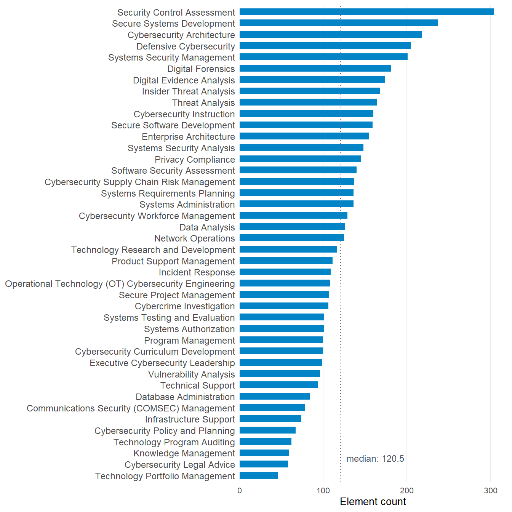

![](data:image/svg+xml;base64,PHN2ZyB4bWxucz0iaHR0cDovL3d3dy53My5vcmcvMjAwMC9zdmciIHN0eWxlPSJkaXNwbGF5Om5vbmUiIGFyaWEtaGlkZGVuPSJ0cnVlIj48c3ltYm9sIGlkPSJpY29uLXdvcmtmb3JjZSIgdmlld2JveD0iMCAwIDI0IDI0IiBmaWxsPSJub25lIiBzdHJva2U9ImN1cnJlbnRDb2xvciIgc3Ryb2tlLXdpZHRoPSIxLjYiIHN0cm9rZS1saW5lY2FwPSJyb3VuZCIgc3Ryb2tlLWxpbmVqb2luPSJyb3VuZCI+PHRpdGxlPldvcmtmb3JjZTwvdGl0bGU+CjxyZWN0IHg9IjMiIHk9IjgiIHdpZHRoPSIxOCIgaGVpZ2h0PSIxMiIgcng9IjEuNSIgLz48cGF0aCBkPSJNOSA4IFY2IFE5IDUgMTAgNSBIMTQgUTE1IDUgMTUgNiBWOCIgLz48bGluZSB4MT0iMyIgeTE9IjEzLjUiIHgyPSIyMSIgeTI9IjEzLjUiPjwvbGluZT48cmVjdCB4PSIxMSIgeT0iMTIuNiIgd2lkdGg9IjIiIGhlaWdodD0iMS44IiByeD0iMC4zIiBmaWxsPSJjdXJyZW50Q29sb3IiIHN0cm9rZT0ibm9uZSIgLz48L3N5bWJvbD48c3ltYm9sIGlkPSJpY29uLXBlZGFnb2d5IiB2aWV3Ym94PSIwIDAgMjQgMjQiIGZpbGw9Im5vbmUiIHN0cm9rZT0iY3VycmVudENvbG9yIiBzdHJva2Utd2lkdGg9IjEuNiIgc3Ryb2tlLWxpbmVjYXA9InJvdW5kIiBzdHJva2UtbGluZWpvaW49InJvdW5kIj48dGl0bGU+UGVkYWdvZ3k8L3RpdGxlPgo8cGF0aCBkPSJNMiA5IEwxMiA0LjUgTDIyIDkgTDEyIDEzLjUgWiIgLz48cGF0aCBkPSJNOCAxMi41IFE4IDE2LjUgMTIgMTYuNSBRMTYgMTYuNSAxNiAxMi41IiAvPjxwYXRoIGQ9Ik0yMiA5IFYxNCIgLz48Y2lyY2xlIGN4PSIyMiIgY3k9IjE0LjgiIHI9IjEiIGZpbGw9ImN1cnJlbnRDb2xvciIgc3Ryb2tlPSJub25lIj48L2NpcmNsZT48L3N5bWJvbD48c3ltYm9sIGlkPSJpY29uLXVzIiB2aWV3Ym94PSIwIDAgMjQgMjQiIGZpbGw9Im5vbmUiIHN0cm9rZT0iY3VycmVudENvbG9yIiBzdHJva2Utd2lkdGg9IjEuNiIgc3Ryb2tlLWxpbmVjYXA9InJvdW5kIiBzdHJva2UtbGluZWpvaW49InJvdW5kIj48dGl0bGU+VVM8L3RpdGxlPgo8cmVjdCB4PSIzIiB5PSI2IiB3aWR0aD0iMTgiIGhlaWdodD0iMTIiIHJ4PSIxIiAvPjxsaW5lIHgxPSIzIiB5MT0iMTAiIHgyPSIyMSIgeTI9IjEwIj48L2xpbmU+PGxpbmUgeDE9IjMiIHkxPSIxNCIgeDI9IjIxIiB5Mj0iMTQiPjwvbGluZT48cmVjdCB4PSIzIiB5PSI2IiB3aWR0aD0iNy41IiBoZWlnaHQ9IjUiIGZpbGw9ImN1cnJlbnRDb2xvciIgb3BhY2l0eT0iMC4yIiBzdHJva2U9Im5vbmUiIC8+PC9zeW1ib2w+PHN5bWJvbCBpZD0iaWNvbi1ldSIgdmlld2JveD0iMCAwIDI0IDI0IiBmaWxsPSJub25lIiBzdHJva2U9ImN1cnJlbnRDb2xvciIgc3Ryb2tlLXdpZHRoPSIxLjYiPjx0aXRsZT5FVTwvdGl0bGU+CjxjaXJjbGUgY3g9IjEyIiBjeT0iMTIiIHI9IjkiPjwvY2lyY2xlPjxjaXJjbGUgY3g9IjEyIiBjeT0iNSIgcj0iMSIgZmlsbD0iY3VycmVudENvbG9yIj48L2NpcmNsZT48Y2lyY2xlIGN4PSIxNy42IiBjeT0iOC41IiByPSIxIiBmaWxsPSJjdXJyZW50Q29sb3IiPjwvY2lyY2xlPjxjaXJjbGUgY3g9IjE3LjYiIGN5PSIxNS41IiByPSIxIiBmaWxsPSJjdXJyZW50Q29sb3IiPjwvY2lyY2xlPjxjaXJjbGUgY3g9IjEyIiBjeT0iMTkiIHI9IjEiIGZpbGw9ImN1cnJlbnRDb2xvciI+PC9jaXJjbGU+PGNpcmNsZSBjeD0iNi40IiBjeT0iMTUuNSIgcj0iMSIgZmlsbD0iY3VycmVudENvbG9yIj48L2NpcmNsZT48Y2lyY2xlIGN4PSI2LjQiIGN5PSI4LjUiIHI9IjEiIGZpbGw9ImN1cnJlbnRDb2xvciI+PC9jaXJjbGU+PC9zeW1ib2w+PHN5bWJvbCBpZD0iaWNvbi1jeiIgdmlld2JveD0iMCAwIDI0IDI0IiBmaWxsPSJub25lIiBzdHJva2U9ImN1cnJlbnRDb2xvciIgc3Ryb2tlLXdpZHRoPSIxLjYiIHN0cm9rZS1saW5lY2FwPSJyb3VuZCIgc3Ryb2tlLWxpbmVqb2luPSJyb3VuZCI+PHRpdGxlPkNaPC90aXRsZT4KPHJlY3QgeD0iMyIgeT0iNiIgd2lkdGg9IjE4IiBoZWlnaHQ9IjEyIiByeD0iMSIgLz48bGluZSB4MT0iMTEiIHkxPSIxMiIgeDI9IjIxIiB5Mj0iMTIiPjwvbGluZT48cGF0aCBkPSJNMyA2IEwxMSAxMiBMMyAxOCBaIiBmaWxsPSJjdXJyZW50Q29sb3IiIG9wYWNpdHk9IjAuMiIgc3Ryb2tlPSJub25lIiAvPjxwYXRoIGQ9Ik0zIDYgTDExIDEyIEwzIDE4IiAvPjwvc3ltYm9sPjxzeW1ib2wgaWQ9Imljb24tY2EiIHZpZXdib3g9IjAgMCAyNCAyNCIgZmlsbD0ibm9uZSIgc3Ryb2tlPSJjdXJyZW50Q29sb3IiIHN0cm9rZS13aWR0aD0iMS42IiBzdHJva2UtbGluZWNhcD0icm91bmQiIHN0cm9rZS1saW5lam9pbj0icm91bmQiPjx0aXRsZT5DQTwvdGl0bGU+CjxyZWN0IHg9IjMiIHk9IjYiIHdpZHRoPSIxOCIgaGVpZ2h0PSIxMiIgcng9IjEiIC8+PGxpbmUgeDE9IjgiIHkxPSI2IiB4Mj0iOCIgeTI9IjE4Ij48L2xpbmU+PGxpbmUgeDE9IjE2IiB5MT0iNiIgeDI9IjE2IiB5Mj0iMTgiPjwvbGluZT48cmVjdCB4PSIzIiB5PSI2IiB3aWR0aD0iNSIgaGVpZ2h0PSIxMiIgZmlsbD0iY3VycmVudENvbG9yIiBvcGFjaXR5PSIwLjIiIHN0cm9rZT0ibm9uZSIgLz48cmVjdCB4PSIxNiIgeT0iNiIgd2lkdGg9IjUiIGhlaWdodD0iMTIiIGZpbGw9ImN1cnJlbnRDb2xvciIgb3BhY2l0eT0iMC4yIiBzdHJva2U9Im5vbmUiIC8+PHBhdGggZD0iTTEyIDkgTDEzIDExLjIgTDE0LjYgMTAuNiBMMTQgMTIuNCBMMTUuNiAxMi42IEwxMi44IDE0LjIgTDEzLjEgMTUgTDExIDE0LjcgTDEwLjkgMTUgTDEwLjcgMTQuNyBMOC42IDE1IEw4LjkgMTQuMiBMNi4xIDEyLjYgTDcuNyAxMi40IEw3LjEgMTAuNiBMOC43IDExLjIgWiIgZmlsbD0iY3VycmVudENvbG9yIiBzdHJva2U9Im5vbmUiIC8+PC9zeW1ib2w+PHN5bWJvbCBpZD0iaWNvbi1zZyIgdmlld2JveD0iMCAwIDI0IDI0IiBmaWxsPSJub25lIiBzdHJva2U9ImN1cnJlbnRDb2xvciIgc3Ryb2tlLXdpZHRoPSIxLjYiIHN0cm9rZS1saW5lY2FwPSJyb3VuZCIgc3Ryb2tlLWxpbmVqb2luPSJyb3VuZCI+PHRpdGxlPlNHPC90aXRsZT4KPHJlY3QgeD0iMyIgeT0iNiIgd2lkdGg9IjE4IiBoZWlnaHQ9IjEyIiByeD0iMSIgLz48bGluZSB4MT0iMyIgeTE9IjEyIiB4Mj0iMjEiIHkyPSIxMiI+PC9saW5lPjxyZWN0IHg9IjMiIHk9IjYiIHdpZHRoPSIxOCIgaGVpZ2h0PSI2IiBmaWxsPSJjdXJyZW50Q29sb3IiIG9wYWNpdHk9IjAuMiIgc3Ryb2tlPSJub25lIiAvPjxwYXRoIGQ9Ik05LjYgOC4xIEEyLjYgMi42IDAgMSAwIDkuNiAxMS45IEEyIDIgMCAxIDEgOS42IDguMSBaIiBmaWxsPSJjdXJyZW50Q29sb3IiIHN0cm9rZT0ibm9uZSIgLz48Y2lyY2xlIGN4PSIxMy4yIiBjeT0iOC4zIiByPSIwLjYiIGZpbGw9ImN1cnJlbnRDb2xvciIgc3Ryb2tlPSJub25lIj48L2NpcmNsZT48Y2lyY2xlIGN4PSIxNS40IiBjeT0iOC4zIiByPSIwLjYiIGZpbGw9ImN1cnJlbnRDb2xvciIgc3Ryb2tlPSJub25lIj48L2NpcmNsZT48Y2lyY2xlIGN4PSIxMi41IiBjeT0iMTAuMiIgcj0iMC42IiBmaWxsPSJjdXJyZW50Q29sb3IiIHN0cm9rZT0ibm9uZSI+PC9jaXJjbGU+PGNpcmNsZSBjeD0iMTYuMSIgY3k9IjEwLjIiIHI9IjAuNiIgZmlsbD0iY3VycmVudENvbG9yIiBzdHJva2U9Im5vbmUiPjwvY2lyY2xlPjxjaXJjbGUgY3g9IjE0LjMiIGN5PSIxMS4zIiByPSIwLjYiIGZpbGw9ImN1cnJlbnRDb2xvciIgc3Ryb2tlPSJub25lIj48L2NpcmNsZT48L3N5bWJvbD48c3ltYm9sIGlkPSJpY29uLWdsb2JhbCIgdmlld2JveD0iMCAwIDI0IDI0IiBmaWxsPSJub25lIiBzdHJva2U9ImN1cnJlbnRDb2xvciIgc3Ryb2tlLXdpZHRoPSIxLjYiIHN0cm9rZS1saW5lY2FwPSJyb3VuZCIgc3Ryb2tlLWxpbmVqb2luPSJyb3VuZCI+PHRpdGxlPkdsb2JhbDwvdGl0bGU+CjxjaXJjbGUgY3g9IjEyIiBjeT0iMTIiIHI9IjkiPjwvY2lyY2xlPjxlbGxpcHNlIGN4PSIxMiIgY3k9IjEyIiByeD0iOSIgcnk9IjMuNCI+PC9lbGxpcHNlPjxsaW5lIHgxPSIxMiIgeTE9IjMiIHgyPSIxMiIgeTI9IjIxIj48L2xpbmU+PC9zeW1ib2w+PHN5bWJvbCBpZD0iaWNvbi1hcmNoaXZlIiB2aWV3Ym94PSIwIDAgMjQgMjQiIGZpbGw9Im5vbmUiIHN0cm9rZT0iY3VycmVudENvbG9yIiBzdHJva2Utd2lkdGg9IjEuNiIgc3Ryb2tlLWxpbmVjYXA9InJvdW5kIiBzdHJva2UtbGluZWpvaW49InJvdW5kIj48dGl0bGU+U291cmNlPC90aXRsZT4KPHJlY3QgeD0iMyIgeT0iNCIgd2lkdGg9IjE4IiBoZWlnaHQ9IjQiIHJ4PSIxIiAvPjxwYXRoIGQ9Ik01IDggVjIwIFE1IDIxIDYgMjEgSDE4IFExOSAyMSAxOSAyMCBWOCIgLz48bGluZSB4MT0iMTAiIHkxPSIxMyIgeDI9IjE0IiB5Mj0iMTMiPjwvbGluZT48L3N5bWJvbD48c3ltYm9sIGlkPSJpY29uLWdlYXIiIHZpZXdib3g9IjAgMCAyNCAyNCIgZmlsbD0ibm9uZSIgc3Ryb2tlPSJjdXJyZW50Q29sb3IiIHN0cm9rZS13aWR0aD0iMS42IiBzdHJva2UtbGluZWNhcD0icm91bmQiIHN0cm9rZS1saW5lam9pbj0icm91bmQiPjx0aXRsZT5Jbmdlc3Rpb248L3RpdGxlPgo8Y2lyY2xlIGN4PSIxMiIgY3k9IjEyIiByPSIzLjUiPjwvY2lyY2xlPjxsaW5lIHgxPSIxMiIgeTE9IjIiIHgyPSIxMiIgeTI9IjUiPjwvbGluZT48bGluZSB4MT0iMTIiIHkxPSIxOSIgeDI9IjEyIiB5Mj0iMjIiPjwvbGluZT48bGluZSB4MT0iMjIiIHkxPSIxMiIgeDI9IjE5IiB5Mj0iMTIiPjwvbGluZT48bGluZSB4MT0iNSIgeTE9IjEyIiB4Mj0iMiIgeTI9IjEyIj48L2xpbmU+PGxpbmUgeDE9IjE5LjA3IiB5MT0iNC45MyIgeDI9IjE3IiB5Mj0iNyI+PC9saW5lPjxsaW5lIHgxPSI3IiB5MT0iMTciIHgyPSI0LjkzIiB5Mj0iMTkuMDciPjwvbGluZT48bGluZSB4MT0iMTkuMDciIHkxPSIxOS4wNyIgeDI9IjE3IiB5Mj0iMTciPjwvbGluZT48bGluZSB4MT0iNyIgeTE9IjciIHgyPSI0LjkzIiB5Mj0iNC45MyI+PC9saW5lPjwvc3ltYm9sPjxzeW1ib2wgaWQ9Imljb24tbGljZW5zZSIgdmlld2JveD0iMCAwIDI0IDI0IiBmaWxsPSJub25lIiBzdHJva2U9ImN1cnJlbnRDb2xvciIgc3Ryb2tlLXdpZHRoPSIxLjYiIHN0cm9rZS1saW5lY2FwPSJyb3VuZCIgc3Ryb2tlLWxpbmVqb2luPSJyb3VuZCI+PHRpdGxlPkxpY2Vuc2U8L3RpdGxlPgo8cGF0aCBkPSJNMTIgMyBMMjAgNiBWMTIgUTIwIDE3IDEyIDIxIFE0IDE3IDQgMTIgVjYgWiIgLz48cmVjdCB4PSI5IiB5PSIxMSIgd2lkdGg9IjYiIGhlaWdodD0iNSIgcng9IjAuNiIgLz48cGF0aCBkPSJNMTAuNSAxMSBWOSBRMTAuNSA3LjUgMTIgNy41IFExMy41IDcuNSAxMy41IDkgVjExIiAvPjwvc3ltYm9sPjxzeW1ib2wgaWQ9Imljb24tc2EiIHZpZXdib3g9IjAgMCAyNCAyNCIgZmlsbD0ibm9uZSIgc3Ryb2tlPSJjdXJyZW50Q29sb3IiIHN0cm9rZS13aWR0aD0iMS42IiBzdHJva2UtbGluZWNhcD0icm91bmQiIHN0cm9rZS1saW5lam9pbj0icm91bmQiPjx0aXRsZT5TQTwvdGl0bGU+CjxyZWN0IHg9IjMiIHk9IjYiIHdpZHRoPSIxOCIgaGVpZ2h0PSIxMiIgcng9IjEiIC8+PHJlY3QgeD0iMyIgeT0iNiIgd2lkdGg9IjE4IiBoZWlnaHQ9IjEyIiBmaWxsPSJjdXJyZW50Q29sb3IiIG9wYWNpdHk9IjAuMiIgc3Ryb2tlPSJub25lIiAvPjxsaW5lIHgxPSI3IiB5MT0iMTIiIHgyPSIxNyIgeTI9IjEyIj48L2xpbmU+PGxpbmUgeDE9IjE0IiB5MT0iOSIgeDI9IjE3IiB5Mj0iMTIiPjwvbGluZT48bGluZSB4MT0iMTQiIHkxPSIxNSIgeDI9IjE3IiB5Mj0iMTIiPjwvbGluZT48L3N5bWJvbD48c3ltYm9sIGlkPSJpY29uLXVrIiB2aWV3Ym94PSIwIDAgMjQgMjQiIGZpbGw9Im5vbmUiIHN0cm9rZT0iY3VycmVudENvbG9yIiBzdHJva2Utd2lkdGg9IjEuNiIgc3Ryb2tlLWxpbmVjYXA9InJvdW5kIiBzdHJva2UtbGluZWpvaW49InJvdW5kIj48dGl0bGU+VUs8L3RpdGxlPgo8cmVjdCB4PSIzIiB5PSI2IiB3aWR0aD0iMTgiIGhlaWdodD0iMTIiIHJ4PSIxIiAvPjxsaW5lIHgxPSIzIiB5MT0iNiIgeDI9IjIxIiB5Mj0iMTgiPjwvbGluZT48bGluZSB4MT0iMjEiIHkxPSI2IiB4Mj0iMyIgeTI9IjE4Ij48L2xpbmU+PGxpbmUgeDE9IjEyIiB5MT0iNiIgeDI9IjEyIiB5Mj0iMTgiPjwvbGluZT48bGluZSB4MT0iMyIgeTE9IjEyIiB4Mj0iMjEiIHkyPSIxMiI+PC9saW5lPjwvc3ltYm9sPjwvc3ZnPg==)

# Which NICE work roles concentrate the most element coverage?

Power-law shape across the NICE work roles

Cross-framework

Workforce

NICE

Per-work-role element counts across NICE Framework v2. The top five carry roughly a fifth of total element coverage. The long tail is real, and what ‘covers NICE’ actually means depends on which end of the distribution a curriculum reaches.

Published

May 9, 2026

## The question

How are NICE work-role element counts distributed across the 42 work roles, and how concentrated is the load at the top?

## Why it matters

Curricula and training programs that “cover NICE” routinely do so by surveying its top work roles. Whether that approach reaches NICE’s specification surface depends on how concentrated the element load is. A flat distribution would mean the top five represent about 11.9% of the total. A power-law would mean the top five carry a much larger share. The shape of the distribution is the question, and the answer reframes what “covers NICE” can credibly claim.

The element count per work role is the sum of NICE Tasks, Knowledge statements, and Skill statements attached to that role under `cybed:hasElement`.

## The result

| Rank | NICE work role              | Element count | Share of total (%) |
|-----:|:----------------------------|:--------------|-------------------:|
|    1 | Security Control Assessment | 304           |                5.6 |
|    2 | Secure Systems Development  | 237           |                4.4 |
|    3 | Cybersecurity Architecture  | 218           |                4.0 |
|    4 | Defensive Cybersecurity     | 205           |                3.8 |
|    5 | Systems Security Management | 201           |                3.7 |
|    6 | Digital Forensics           | 181           |                3.3 |
|    7 | Digital Evidence Analysis   | 174           |                3.2 |
|    8 | Insider Threat Analysis     | 168           |                3.1 |
|    9 | Threat Analysis             | 164           |                3.0 |
|   10 | Cybersecurity Instruction   | 160           |                2.9 |

Table 1: Top 10 NICE work roles by element count

[](top-work-roles_files/figure-html/fig-power-law-1.png "Figure 1: Element count per NICE work role, all 42 roles. The top end is steep, the tail is real, and the median sits well below the mean.")

Figure 1: Element count per NICE work role, all 42 roles. The top end is steep, the tail is real, and the median sits well below the mean.

The top five work roles carry 21.5% of NICE’s element total. The top role (Security Control Assessment) lands at 304 elements. The median role sits at 120.5, which means the top role carries roughly 2.5 times the load of a median role.

## What this tells us

### The distribution is concentrated, not extreme

Top-five roles carry about a fifth of total elements. That is well above flat-uniform (11.9% if every role were equal) and well below scale-free (where the top would carry half or more).

### Top-five surveying reaches breadth, not the full corpus

Most of NICE’s specification body lives in the long tail. A program that limits coverage to the top five hits the densest specification surface but misses about four-fifths of NICE’s element load. Whether that matters depends on the program’s purpose. Workforce-pipeline preparation that wants to mirror federal hiring weights leans into the top end. Comprehensive curricular coverage needs the long tail too.

### The shape is structural to NICE v2.2.0

The concentration reflects which work roles NIST chose to specify in depth. Roles like Security Control Assessment, Secure Systems Development, Cybersecurity Architecture are built up with extensive Task and Knowledge statement libraries. Specialized roles in the long tail have leaner specification by design, not by oversight.

## What this doesn’t tell us

### Element count is specification weight, not workforce demand

A role with high element count is well-specified. It is not necessarily the role most US cyber jobs map onto. Workforce-demand evidence sits in BLS occupational data and CyberSeek, not in NICE element counts.

### Element count is not curricular effort either

A curricular program may invest heavily in a role with leaner NICE specification because the topic itself is conceptually demanding. Elements measure what NICE specifies, not what teaching the topic requires.

### This is a property of NICE v2.2.0

Earlier NICE releases distributed their specification differently. Comparisons across NICE versions need to refit element-count distributions per version, not assume the v2.2.0 shape carries.

## Look up by NICE work role

The widget below ranks all 42 NICE work roles by element count. Search by role name to find a specific role’s position in the distribution.

Table 2

## Reproduce this

``` downlit
library(cybedtools)
library(dplyr)

rdf <- load_combined_ntriples_graph()
```

The ranking is read straight out of the prep script, so this block cannot drift away from what actually ran:

``` downlit
nice_role_counts <- role_framework_bindings(rdf) |>
  filter(grepl("^NICE", framework_name)) |>
  inner_join(
    role_element_bindings(rdf) |> count(role, name = "element_count"),
    by = "role"
  ) |>
  arrange(desc(element_count)) |>
  select(role_name, element_count)
```

[`role_framework_bindings()`](https://ryanstraight.github.io/cybedtools/reference/role_framework_bindings.html) is the right binding here rather than [`organizing_unit_framework_bindings()`](https://ryanstraight.github.io/cybedtools/reference/organizing_unit_framework_bindings.html). Since the v2.2.0 re-ingest, NICE contributes 11 competency areas as organizing units alongside its work roles, and a unit-level pull would fold them into this ranking.

The full prep script is `concordance/_data-prep-top-work-roles.R` in the repository.

## Related queries

- [How does element density vary across frameworks?](../queries/density-spread.llms.md), the cross-framework view that puts NICE at the dense end of the corpus.
- [How is element coverage distributed across US and EU frameworks?](../queries/us-eu-asymmetry.llms.md), the jurisdictional rollup that NICE concentration partially drives.
- [Where do NICE work roles align with CSEC2017 Knowledge Areas?](../queries/nice-csec2017-alignment.llms.md), the curricular-vocabulary cross-walk against the same 42 NICE roles.
- [Where do NICE work roles align with ENISA ECSF role profiles?](../queries/nice-ecsf-alignment.llms.md), the cross-jurisdictional view of the same roles.

Back to top
