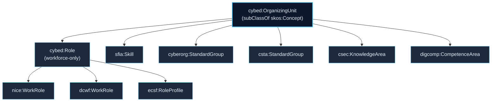
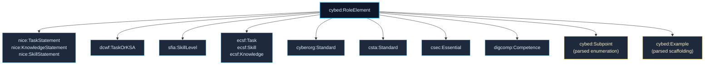

```{r, include = FALSE}
knitr::opts_chunk$set(collapse = TRUE, comment = "#>")
```

The core tension is that each framework uses its own vocabulary (work roles, tasks, competences, skills, levels, learning standards) while comparative analysis needs a framework-agnostic layer that lets SPARQL queries operate uniformly across them.

## Design choices

The architecture uses a two-tier namespace structure: a base vocabulary that is cross-framework, and framework-specific vocabularies that subclass the base. Each tier has a distinct prefix.

The base vocabulary subsumes the conceptual common ground of all in-scope frameworks: framework, organizing unit (the framework's top-level enumerated unit, whether a work role, skill, learning standard cluster, knowledge area, or competence area), role element (task, knowledge statement, skill statement, competence, learning standard), sub-point, example, element text, source reference, and structural metadata (jurisdiction, sector, specificity). Per-framework vocabularies specialize these via subclassing, so a single SPARQL query targeting `cybed:OrganizingUnit` returns parent units across all eight frameworks in one pass.

Schema.org (`schema:`) and SKOS (`skos:`) provide the outermost vocabulary layer for generic properties such as name, description, prefLabel, and altLabel. `cybed:OrganizingUnit` itself is `subClassOf skos:Concept` for downstream interoperability with the wider linked-data ecosystem.

The project namespace URI is `https://w3id.org/cybed/ontology#` (prefix `cybed`). w3id.org provides stable, redirectable URIs for vocabularies via a community-maintained GitHub repository, which means the URI persists across changes to the maintainer's personal infrastructure. Resolving the URI follows the redirect maintained at the `cybed` entry in the w3id.org configuration repo.

## Why a custom URI rather than reusing existing ontologies

The natural semantic-web question is: why mint `cybed:` rather than reuse an existing competency or skills ontology? Three constraints made reuse insufficient.

**Coverage.** Existing competency ontologies (ESCO, O*NET, CEDEFOP qualifications taxonomies) cover labor-market competencies in general terms but do not represent the structural commitments of the specific frameworks this package handles. NICE work roles, SFIA skill levels, and ENISA ECSF role profiles each carry framework-specific structural metadata (TKS classifications, responsibility levels, cross-framework references) that an ESCO-based mapping would either lose or distort.

**Pedagogical-frameworks gap.** ESCO and the workforce-competency ontologies do not represent K-12 or higher-education curricular frameworks (Cyber.org K-12 standards, CSTA standards, CSEC2017 guidelines, DigComp). The package's design commitment is to make workforce frameworks and pedagogical frameworks queryable through the same schema. That requires a base vocabulary that subsumes both, which existing competency ontologies do not.

**Comparison-layer purpose.** The `cybed:` schema is designed specifically for cross-framework comparison: a single SPARQL query targeting `cybed:OrganizingUnit` returns parent units across every framework in one pass, regardless of whether that unit is a NICE work role, an SFIA skill, a Cyber.org K-12 grade-band concept, or a DigComp competence area. Existing ontologies are not built to subsume this heterogeneity at the comparison layer.

Where existing vocabulary fits cleanly, the schema reuses it: Schema.org (`schema:`) for generic properties (name, description, version, publisher, datePublished, license) and SKOS (`skos:`) for prefLabel and altLabel. Tier 1 `cybed:` types specialize these where framework structure requires it. Tier 2 framework prefixes specialize `cybed:` types where framework vocabulary requires it.

## The two-tier shape

The cross-framework abstract is `cybed:OrganizingUnit`, which every framework's parent type subclasses. Workforce frameworks where the unit is genuinely a work role or work profile additionally subclass `cybed:Role` (itself `subClassOf cybed:OrganizingUnit`); non-workforce frameworks subclass `cybed:OrganizingUnit` directly.



Atomic content elements have their own parallel hierarchy under `cybed:RoleElement`, with two specialized child types for parsed sub-content (`cybed:Subpoint` for framework-as-specified enumerations and `cybed:Example` for pedagogical-scaffolding fragments).



A single SPARQL query against `cybed:OrganizingUnit` returns comparable parent-level bindings across all eight frameworks at once. A query against `cybed:RoleElement` returns every atomic content node (parents, Subpoints, and Examples). A query against `cybed:Role` is workforce-restricted to NICE / DCWF / ENISA ECSF.

### Tier 1: Base vocabulary (`cybed:`)

Framework-agnostic terms. `cybed:OrganizingUnit` is the cross-framework abstract; every framework's parent type subclasses it, and queries against it reach all eight frameworks. `cybed:Role` is reserved for workforce frameworks where the unit is genuinely a work role or work profile.

- `cybed:Framework`, top-level container for a specific framework.
- `cybed:OrganizingUnit`, `subClassOf skos:Concept`. The cross-framework abstract for any framework's top-level enumerated unit (work role, role profile, skill, grade-band concept, level-concept bucket, Knowledge Area, competence area).
- `cybed:Role`, `subClassOf cybed:OrganizingUnit`. The workforce-specific intermediate type. Asserted on NICE work roles, DCWF work roles, and ENISA ECSF profiles. Not asserted on SFIA skills, Cyber.org K-12 grade-band concepts, CSTA level-concept buckets, CSEC2017 Knowledge Areas, or DigComp competence areas.
- `cybed:RoleElement`, an atomic element attached to a parent unit (task, competence, skill statement, knowledge statement, learning standard, etc.).
- `cybed:Subpoint`, `subClassOf cybed:RoleElement`. Tags graph nodes parsed from framework-as-specified enumerations within a parent's text ("such as" lists, "including" patterns, semicolon-delimited examples). Subpoints retain their parent's framework-native subtype and link back via `cybed:elaborates`. Subpoints appear in default `cybed:hasElement` traversals.
- `cybed:Example`, `subClassOf cybed:RoleElement`. Tags graph nodes parsed from pedagogical-scaffolding "Clarification statement:" prose (Cyber.org K-12 and CSTA convention). Examples carry no framework-native subtype because the source frameworks treat them as illustrative rather than enumerable. Examples are reachable only via the parent element's `cybed:hasExample` predicate and are excluded from default `cybed:hasElement` traversals.
- `cybed:hasElement`, object property from a parent unit to a `cybed:RoleElement`. Cluster-level queries return atomic elements (parents and Subpoints) but not Examples.
- `cybed:hasExample`, object property from a parent `cybed:RoleElement` to a `cybed:Example`. The only path by which Examples are reachable from above. Distinct from `cybed:hasElement` so role-level "all elements" queries remain restricted to framework-as-specified content.
- `cybed:partOf`, links a parent unit, atomic element, Subpoint, or Example to its `cybed:Framework`.
- `cybed:elaborates`, object property from a `cybed:Subpoint` to its parent `cybed:RoleElement`. Use this predicate to recover the parent-vs-Subpoint distinction when both appear in the same `cybed:hasElement` collection.
- `cybed:elementText`, literal text of the element.
- `cybed:sourceSection`, where this element appears in the source document.
- `cybed:jurisdiction`, e.g., "US", "EU", "UK", "global".
- `cybed:sector`, e.g., "civilian", "defense", "general", "K-12-education", "higher-education", "citizen-education".
- `cybed:specificity`, e.g., "general-IT", "cybersecurity-specific", "general-computing", "general-digital-competence".

### Tier 2: Framework-specific vocabularies

Each framework has its own prefix. The per-framework parent type subclasses `cybed:OrganizingUnit` directly (non-workforce frameworks) or via `cybed:Role` (workforce frameworks). Per-framework atomic types subclass `cybed:RoleElement`.

| Framework         | Parent type                    | Subclass-of            | Atomic types                                     |
|-------------------|--------------------------------|------------------------|--------------------------------------------------|
| NICE Framework v2 | `nice:WorkRole`                | `cybed:Role`           | `nice:TaskStatement`, `nice:KnowledgeStatement`, `nice:SkillStatement` |
| DCWF v5.1         | `dcwf:WorkRole`                | `cybed:Role`           | `dcwf:TaskOrKSA`                                 |
| ENISA ECSF v1     | `ecsf:RoleProfile`             | `cybed:Role`           | `ecsf:Task`, `ecsf:Skill`, `ecsf:Knowledge`, `ecsf:Deliverable` |
| SFIA 9            | `sfia:Skill`                   | `cybed:OrganizingUnit` | `sfia:SkillLevel`                                |
| Cyber.org K-12    | `cyberorg:StandardGroup`    | `cybed:OrganizingUnit` | `cyberorg:Standard`                              |
| CSTA K-12 CS      | `csta:StandardGroup`      | `cybed:OrganizingUnit` | `csta:Standard`                                  |
| ACM/IEEE CSEC2017 | `csec:KnowledgeArea`           | `cybed:OrganizingUnit` | `csec:Essential`                                 |
| DigComp 2.2       | `digcomp:CompetenceArea`       | `cybed:OrganizingUnit` | `digcomp:Competence`                             |

## Example JSON-LD documents

A workforce framework parent (NICE work role) carries `cybed:Role` and `cybed:OrganizingUnit`:

```json
{
  "@context": {
    "schema": "http://schema.org/",
    "skos": "http://www.w3.org/2004/02/skos/core#",
    "cybed": "https://w3id.org/cybed/ontology#",
    "nice": "https://nice.nist.gov/framework/terms#"
  },
  "@graph": [
    {
      "@id": "nice:OG-WRL-015",
      "@type": ["nice:WorkRole", "cybed:Role", "cybed:OrganizingUnit"],
      "schema:name": "Technology Portfolio Management",
      "cybed:partOf": { "@id": "cybed:framework/nice-v2" },
      "cybed:hasElement": [
        { "@id": "nice:OG-WRL-015-T01" }
      ]
    },
    {
      "@id": "nice:OG-WRL-015-T01",
      "@type": ["nice:TaskStatement", "cybed:RoleElement"],
      "cybed:elementText": "Evaluate the strategic alignment of emerging technologies..."
    }
  ]
}
```

A non-workforce framework parent (Cyber.org K-12 grade-band concept) carries `cybed:OrganizingUnit` only, and its standard's Clarification examples are typed `cybed:Example` linked via `cybed:hasExample`:

```json
{
  "@context": {
    "schema": "http://schema.org/",
    "cybed": "https://w3id.org/cybed/ontology#",
    "cyberorg": "https://cyber.org/standards/terms#"
  },
  "@graph": [
    {
      "@id": "cyberorg:K-2.SEC.AUTH",
      "@type": ["cyberorg:StandardGroup", "cybed:OrganizingUnit"],
      "schema:name": "K-2 / Secure Computing / Authentication",
      "cybed:hasElement": [{ "@id": "cyberorg:K-2.SEC.AUTH.1" }]
    },
    {
      "@id": "cyberorg:K-2.SEC.AUTH.1",
      "@type": ["cyberorg:Standard", "cybed:RoleElement"],
      "cybed:elementText": "Describe a good password. Clarification statement: ...",
      "cybed:hasExample": [
        { "@id": "cyberorg:K-2.SEC.AUTH.1.example.1" },
        { "@id": "cyberorg:K-2.SEC.AUTH.1.example.2" }
      ]
    },
    {
      "@id": "cyberorg:K-2.SEC.AUTH.1.example.1",
      "@type": ["cybed:Example", "cybed:RoleElement"],
      "cybed:elementText": "not using common words as passwords"
    }
  ]
}
```

The Example node deliberately carries no `cyberorg:Standard` typing and is not in any organizing unit's `cybed:hasElement`. It is reachable only via the parent standard's `cybed:hasExample`, matching the framework's own treatment of Clarification examples as teacher-facing scaffolding rather than enumerable sub-standards.
