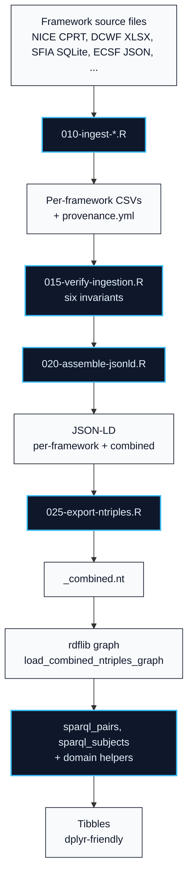

```{r, include = FALSE}
knitr::opts_chunk$set(
  collapse = TRUE,
  comment = "#>",
  eval = FALSE,
  message = FALSE,
  warning = FALSE
)
```

## What cybedtools does

Eight cybersecurity workforce and learning frameworks (NICE, DCWF, SFIA, ENISA ECSF, Cyber.org K-12, CSTA K-12 CS, ACM/IEEE CSEC2017, DigComp 2.2) expressed in a shared `cybed:` semantic schema. The package adds a comparison layer over existing frameworks, not a replacement for them.

This vignette walks through the two ways to use it: install the package and run helpers against the small built-in demo graph, or clone the repository and run the full pipeline against staged framework sources.

Three semantic abstractions carry the work:

- **`cybed:Framework`**: a competency or learning framework.
- **`cybed:OrganizingUnit`**: the framework's top-level enumerated unit (work role, work profile, skill, grade-band x sub-concept cell, level x concept cell, Knowledge Area, competence area). The cross-framework abstract; queries against it reach all eight frameworks. Workforce frameworks where the unit is genuinely a work role or profile (NICE / DCWF / ENISA ECSF) additionally subclass `cybed:Role`.
- **`cybed:RoleElement`**: the codable atomic statement attached to an organizing unit (task, knowledge statement, skill statement, learning standard). Two specialized subtypes for parsed sub-content: `cybed:Subpoint` for framework-as-specified enumerations, and `cybed:Example` for pedagogical-scaffolding fragments lifted from "Clarification statement:" prose.

A single SPARQL query targeting `cybed:RoleElement` returns atomic elements across every framework in one pass; targeting `cybed:OrganizingUnit` returns parents.

## Installation

```{r, eval = FALSE}
# Install from GitHub (not yet on CRAN)
# install.packages("remotes")
remotes::install_github("ryanstraight/cybedtools")
```

The package depends on `rdflib` for RDF/SPARQL, `jsonlite` for JSON-LD I/O, and a small subset of the tidyverse (`dplyr`, `purrr`, `tibble`).

## Pipeline overview

The pipeline turns staged framework source files into a queryable RDF graph through five scripts. Each stage produces an artifact the next stage reads:



The next sections walk through each stage.

## Ingesting a framework

Each framework has a dedicated ingestion script under `scripts/` in the repository. After installing the package, fetch the framework source data (see `docs/framework-data-sources.md` for per-framework notes on where to obtain each) and run the matching ingestion script.

For example, to ingest the NICE Framework:

```{bash, eval = FALSE}
# Copy the NIST CPRT JSON to data/raw/nice/
cp ~/Downloads/nice-v2-framework.json data/raw/nice/

# Run the ingestion
Rscript scripts/010-ingest-nice.R
```

The script parses the source, writes tidy CSVs to `data/raw/nice/tables/`, and generates a `data/raw/nice/provenance.yml` manifest with SHA256, retrieval date, and licensing info.

## Verifying data integrity

Before any downstream analysis, verify the ingested data against declared invariants:

```{bash, eval = FALSE}
Rscript scripts/015-verify-ingestion.R
```

The verifier checks six invariant layers: source provenance (SHA256 match), extraction count bounds, referential integrity, text-integrity (UTF-8 validity, non-empty, length sanity), ID uniqueness, and audit trail. Hard failures block downstream scripts. Soft flags warn but allow continuation.

```{r, eval = FALSE}
# Typical output
# Summary: 95 pass, 0 soft flags, 0 HARD FAILURES.
# VERIFICATION PASSED (with 0 soft flags for review).
```

## Assembling JSON-LD

Once the frameworks are ingested and verified, assemble the semantic representation:

```{bash, eval = FALSE}
Rscript scripts/020-assemble-jsonld.R
```

This produces:

- One JSON-LD document per framework: `data/processed/jsonld/<framework>.jsonld`
- A combined multi-framework graph: `data/processed/jsonld/_combined.jsonld`

Each document uses the two-tier namespace architecture:

- **Tier 1 (`cybed:`):** framework-agnostic base vocabulary.
- **Tier 2 (per-framework: `nice:`, `sfia:`, `dcwf:`, etc.):** per-framework subclasses of Tier 1 types.

## Running the analytical queries

The package's six named analyses are implemented in R, not as `.rq` files. They use single-BGP SPARQL primitives (`sparql_pairs()`, `sparql_subjects()`) composed via dplyr. See the `cross-framework-analysis` vignette for the full design rationale and the helper functions exposed.

Run all six against the combined graph:

```{bash, eval = FALSE}
Rscript scripts/040-run-sparql.R
```

Each analysis writes one CSV to `data/processed/query-results/`:

- `q10-organizing-units-per-framework.csv`, cross-framework parent count (all eight frameworks via `cybed:OrganizingUnit`).
- `q10b-roles-per-framework.csv`, workforce-restricted parent count (NICE / DCWF / ECSF via `cybed:Role`).
- `q11-elements-per-framework-strict.csv`, strict element count per framework (parents + Subpoints, Examples excluded).
- `q11b-elements-per-framework-with-examples.csv`, inclusive element count per framework (parents + Subpoints + Examples).
- `q12-framework-metadata.csv`, jurisdiction, sector, specificity per framework.
- `q13-elements-by-jurisdiction-strict.csv`, strict element count per jurisdiction.
- `q14-elements-by-sector-strict.csv`, strict element count per sector.
- `q15-largest-organizing-units.csv`, top 20 organizing units by element count (cross-framework).
- `q16-examples-per-framework.csv`, per-framework count of `cybed:Example` nodes (Cyber.org K-12 + CSTA scaffolding).

A `_run-summary.csv` records row counts and timings.

Direct SPARQL access remains available via `rdflib::rdf_query()` for ad-hoc queries. Stick to single basic graph patterns (one triple match per query) and join in dplyr.

## Try it without staging any data

If you just installed the package and want to confirm it works before
staging real framework sources, `make_demo_graph()` returns a small
in-memory two-framework graph that exercises every domain helper:

```{r, eval = TRUE}
library(cybedtools)
library(dplyr)

# Synthetic two-framework graph; works without staging any framework data.
rdf <- make_demo_graph()

# One row per framework with jurisdiction, sector, and specificity attached.
framework_metadata(rdf) |>
  arrange(jurisdiction, name)
```

```{r, eval = TRUE}
# Count how many top-level organizing units each framework declares.
# organizing_unit_framework_bindings reaches all eight frameworks via the
# cross-framework cybed:OrganizingUnit type. role_framework_bindings
# would restrict to workforce frameworks (NICE / DCWF / ECSF) only.
organizing_unit_framework_bindings(rdf) |>
  count(framework_name, name = "organizing_unit_count")
```

This is enough to verify your `librdf` system library is functional and the
SPARQL helpers compose correctly on your machine. It is not a substitute
for real framework data. For cross-framework analysis use
`load_combined_ntriples_graph()` against a graph you assembled from staged
sources.

## A minimal end-to-end example with real data

```{r, eval = FALSE}
library(cybedtools)
library(dplyr)

# 1. Load the assembled combined graph. N-Triples is the recommended backend
#    (parses fast, executes the package's single-BGP queries correctly).
rdf <- load_combined_ntriples_graph()

# 2. Get framework metadata via the domain helper. Internally this issues
#    several single-BGP queries and joins them in dplyr. See
#    R/sparql-helpers.R and the cross-framework-analysis vignette for
#    why the package avoids multi-pattern SPARQL on this graph.
results <- framework_metadata(rdf) |>
  arrange(jurisdiction, name)

# 3. Inspect the result. One row per framework, columns for name,
#    jurisdiction, sector, specificity. This metadata frame is the
#    foundation for every cross-framework pivot the package supports.
print(results)
```

This returns one row per framework with jurisdiction, sector, and specificity, the metadata foundation for cross-framework pivots.

## Next steps

- See the vignette **"Cross-framework analysis"** for worked examples of structural and analytical queries across frameworks.
- See the vignette **"Adding a new framework"** for how to extend the package with a framework beyond the current eight.
- See the [namespace-architecture](../articles/namespace-architecture.html) article for the two-tier schema design.
- See the [data-integrity](../articles/data-integrity.html) article for the verification contract.
- See the [sparql-strategy](../articles/sparql-strategy.html) article for query design rationale.

## License

The package code is MIT-licensed. Framework content staged in `data/raw/` retains its upstream license per framework. The package does not redistribute framework text. See `LICENSE.md` for the layered licensing structure.
